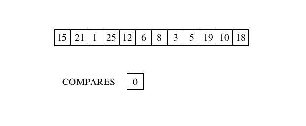
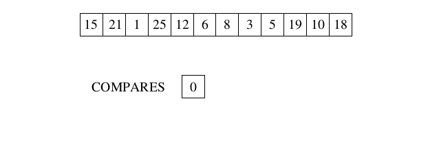
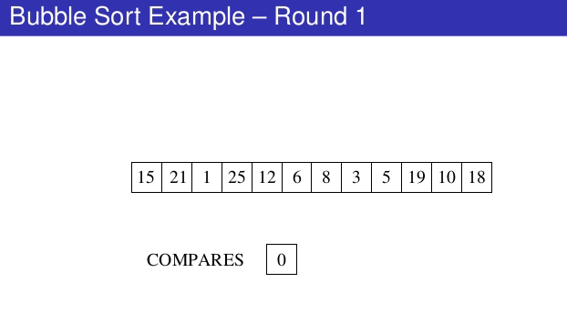
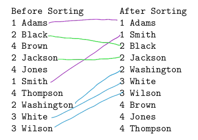
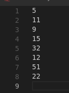
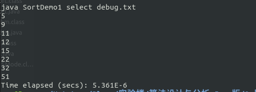
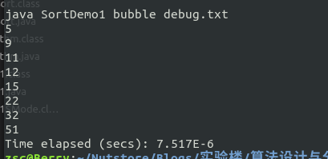
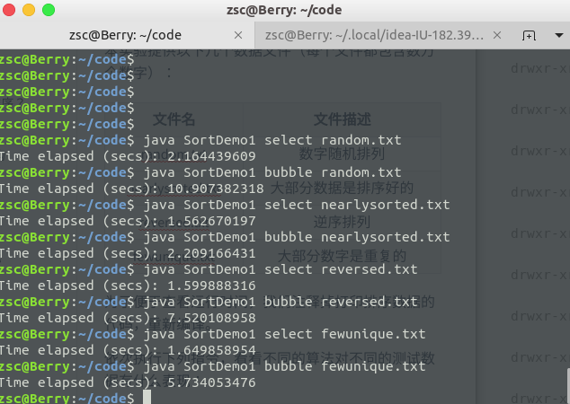

<!doctype html>
<html>
<head>
<meta charset='UTF-8'><meta name='viewport' content='width=device-width initial-scale=1'>
<title>暴力美学-排序</title><link href='https://fonts.googleapis.com/css?family=Open+Sans:400italic,700italic,700,400&subset=latin,latin-ext' rel='stylesheet' type='text/css' />
</head>
<body class='typora-export' >

<h1>暴力美学之——排序</h1><h2>一、知识点</h2><ul><li>蛮力算法定义</li><li>选择排序</li><li>冒泡排序</li><li>算法效率评估</li></ul><h2>二、实验原理</h2><h2>2.1 蛮力算法</h2>
蛮力算法是一种直接解决问题的方法，通常基于问题描述或者概念定义直接设计算法。

比如，计算<svg xmlns:xlink="http://www.w3.org/1999/xlink" width="2.446ex" height="1.994ex" viewBox="0 -755.9 1053.3 858.4" role="img" focusable="false" style="vertical-align: -0.238ex;"><defs><path stroke-width="0" id="E1-MJMATHI-61" d="M33 157Q33 258 109 349T280 441Q331 441 370 392Q386 422 416 422Q429 422 439 414T449 394Q449 381 412 234T374 68Q374 43 381 35T402 26Q411 27 422 35Q443 55 463 131Q469 151 473 152Q475 153 483 153H487Q506 153 506 144Q506 138 501 117T481 63T449 13Q436 0 417 -8Q409 -10 393 -10Q359 -10 336 5T306 36L300 51Q299 52 296 50Q294 48 292 46Q233 -10 172 -10Q117 -10 75 30T33 157ZM351 328Q351 334 346 350T323 385T277 405Q242 405 210 374T160 293Q131 214 119 129Q119 126 119 118T118 106Q118 61 136 44T179 26Q217 26 254 59T298 110Q300 114 325 217T351 328Z"></path><path stroke-width="0" id="E1-MJMATHI-6E" d="M21 287Q22 293 24 303T36 341T56 388T89 425T135 442Q171 442 195 424T225 390T231 369Q231 367 232 367L243 378Q304 442 382 442Q436 442 469 415T503 336T465 179T427 52Q427 26 444 26Q450 26 453 27Q482 32 505 65T540 145Q542 153 560 153Q580 153 580 145Q580 144 576 130Q568 101 554 73T508 17T439 -10Q392 -10 371 17T350 73Q350 92 386 193T423 345Q423 404 379 404H374Q288 404 229 303L222 291L189 157Q156 26 151 16Q138 -11 108 -11Q95 -11 87 -5T76 7T74 17Q74 30 112 180T152 343Q153 348 153 366Q153 405 129 405Q91 405 66 305Q60 285 60 284Q58 278 41 278H27Q21 284 21 287Z"></path></defs><g stroke="currentColor" fill="currentColor" stroke-width="0" transform="matrix(1 0 0 -1 0 0)"><use xmlns:xlink="http://www.w3.org/1999/xlink" xlink:href="#E1-MJMATHI-61" x="0" y="0"></use><use transform="scale(0.707)" xmlns:xlink="http://www.w3.org/1999/xlink" xlink:href="#E1-MJMATHI-6E" x="748" y="513"></use></g></svg>，最直接的方法就是把数字<svg xmlns:xlink="http://www.w3.org/1999/xlink" width="1.229ex" height="1.41ex" viewBox="0 -504.6 529 607.1" role="img" focusable="false" style="vertical-align: -0.238ex;"><defs><path stroke-width="0" id="E2-MJMATHI-61" d="M33 157Q33 258 109 349T280 441Q331 441 370 392Q386 422 416 422Q429 422 439 414T449 394Q449 381 412 234T374 68Q374 43 381 35T402 26Q411 27 422 35Q443 55 463 131Q469 151 473 152Q475 153 483 153H487Q506 153 506 144Q506 138 501 117T481 63T449 13Q436 0 417 -8Q409 -10 393 -10Q359 -10 336 5T306 36L300 51Q299 52 296 50Q294 48 292 46Q233 -10 172 -10Q117 -10 75 30T33 157ZM351 328Q351 334 346 350T323 385T277 405Q242 405 210 374T160 293Q131 214 119 129Q119 126 119 118T118 106Q118 61 136 44T179 26Q217 26 254 59T298 110Q300 114 325 217T351 328Z"></path></defs><g stroke="currentColor" fill="currentColor" stroke-width="0" transform="matrix(1 0 0 -1 0 0)"><use xmlns:xlink="http://www.w3.org/1999/xlink" xlink:href="#E2-MJMATHI-61" x="0" y="0"></use></g></svg>乘以<svg xmlns:xlink="http://www.w3.org/1999/xlink" width="1.394ex" height="1.41ex" viewBox="0 -504.6 600 607.1" role="img" focusable="false" style="vertical-align: -0.238ex;"><defs><path stroke-width="0" id="E6-MJMATHI-6E" d="M21 287Q22 293 24 303T36 341T56 388T89 425T135 442Q171 442 195 424T225 390T231 369Q231 367 232 367L243 378Q304 442 382 442Q436 442 469 415T503 336T465 179T427 52Q427 26 444 26Q450 26 453 27Q482 32 505 65T540 145Q542 153 560 153Q580 153 580 145Q580 144 576 130Q568 101 554 73T508 17T439 -10Q392 -10 371 17T350 73Q350 92 386 193T423 345Q423 404 379 404H374Q288 404 229 303L222 291L189 157Q156 26 151 16Q138 -11 108 -11Q95 -11 87 -5T76 7T74 17Q74 30 112 180T152 343Q153 348 153 366Q153 405 129 405Q91 405 66 305Q60 285 60 284Q58 278 41 278H27Q21 284 21 287Z"></path></defs><g stroke="currentColor" fill="currentColor" stroke-width="0" transform="matrix(1 0 0 -1 0 0)"><use xmlns:xlink="http://www.w3.org/1999/xlink" xlink:href="#E6-MJMATHI-6E" x="0" y="0"></use></g></svg>次，这就是直接基于指数计算概念定义来进行的。

再比如，在一个乱序列表里查找概率列表是否包含<svg xmlns:xlink="http://www.w3.org/1999/xlink" width="2.065ex" height="1.877ex" viewBox="0 -755.9 889 808.1" role="img" focusable="false" style="vertical-align: -0.121ex;"><defs><path stroke-width="0" id="E5-MJMATHI-4B" d="M285 628Q285 635 228 637Q205 637 198 638T191 647Q191 649 193 661Q199 681 203 682Q205 683 214 683H219Q260 681 355 681Q389 681 418 681T463 682T483 682Q500 682 500 674Q500 669 497 660Q496 658 496 654T495 648T493 644T490 641T486 639T479 638T470 637T456 637Q416 636 405 634T387 623L306 305Q307 305 490 449T678 597Q692 611 692 620Q692 635 667 637Q651 637 651 648Q651 650 654 662T659 677Q662 682 676 682Q680 682 711 681T791 680Q814 680 839 681T869 682Q889 682 889 672Q889 650 881 642Q878 637 862 637Q787 632 726 586Q710 576 656 534T556 455L509 418L518 396Q527 374 546 329T581 244Q656 67 661 61Q663 59 666 57Q680 47 717 46H738Q744 38 744 37T741 19Q737 6 731 0H720Q680 3 625 3Q503 3 488 0H478Q472 6 472 9T474 27Q478 40 480 43T491 46H494Q544 46 544 71Q544 75 517 141T485 216L427 354L359 301L291 248L268 155Q245 63 245 58Q245 51 253 49T303 46H334Q340 37 340 35Q340 19 333 5Q328 0 317 0Q314 0 280 1T180 2Q118 2 85 2T49 1Q31 1 31 11Q31 13 34 25Q38 41 42 43T65 46Q92 46 125 49Q139 52 144 61Q147 65 216 339T285 628Z"></path></defs><g stroke="currentColor" fill="currentColor" stroke-width="0" transform="matrix(1 0 0 -1 0 0)"><use xmlns:xlink="http://www.w3.org/1999/xlink" xlink:href="#E5-MJMATHI-4B" x="0" y="0"></use></g></svg>，最直接的方法就是遍历列表的每个元素，并把每个元素和<svg xmlns:xlink="http://www.w3.org/1999/xlink" width="2.065ex" height="1.877ex" viewBox="0 -755.9 889 808.1" role="img" focusable="false" style="vertical-align: -0.121ex;"><defs><path stroke-width="0" id="E5-MJMATHI-4B" d="M285 628Q285 635 228 637Q205 637 198 638T191 647Q191 649 193 661Q199 681 203 682Q205 683 214 683H219Q260 681 355 681Q389 681 418 681T463 682T483 682Q500 682 500 674Q500 669 497 660Q496 658 496 654T495 648T493 644T490 641T486 639T479 638T470 637T456 637Q416 636 405 634T387 623L306 305Q307 305 490 449T678 597Q692 611 692 620Q692 635 667 637Q651 637 651 648Q651 650 654 662T659 677Q662 682 676 682Q680 682 711 681T791 680Q814 680 839 681T869 682Q889 682 889 672Q889 650 881 642Q878 637 862 637Q787 632 726 586Q710 576 656 534T556 455L509 418L518 396Q527 374 546 329T581 244Q656 67 661 61Q663 59 666 57Q680 47 717 46H738Q744 38 744 37T741 19Q737 6 731 0H720Q680 3 625 3Q503 3 488 0H478Q472 6 472 9T474 27Q478 40 480 43T491 46H494Q544 46 544 71Q544 75 517 141T485 216L427 354L359 301L291 248L268 155Q245 63 245 58Q245 51 253 49T303 46H334Q340 37 340 35Q340 19 333 5Q328 0 317 0Q314 0 280 1T180 2Q118 2 85 2T49 1Q31 1 31 11Q31 13 34 25Q38 41 42 43T65 46Q92 46 125 49Q139 52 144 61Q147 65 216 339T285 628Z"></path></defs><g stroke="currentColor" fill="currentColor" stroke-width="0" transform="matrix(1 0 0 -1 0 0)"><use xmlns:xlink="http://www.w3.org/1999/xlink" xlink:href="#E5-MJMATHI-4B" x="0" y="0"></use></g></svg>比较，这就是基于问题描述来进行的。

蛮力算法虽然不够巧妙，但是却是一种几乎什么问题都能解决的一般性方法。
<h2>2.2 选择排序</h2>
选择排序的设计思想就是蛮力算法。

选择排序算法流程：

扫描整个待排序列表（长度为<svg xmlns:xlink="http://www.w3.org/1999/xlink" width="1.394ex" height="1.41ex" viewBox="0 -504.6 600 607.1" role="img" focusable="false" style="vertical-align: -0.238ex;"><defs><path stroke-width="0" id="E6-MJMATHI-6E" d="M21 287Q22 293 24 303T36 341T56 388T89 425T135 442Q171 442 195 424T225 390T231 369Q231 367 232 367L243 378Q304 442 382 442Q436 442 469 415T503 336T465 179T427 52Q427 26 444 26Q450 26 453 27Q482 32 505 65T540 145Q542 153 560 153Q580 153 580 145Q580 144 576 130Q568 101 554 73T508 17T439 -10Q392 -10 371 17T350 73Q350 92 386 193T423 345Q423 404 379 404H374Q288 404 229 303L222 291L189 157Q156 26 151 16Q138 -11 108 -11Q95 -11 87 -5T76 7T74 17Q74 30 112 180T152 343Q153 348 153 366Q153 405 129 405Q91 405 66 305Q60 285 60 284Q58 278 41 278H27Q21 284 21 287Z"></path></defs><g stroke="currentColor" fill="currentColor" stroke-width="0" transform="matrix(1 0 0 -1 0 0)"><use xmlns:xlink="http://www.w3.org/1999/xlink" xlink:href="#E6-MJMATHI-6E" x="0" y="0"></use></g></svg>），找到最小的元素，把这个元素和列表第一个元素交换；从第二个元素开始扫描列表，找到剩余<svg xmlns:xlink="http://www.w3.org/1999/xlink" width="5.394ex" height="1.994ex" viewBox="0 -755.9 2322.4 858.4" role="img" focusable="false" style="vertical-align: -0.238ex;"><defs><path stroke-width="0" id="E29-MJMATHI-6E" d="M21 287Q22 293 24 303T36 341T56 388T89 425T135 442Q171 442 195 424T225 390T231 369Q231 367 232 367L243 378Q304 442 382 442Q436 442 469 415T503 336T465 179T427 52Q427 26 444 26Q450 26 453 27Q482 32 505 65T540 145Q542 153 560 153Q580 153 580 145Q580 144 576 130Q568 101 554 73T508 17T439 -10Q392 -10 371 17T350 73Q350 92 386 193T423 345Q423 404 379 404H374Q288 404 229 303L222 291L189 157Q156 26 151 16Q138 -11 108 -11Q95 -11 87 -5T76 7T74 17Q74 30 112 180T152 343Q153 348 153 366Q153 405 129 405Q91 405 66 305Q60 285 60 284Q58 278 41 278H27Q21 284 21 287Z"></path><path stroke-width="0" id="E29-MJMAIN-2212" d="M84 237T84 250T98 270H679Q694 262 694 250T679 230H98Q84 237 84 250Z"></path><path stroke-width="0" id="E29-MJMAIN-31" d="M213 578L200 573Q186 568 160 563T102 556H83V602H102Q149 604 189 617T245 641T273 663Q275 666 285 666Q294 666 302 660V361L303 61Q310 54 315 52T339 48T401 46H427V0H416Q395 3 257 3Q121 3 100 0H88V46H114Q136 46 152 46T177 47T193 50T201 52T207 57T213 61V578Z"></path></defs><g stroke="currentColor" fill="currentColor" stroke-width="0" transform="matrix(1 0 0 -1 0 0)"><use xmlns:xlink="http://www.w3.org/1999/xlink" xlink:href="#E29-MJMATHI-6E" x="0" y="0"></use><use xmlns:xlink="http://www.w3.org/1999/xlink" xlink:href="#E29-MJMAIN-2212" x="822" y="0"></use><use xmlns:xlink="http://www.w3.org/1999/xlink" xlink:href="#E29-MJMAIN-31" x="1822" y="0"></use></g></svg>个元素中最小的元素，把这个元素和列表第二个元素交换；从第三个元素开始……

这样遍历<svg xmlns:xlink="http://www.w3.org/1999/xlink" width="5.394ex" height="1.994ex" viewBox="0 -755.9 2322.4 858.4" role="img" focusable="false" style="vertical-align: -0.238ex;"><defs><path stroke-width="0" id="E29-MJMATHI-6E" d="M21 287Q22 293 24 303T36 341T56 388T89 425T135 442Q171 442 195 424T225 390T231 369Q231 367 232 367L243 378Q304 442 382 442Q436 442 469 415T503 336T465 179T427 52Q427 26 444 26Q450 26 453 27Q482 32 505 65T540 145Q542 153 560 153Q580 153 580 145Q580 144 576 130Q568 101 554 73T508 17T439 -10Q392 -10 371 17T350 73Q350 92 386 193T423 345Q423 404 379 404H374Q288 404 229 303L222 291L189 157Q156 26 151 16Q138 -11 108 -11Q95 -11 87 -5T76 7T74 17Q74 30 112 180T152 343Q153 348 153 366Q153 405 129 405Q91 405 66 305Q60 285 60 284Q58 278 41 278H27Q21 284 21 287Z"></path><path stroke-width="0" id="E29-MJMAIN-2212" d="M84 237T84 250T98 270H679Q694 262 694 250T679 230H98Q84 237 84 250Z"></path><path stroke-width="0" id="E29-MJMAIN-31" d="M213 578L200 573Q186 568 160 563T102 556H83V602H102Q149 604 189 617T245 641T273 663Q275 666 285 666Q294 666 302 660V361L303 61Q310 54 315 52T339 48T401 46H427V0H416Q395 3 257 3Q121 3 100 0H88V46H114Q136 46 152 46T177 47T193 50T201 52T207 57T213 61V578Z"></path></defs><g stroke="currentColor" fill="currentColor" stroke-width="0" transform="matrix(1 0 0 -1 0 0)"><use xmlns:xlink="http://www.w3.org/1999/xlink" xlink:href="#E29-MJMATHI-6E" x="0" y="0"></use><use xmlns:xlink="http://www.w3.org/1999/xlink" xlink:href="#E29-MJMAIN-2212" x="822" y="0"></use><use xmlns:xlink="http://www.w3.org/1999/xlink" xlink:href="#E29-MJMAIN-31" x="1822" y="0"></use></g></svg>次以后，该列表就完成了排序。

伪代码如下：
<blockquote>
<svg xmlns:xlink="http://www.w3.org/1999/xlink" width="32.586ex" height="28.142ex" viewBox="0 -806.1 14029.8 12116.5" role="img" focusable="false" style="vertical-align: -26.269ex;"><defs><path stroke-width="0" id="E9-MJMATHI-53" d="M308 24Q367 24 416 76T466 197Q466 260 414 284Q308 311 278 321T236 341Q176 383 176 462Q176 523 208 573T273 648Q302 673 343 688T407 704H418H425Q521 704 564 640Q565 640 577 653T603 682T623 704Q624 704 627 704T632 705Q645 705 645 698T617 577T585 459T569 456Q549 456 549 465Q549 471 550 475Q550 478 551 494T553 520Q553 554 544 579T526 616T501 641Q465 662 419 662Q362 662 313 616T263 510Q263 480 278 458T319 427Q323 425 389 408T456 390Q490 379 522 342T554 242Q554 216 546 186Q541 164 528 137T492 78T426 18T332 -20Q320 -22 298 -22Q199 -22 144 33L134 44L106 13Q83 -14 78 -18T65 -22Q52 -22 52 -14Q52 -11 110 221Q112 227 130 227H143Q149 221 149 216Q149 214 148 207T144 186T142 153Q144 114 160 87T203 47T255 29T308 24Z"></path><path stroke-width="0" id="E9-MJMATHI-65" d="M39 168Q39 225 58 272T107 350T174 402T244 433T307 442H310Q355 442 388 420T421 355Q421 265 310 237Q261 224 176 223Q139 223 138 221Q138 219 132 186T125 128Q125 81 146 54T209 26T302 45T394 111Q403 121 406 121Q410 121 419 112T429 98T420 82T390 55T344 24T281 -1T205 -11Q126 -11 83 42T39 168ZM373 353Q367 405 305 405Q272 405 244 391T199 357T170 316T154 280T149 261Q149 260 169 260Q282 260 327 284T373 353Z"></path><path stroke-width="0" id="E9-MJMATHI-6C" d="M117 59Q117 26 142 26Q179 26 205 131Q211 151 215 152Q217 153 225 153H229Q238 153 241 153T246 151T248 144Q247 138 245 128T234 90T214 43T183 6T137 -11Q101 -11 70 11T38 85Q38 97 39 102L104 360Q167 615 167 623Q167 626 166 628T162 632T157 634T149 635T141 636T132 637T122 637Q112 637 109 637T101 638T95 641T94 647Q94 649 96 661Q101 680 107 682T179 688Q194 689 213 690T243 693T254 694Q266 694 266 686Q266 675 193 386T118 83Q118 81 118 75T117 65V59Z"></path><path stroke-width="0" id="E9-MJMATHI-63" d="M34 159Q34 268 120 355T306 442Q362 442 394 418T427 355Q427 326 408 306T360 285Q341 285 330 295T319 325T330 359T352 380T366 386H367Q367 388 361 392T340 400T306 404Q276 404 249 390Q228 381 206 359Q162 315 142 235T121 119Q121 73 147 50Q169 26 205 26H209Q321 26 394 111Q403 121 406 121Q410 121 419 112T429 98T420 83T391 55T346 25T282 0T202 -11Q127 -11 81 37T34 159Z"></path><path stroke-width="0" id="E9-MJMATHI-74" d="M26 385Q19 392 19 395Q19 399 22 411T27 425Q29 430 36 430T87 431H140L159 511Q162 522 166 540T173 566T179 586T187 603T197 615T211 624T229 626Q247 625 254 615T261 596Q261 589 252 549T232 470L222 433Q222 431 272 431H323Q330 424 330 420Q330 398 317 385H210L174 240Q135 80 135 68Q135 26 162 26Q197 26 230 60T283 144Q285 150 288 151T303 153H307Q322 153 322 145Q322 142 319 133Q314 117 301 95T267 48T216 6T155 -11Q125 -11 98 4T59 56Q57 64 57 83V101L92 241Q127 382 128 383Q128 385 77 385H26Z"></path><path stroke-width="0" id="E9-MJMATHI-69" d="M184 600Q184 624 203 642T247 661Q265 661 277 649T290 619Q290 596 270 577T226 557Q211 557 198 567T184 600ZM21 287Q21 295 30 318T54 369T98 420T158 442Q197 442 223 419T250 357Q250 340 236 301T196 196T154 83Q149 61 149 51Q149 26 166 26Q175 26 185 29T208 43T235 78T260 137Q263 149 265 151T282 153Q302 153 302 143Q302 135 293 112T268 61T223 11T161 -11Q129 -11 102 10T74 74Q74 91 79 106T122 220Q160 321 166 341T173 380Q173 404 156 404H154Q124 404 99 371T61 287Q60 286 59 284T58 281T56 279T53 278T49 278T41 278H27Q21 284 21 287Z"></path><path stroke-width="0" id="E9-MJMATHI-6F" d="M201 -11Q126 -11 80 38T34 156Q34 221 64 279T146 380Q222 441 301 441Q333 441 341 440Q354 437 367 433T402 417T438 387T464 338T476 268Q476 161 390 75T201 -11ZM121 120Q121 70 147 48T206 26Q250 26 289 58T351 142Q360 163 374 216T388 308Q388 352 370 375Q346 405 306 405Q243 405 195 347Q158 303 140 230T121 120Z"></path><path stroke-width="0" id="E9-MJMATHI-6E" d="M21 287Q22 293 24 303T36 341T56 388T89 425T135 442Q171 442 195 424T225 390T231 369Q231 367 232 367L243 378Q304 442 382 442Q436 442 469 415T503 336T465 179T427 52Q427 26 444 26Q450 26 453 27Q482 32 505 65T540 145Q542 153 560 153Q580 153 580 145Q580 144 576 130Q568 101 554 73T508 17T439 -10Q392 -10 371 17T350 73Q350 92 386 193T423 345Q423 404 379 404H374Q288 404 229 303L222 291L189 157Q156 26 151 16Q138 -11 108 -11Q95 -11 87 -5T76 7T74 17Q74 30 112 180T152 343Q153 348 153 366Q153 405 129 405Q91 405 66 305Q60 285 60 284Q58 278 41 278H27Q21 284 21 287Z"></path><path stroke-width="0" id="E9-MJMATHI-72" d="M21 287Q22 290 23 295T28 317T38 348T53 381T73 411T99 433T132 442Q161 442 183 430T214 408T225 388Q227 382 228 382T236 389Q284 441 347 441H350Q398 441 422 400Q430 381 430 363Q430 333 417 315T391 292T366 288Q346 288 334 299T322 328Q322 376 378 392Q356 405 342 405Q286 405 239 331Q229 315 224 298T190 165Q156 25 151 16Q138 -11 108 -11Q95 -11 87 -5T76 7T74 17Q74 30 114 189T154 366Q154 405 128 405Q107 405 92 377T68 316T57 280Q55 278 41 278H27Q21 284 21 287Z"></path><path stroke-width="0" id="E9-MJMAIN-28" d="M94 250Q94 319 104 381T127 488T164 576T202 643T244 695T277 729T302 750H315H319Q333 750 333 741Q333 738 316 720T275 667T226 581T184 443T167 250T184 58T225 -81T274 -167T316 -220T333 -241Q333 -250 318 -250H315H302L274 -226Q180 -141 137 -14T94 250Z"></path><path stroke-width="0" id="E9-MJMATHI-41" d="M208 74Q208 50 254 46Q272 46 272 35Q272 34 270 22Q267 8 264 4T251 0Q249 0 239 0T205 1T141 2Q70 2 50 0H42Q35 7 35 11Q37 38 48 46H62Q132 49 164 96Q170 102 345 401T523 704Q530 716 547 716H555H572Q578 707 578 706L606 383Q634 60 636 57Q641 46 701 46Q726 46 726 36Q726 34 723 22Q720 7 718 4T704 0Q701 0 690 0T651 1T578 2Q484 2 455 0H443Q437 6 437 9T439 27Q443 40 445 43L449 46H469Q523 49 533 63L521 213H283L249 155Q208 86 208 74ZM516 260Q516 271 504 416T490 562L463 519Q447 492 400 412L310 260L413 259Q516 259 516 260Z"></path><path stroke-width="0" id="E9-MJMAIN-5B" d="M118 -250V750H255V710H158V-210H255V-250H118Z"></path><path stroke-width="0" id="E9-MJMAIN-30" d="M96 585Q152 666 249 666Q297 666 345 640T423 548Q460 465 460 320Q460 165 417 83Q397 41 362 16T301 -15T250 -22Q224 -22 198 -16T137 16T82 83Q39 165 39 320Q39 494 96 585ZM321 597Q291 629 250 629Q208 629 178 597Q153 571 145 525T137 333Q137 175 145 125T181 46Q209 16 250 16Q290 16 318 46Q347 76 354 130T362 333Q362 478 354 524T321 597Z"></path><path stroke-width="0" id="E9-MJMAIN-2E" d="M78 60Q78 84 95 102T138 120Q162 120 180 104T199 61Q199 36 182 18T139 0T96 17T78 60Z"></path><path stroke-width="0" id="E9-MJMATHI-4E" d="M234 637Q231 637 226 637Q201 637 196 638T191 649Q191 676 202 682Q204 683 299 683Q376 683 387 683T401 677Q612 181 616 168L670 381Q723 592 723 606Q723 633 659 637Q635 637 635 648Q635 650 637 660Q641 676 643 679T653 683Q656 683 684 682T767 680Q817 680 843 681T873 682Q888 682 888 672Q888 650 880 642Q878 637 858 637Q787 633 769 597L620 7Q618 0 599 0Q585 0 582 2Q579 5 453 305L326 604L261 344Q196 88 196 79Q201 46 268 46H278Q284 41 284 38T282 19Q278 6 272 0H259Q228 2 151 2Q123 2 100 2T63 2T46 1Q31 1 31 10Q31 14 34 26T39 40Q41 46 62 46Q130 49 150 85Q154 91 221 362L289 634Q287 635 234 637Z"></path><path stroke-width="0" id="E9-MJMAIN-2212" d="M84 237T84 250T98 270H679Q694 262 694 250T679 230H98Q84 237 84 250Z"></path><path stroke-width="0" id="E9-MJMAIN-31" d="M213 578L200 573Q186 568 160 563T102 556H83V602H102Q149 604 189 617T245 641T273 663Q275 666 285 666Q294 666 302 660V361L303 61Q310 54 315 52T339 48T401 46H427V0H416Q395 3 257 3Q121 3 100 0H88V46H114Q136 46 152 46T177 47T193 50T201 52T207 57T213 61V578Z"></path><path stroke-width="0" id="E9-MJMAIN-5D" d="M22 710V750H159V-250H22V-210H119V710H22Z"></path><path stroke-width="0" id="E9-MJMAIN-29" d="M60 749L64 750Q69 750 74 750H86L114 726Q208 641 251 514T294 250Q294 182 284 119T261 12T224 -76T186 -143T145 -194T113 -227T90 -246Q87 -249 86 -250H74Q66 -250 63 -250T58 -247T55 -238Q56 -237 66 -225Q221 -64 221 250T66 725Q56 737 55 738Q55 746 60 749Z"></path><path stroke-width="0" id="E9-MJMAIN-2F" d="M423 750Q432 750 438 744T444 730Q444 725 271 248T92 -240Q85 -250 75 -250Q68 -250 62 -245T56 -231Q56 -221 230 257T407 740Q411 750 423 750Z"></path><path stroke-width="0" id="E9-MJMATHI-66" d="M118 -162Q120 -162 124 -164T135 -167T147 -168Q160 -168 171 -155T187 -126Q197 -99 221 27T267 267T289 382V385H242Q195 385 192 387Q188 390 188 397L195 425Q197 430 203 430T250 431Q298 431 298 432Q298 434 307 482T319 540Q356 705 465 705Q502 703 526 683T550 630Q550 594 529 578T487 561Q443 561 443 603Q443 622 454 636T478 657L487 662Q471 668 457 668Q445 668 434 658T419 630Q412 601 403 552T387 469T380 433Q380 431 435 431Q480 431 487 430T498 424Q499 420 496 407T491 391Q489 386 482 386T428 385H372L349 263Q301 15 282 -47Q255 -132 212 -173Q175 -205 139 -205Q107 -205 81 -186T55 -132Q55 -95 76 -78T118 -61Q162 -61 162 -103Q162 -122 151 -136T127 -157L118 -162Z"></path><path stroke-width="0" id="E9-MJMAIN-2190" d="M944 261T944 250T929 230H165Q167 228 182 216T211 189T244 152T277 96T303 25Q308 7 308 0Q308 -11 288 -11Q281 -11 278 -11T272 -7T267 2T263 21Q245 94 195 151T73 236Q58 242 55 247Q55 254 59 257T73 264Q121 283 158 314T215 375T247 434T264 480L267 497Q269 503 270 505T275 509T288 511Q308 511 308 500Q308 493 303 475Q293 438 278 406T246 352T215 315T185 287T165 270H929Q944 261 944 250Z"></path><path stroke-width="0" id="E9-MJMAIN-32" d="M109 429Q82 429 66 447T50 491Q50 562 103 614T235 666Q326 666 387 610T449 465Q449 422 429 383T381 315T301 241Q265 210 201 149L142 93L218 92Q375 92 385 97Q392 99 409 186V189H449V186Q448 183 436 95T421 3V0H50V19V31Q50 38 56 46T86 81Q115 113 136 137Q145 147 170 174T204 211T233 244T261 278T284 308T305 340T320 369T333 401T340 431T343 464Q343 527 309 573T212 619Q179 619 154 602T119 569T109 550Q109 549 114 549Q132 549 151 535T170 489Q170 464 154 447T109 429Z"></path><path stroke-width="0" id="E9-MJMATHI-64" d="M366 683Q367 683 438 688T511 694Q523 694 523 686Q523 679 450 384T375 83T374 68Q374 26 402 26Q411 27 422 35Q443 55 463 131Q469 151 473 152Q475 153 483 153H487H491Q506 153 506 145Q506 140 503 129Q490 79 473 48T445 8T417 -8Q409 -10 393 -10Q359 -10 336 5T306 36L300 51Q299 52 296 50Q294 48 292 46Q233 -10 172 -10Q117 -10 75 30T33 157Q33 205 53 255T101 341Q148 398 195 420T280 442Q336 442 364 400Q369 394 369 396Q370 400 396 505T424 616Q424 629 417 632T378 637H357Q351 643 351 645T353 664Q358 683 366 683ZM352 326Q329 405 277 405Q242 405 210 374T160 293Q131 214 119 129Q119 126 119 118T118 106Q118 61 136 44T179 26Q233 26 290 98L298 109L352 326Z"></path><path stroke-width="0" id="E9-MJMATHI-6D" d="M21 287Q22 293 24 303T36 341T56 388T88 425T132 442T175 435T205 417T221 395T229 376L231 369Q231 367 232 367L243 378Q303 442 384 442Q401 442 415 440T441 433T460 423T475 411T485 398T493 385T497 373T500 364T502 357L510 367Q573 442 659 442Q713 442 746 415T780 336Q780 285 742 178T704 50Q705 36 709 31T724 26Q752 26 776 56T815 138Q818 149 821 151T837 153Q857 153 857 145Q857 144 853 130Q845 101 831 73T785 17T716 -10Q669 -10 648 17T627 73Q627 92 663 193T700 345Q700 404 656 404H651Q565 404 506 303L499 291L466 157Q433 26 428 16Q415 -11 385 -11Q372 -11 364 -4T353 8T350 18Q350 29 384 161L420 307Q423 322 423 345Q423 404 379 404H374Q288 404 229 303L222 291L189 157Q156 26 151 16Q138 -11 108 -11Q95 -11 87 -5T76 7T74 17Q74 30 112 181Q151 335 151 342Q154 357 154 369Q154 405 129 405Q107 405 92 377T69 316T57 280Q55 278 41 278H27Q21 284 21 287Z"></path><path stroke-width="0" id="E9-MJMATHI-6A" d="M297 596Q297 627 318 644T361 661Q378 661 389 651T403 623Q403 595 384 576T340 557Q322 557 310 567T297 596ZM288 376Q288 405 262 405Q240 405 220 393T185 362T161 325T144 293L137 279Q135 278 121 278H107Q101 284 101 286T105 299Q126 348 164 391T252 441Q253 441 260 441T272 442Q296 441 316 432Q341 418 354 401T367 348V332L318 133Q267 -67 264 -75Q246 -125 194 -164T75 -204Q25 -204 7 -183T-12 -137Q-12 -110 7 -91T53 -71Q70 -71 82 -81T95 -112Q95 -148 63 -167Q69 -168 77 -168Q111 -168 139 -140T182 -74L193 -32Q204 11 219 72T251 197T278 308T289 365Q289 372 288 376Z"></path><path stroke-width="0" id="E9-MJMAIN-2B" d="M56 237T56 250T70 270H369V420L370 570Q380 583 389 583Q402 583 409 568V270H707Q722 262 722 250T707 230H409V-68Q401 -82 391 -82H389H387Q375 -82 369 -68V230H70Q56 237 56 250Z"></path><path stroke-width="0" id="E9-MJMAIN-3C" d="M694 -11T694 -19T688 -33T678 -40Q671 -40 524 29T234 166L90 235Q83 240 83 250Q83 261 91 266Q664 540 678 540Q681 540 687 534T694 519T687 505Q686 504 417 376L151 250L417 124Q686 -4 687 -5Q694 -11 694 -19Z"></path><path stroke-width="0" id="E9-MJMATHI-61" d="M33 157Q33 258 109 349T280 441Q331 441 370 392Q386 422 416 422Q429 422 439 414T449 394Q449 381 412 234T374 68Q374 43 381 35T402 26Q411 27 422 35Q443 55 463 131Q469 151 473 152Q475 153 483 153H487Q506 153 506 144Q506 138 501 117T481 63T449 13Q436 0 417 -8Q409 -10 393 -10Q359 -10 336 5T306 36L300 51Q299 52 296 50Q294 48 292 46Q233 -10 172 -10Q117 -10 75 30T33 157ZM351 328Q351 334 346 350T323 385T277 405Q242 405 210 374T160 293Q131 214 119 129Q119 126 119 118T118 106Q118 61 136 44T179 26Q217 26 254 59T298 110Q300 114 325 217T351 328Z"></path><path stroke-width="0" id="E9-MJMATHI-73" d="M131 289Q131 321 147 354T203 415T300 442Q362 442 390 415T419 355Q419 323 402 308T364 292Q351 292 340 300T328 326Q328 342 337 354T354 372T367 378Q368 378 368 379Q368 382 361 388T336 399T297 405Q249 405 227 379T204 326Q204 301 223 291T278 274T330 259Q396 230 396 163Q396 135 385 107T352 51T289 7T195 -10Q118 -10 86 19T53 87Q53 126 74 143T118 160Q133 160 146 151T160 120Q160 94 142 76T111 58Q109 57 108 57T107 55Q108 52 115 47T146 34T201 27Q237 27 263 38T301 66T318 97T323 122Q323 150 302 164T254 181T195 196T148 231Q131 256 131 289Z"></path><path stroke-width="0" id="E9-MJMATHI-77" d="M580 385Q580 406 599 424T641 443Q659 443 674 425T690 368Q690 339 671 253Q656 197 644 161T609 80T554 12T482 -11Q438 -11 404 5T355 48Q354 47 352 44Q311 -11 252 -11Q226 -11 202 -5T155 14T118 53T104 116Q104 170 138 262T173 379Q173 380 173 381Q173 390 173 393T169 400T158 404H154Q131 404 112 385T82 344T65 302T57 280Q55 278 41 278H27Q21 284 21 287Q21 293 29 315T52 366T96 418T161 441Q204 441 227 416T250 358Q250 340 217 250T184 111Q184 65 205 46T258 26Q301 26 334 87L339 96V119Q339 122 339 128T340 136T341 143T342 152T345 165T348 182T354 206T362 238T373 281Q402 395 406 404Q419 431 449 431Q468 431 475 421T483 402Q483 389 454 274T422 142Q420 131 420 107V100Q420 85 423 71T442 42T487 26Q558 26 600 148Q609 171 620 213T632 273Q632 306 619 325T593 357T580 385Z"></path><path stroke-width="0" id="E9-MJMATHI-70" d="M23 287Q24 290 25 295T30 317T40 348T55 381T75 411T101 433T134 442Q209 442 230 378L240 387Q302 442 358 442Q423 442 460 395T497 281Q497 173 421 82T249 -10Q227 -10 210 -4Q199 1 187 11T168 28L161 36Q160 35 139 -51T118 -138Q118 -144 126 -145T163 -148H188Q194 -155 194 -157T191 -175Q188 -187 185 -190T172 -194Q170 -194 161 -194T127 -193T65 -192Q-5 -192 -24 -194H-32Q-39 -187 -39 -183Q-37 -156 -26 -148H-6Q28 -147 33 -136Q36 -130 94 103T155 350Q156 355 156 364Q156 405 131 405Q109 405 94 377T71 316T59 280Q57 278 43 278H29Q23 284 23 287ZM178 102Q200 26 252 26Q282 26 310 49T356 107Q374 141 392 215T411 325V331Q411 405 350 405Q339 405 328 402T306 393T286 380T269 365T254 350T243 336T235 326L232 322Q232 321 229 308T218 264T204 212Q178 106 178 102Z"></path></defs><g stroke="currentColor" fill="currentColor" stroke-width="0" transform="matrix(1 0 0 -1 0 0)"><use xmlns:xlink="http://www.w3.org/1999/xlink" xlink:href="#E9-MJMATHI-53" x="0" y="0"></use><use xmlns:xlink="http://www.w3.org/1999/xlink" xlink:href="#E9-MJMATHI-65" x="645" y="0"></use><use xmlns:xlink="http://www.w3.org/1999/xlink" xlink:href="#E9-MJMATHI-6C" x="1111" y="0"></use><use xmlns:xlink="http://www.w3.org/1999/xlink" xlink:href="#E9-MJMATHI-65" x="1409" y="0"></use><use xmlns:xlink="http://www.w3.org/1999/xlink" xlink:href="#E9-MJMATHI-63" x="1875" y="0"></use><use xmlns:xlink="http://www.w3.org/1999/xlink" xlink:href="#E9-MJMATHI-74" x="2308" y="0"></use><use xmlns:xlink="http://www.w3.org/1999/xlink" xlink:href="#E9-MJMATHI-69" x="2669" y="0"></use><use xmlns:xlink="http://www.w3.org/1999/xlink" xlink:href="#E9-MJMATHI-6F" x="3014" y="0"></use><use xmlns:xlink="http://www.w3.org/1999/xlink" xlink:href="#E9-MJMATHI-6E" x="3499" y="0"></use><use xmlns:xlink="http://www.w3.org/1999/xlink" xlink:href="#E9-MJMATHI-53" x="4099" y="0"></use><use xmlns:xlink="http://www.w3.org/1999/xlink" xlink:href="#E9-MJMATHI-6F" x="4744" y="0"></use><use xmlns:xlink="http://www.w3.org/1999/xlink" xlink:href="#E9-MJMATHI-72" x="5229" y="0"></use><use xmlns:xlink="http://www.w3.org/1999/xlink" xlink:href="#E9-MJMATHI-74" x="5680" y="0"></use><use xmlns:xlink="http://www.w3.org/1999/xlink" xlink:href="#E9-MJMAIN-28" x="6041" y="0"></use><use xmlns:xlink="http://www.w3.org/1999/xlink" xlink:href="#E9-MJMATHI-41" x="6430" y="0"></use><use xmlns:xlink="http://www.w3.org/1999/xlink" xlink:href="#E9-MJMAIN-5B" x="7180" y="0"></use><g transform="translate(7458,0)"><use xmlns:xlink="http://www.w3.org/1999/xlink" xlink:href="#E9-MJMAIN-30"></use><use xmlns:xlink="http://www.w3.org/1999/xlink" xlink:href="#E9-MJMAIN-2E" x="500" y="0"></use><use xmlns:xlink="http://www.w3.org/1999/xlink" xlink:href="#E9-MJMAIN-2E" x="778" y="0"></use><use xmlns:xlink="http://www.w3.org/1999/xlink" xlink:href="#E9-MJMAIN-2E" x="1056" y="0"></use></g><use xmlns:xlink="http://www.w3.org/1999/xlink" xlink:href="#E9-MJMATHI-4E" x="8792" y="0"></use><use xmlns:xlink="http://www.w3.org/1999/xlink" xlink:href="#E9-MJMAIN-2212" x="9902" y="0"></use><use xmlns:xlink="http://www.w3.org/1999/xlink" xlink:href="#E9-MJMAIN-31" x="10902" y="0"></use><use xmlns:xlink="http://www.w3.org/1999/xlink" xlink:href="#E9-MJMAIN-5D" x="11402" y="0"></use><use xmlns:xlink="http://www.w3.org/1999/xlink" xlink:href="#E9-MJMAIN-29" x="11680" y="0"></use><g transform="translate(0,-1431)"><use xmlns:xlink="http://www.w3.org/1999/xlink" xlink:href="#E9-MJMAIN-2F" x="0" y="0"></use><use xmlns:xlink="http://www.w3.org/1999/xlink" xlink:href="#E9-MJMAIN-2F" x="500" y="0"></use><g transform="translate(1000,0)"><text font-family="STIXGeneral,'Arial Unicode MS',serif" stroke="none" transform="scale(50.259) matrix(1 0 0 -1 0 0)">选</text></g><g transform="translate(1803,0)"><text font-family="STIXGeneral,'Arial Unicode MS',serif" stroke="none" transform="scale(50.259) matrix(1 0 0 -1 0 0)">择</text></g><g transform="translate(2606,0)"><text font-family="STIXGeneral,'Arial Unicode MS',serif" stroke="none" transform="scale(50.259) matrix(1 0 0 -1 0 0)">排</text></g><g transform="translate(3410,0)"><text font-family="STIXGeneral,'Arial Unicode MS',serif" stroke="none" transform="scale(50.259) matrix(1 0 0 -1 0 0)">序</text></g></g><g transform="translate(0,-2862)"><use xmlns:xlink="http://www.w3.org/1999/xlink" xlink:href="#E9-MJMAIN-2F" x="0" y="0"></use><use xmlns:xlink="http://www.w3.org/1999/xlink" xlink:href="#E9-MJMAIN-2F" x="500" y="0"></use><g transform="translate(1000,0)"><text font-family="STIXGeneral,'Arial Unicode MS',serif" stroke="none" transform="scale(50.259) matrix(1 0 0 -1 0 0)">输</text></g><g transform="translate(1803,0)"><text font-family="STIXGeneral,'Arial Unicode MS',serif" stroke="none" transform="scale(50.259) matrix(1 0 0 -1 0 0)">入</text></g><g transform="translate(2606,0)"><text font-family="STIXGeneral,'Arial Unicode MS',serif" stroke="none" transform="scale(50.259) matrix(1 0 0 -1 0 0)">：</text></g><g transform="translate(3410,0)"><text font-family="STIXGeneral,'Arial Unicode MS',serif" stroke="none" transform="scale(50.259) matrix(1 0 0 -1 0 0)">一</text></g><g transform="translate(4213,0)"><text font-family="STIXGeneral,'Arial Unicode MS',serif" stroke="none" transform="scale(50.259) matrix(1 0 0 -1 0 0)">个</text></g><g transform="translate(5050,0)"><text font-family="STIXGeneral,'Arial Unicode MS',serif" stroke="none" transform="scale(50.259) matrix(1 0 0 -1 0 0)">可</text></g><g transform="translate(5853,0)"><text font-family="STIXGeneral,'Arial Unicode MS',serif" stroke="none" transform="scale(50.259) matrix(1 0 0 -1 0 0)">排</text></g><g transform="translate(6657,0)"><text font-family="STIXGeneral,'Arial Unicode MS',serif" stroke="none" transform="scale(50.259) matrix(1 0 0 -1 0 0)">序</text></g><g transform="translate(7460,0)"><text font-family="STIXGeneral,'Arial Unicode MS',serif" stroke="none" transform="scale(50.259) matrix(1 0 0 -1 0 0)">数</text></g><g transform="translate(8264,0)"><text font-family="STIXGeneral,'Arial Unicode MS',serif" stroke="none" transform="scale(50.259) matrix(1 0 0 -1 0 0)">组</text></g><use xmlns:xlink="http://www.w3.org/1999/xlink" xlink:href="#E9-MJMATHI-41" x="9067" y="0"></use><use xmlns:xlink="http://www.w3.org/1999/xlink" xlink:href="#E9-MJMAIN-5B" x="9817" y="0"></use><g transform="translate(10095,0)"><use xmlns:xlink="http://www.w3.org/1999/xlink" xlink:href="#E9-MJMAIN-30"></use><use xmlns:xlink="http://www.w3.org/1999/xlink" xlink:href="#E9-MJMAIN-2E" x="500" y="0"></use><use xmlns:xlink="http://www.w3.org/1999/xlink" xlink:href="#E9-MJMAIN-2E" x="778" y="0"></use><use xmlns:xlink="http://www.w3.org/1999/xlink" xlink:href="#E9-MJMAIN-2E" x="1056" y="0"></use></g><use xmlns:xlink="http://www.w3.org/1999/xlink" xlink:href="#E9-MJMATHI-6E" x="11429" y="0"></use><use xmlns:xlink="http://www.w3.org/1999/xlink" xlink:href="#E9-MJMAIN-2212" x="12251" y="0"></use><use xmlns:xlink="http://www.w3.org/1999/xlink" xlink:href="#E9-MJMAIN-31" x="13251" y="0"></use><use xmlns:xlink="http://www.w3.org/1999/xlink" xlink:href="#E9-MJMAIN-5D" x="13751" y="0"></use></g><g transform="translate(0,-4292)"><use xmlns:xlink="http://www.w3.org/1999/xlink" xlink:href="#E9-MJMAIN-2F" x="0" y="0"></use><use xmlns:xlink="http://www.w3.org/1999/xlink" xlink:href="#E9-MJMAIN-2F" x="500" y="0"></use><g transform="translate(1000,0)"><text font-family="STIXGeneral,'Arial Unicode MS',serif" stroke="none" transform="scale(50.259) matrix(1 0 0 -1 0 0)">输</text></g><g transform="translate(1803,0)"><text font-family="STIXGeneral,'Arial Unicode MS',serif" stroke="none" transform="scale(50.259) matrix(1 0 0 -1 0 0)">出</text></g><g transform="translate(2606,0)"><text font-family="STIXGeneral,'Arial Unicode MS',serif" stroke="none" transform="scale(50.259) matrix(1 0 0 -1 0 0)">：</text></g><g transform="translate(3410,0)"><text font-family="STIXGeneral,'Arial Unicode MS',serif" stroke="none" transform="scale(50.259) matrix(1 0 0 -1 0 0)">排</text></g><g transform="translate(4213,0)"><text font-family="STIXGeneral,'Arial Unicode MS',serif" stroke="none" transform="scale(50.259) matrix(1 0 0 -1 0 0)">序</text></g><g transform="translate(5016,0)"><text font-family="STIXGeneral,'Arial Unicode MS',serif" stroke="none" transform="scale(50.259) matrix(1 0 0 -1 0 0)">好</text></g><g transform="translate(5820,0)"><text font-family="STIXGeneral,'Arial Unicode MS',serif" stroke="none" transform="scale(50.259) matrix(1 0 0 -1 0 0)">的</text></g><g transform="translate(6623,0)"><text font-family="STIXGeneral,'Arial Unicode MS',serif" stroke="none" transform="scale(50.259) matrix(1 0 0 -1 0 0)">升</text></g><g transform="translate(7426,0)"><text font-family="STIXGeneral,'Arial Unicode MS',serif" stroke="none" transform="scale(50.259) matrix(1 0 0 -1 0 0)">序</text></g><g transform="translate(8230,0)"><text font-family="STIXGeneral,'Arial Unicode MS',serif" stroke="none" transform="scale(50.259) matrix(1 0 0 -1 0 0)">数</text></g><g transform="translate(9033,0)"><text font-family="STIXGeneral,'Arial Unicode MS',serif" stroke="none" transform="scale(50.259) matrix(1 0 0 -1 0 0)">组</text></g></g><g transform="translate(0,-5678)"><use xmlns:xlink="http://www.w3.org/1999/xlink" xlink:href="#E9-MJMATHI-66" x="0" y="0"></use><use xmlns:xlink="http://www.w3.org/1999/xlink" xlink:href="#E9-MJMATHI-6F" x="550" y="0"></use><use xmlns:xlink="http://www.w3.org/1999/xlink" xlink:href="#E9-MJMATHI-72" x="1035" y="0"></use><use xmlns:xlink="http://www.w3.org/1999/xlink" xlink:href="#E9-MJMATHI-69" x="1736" y="0"></use><use xmlns:xlink="http://www.w3.org/1999/xlink" xlink:href="#E9-MJMAIN-2190" x="2358" y="0"></use><use xmlns:xlink="http://www.w3.org/1999/xlink" xlink:href="#E9-MJMAIN-30" x="3636" y="0"></use><use xmlns:xlink="http://www.w3.org/1999/xlink" xlink:href="#E9-MJMATHI-74" x="4386" y="0"></use><use xmlns:xlink="http://www.w3.org/1999/xlink" xlink:href="#E9-MJMATHI-6F" x="4747" y="0"></use><use xmlns:xlink="http://www.w3.org/1999/xlink" xlink:href="#E9-MJMATHI-6E" x="5482" y="0"></use><use xmlns:xlink="http://www.w3.org/1999/xlink" xlink:href="#E9-MJMAIN-2212" x="6304" y="0"></use><use xmlns:xlink="http://www.w3.org/1999/xlink" xlink:href="#E9-MJMAIN-32" x="7305" y="0"></use><use xmlns:xlink="http://www.w3.org/1999/xlink" xlink:href="#E9-MJMATHI-64" x="8055" y="0"></use><use xmlns:xlink="http://www.w3.org/1999/xlink" xlink:href="#E9-MJMATHI-6F" x="8578" y="0"></use></g><g transform="translate(0,-6974)"><use xmlns:xlink="http://www.w3.org/1999/xlink" xlink:href="#E9-MJMATHI-6D" x="1000" y="0"></use><use xmlns:xlink="http://www.w3.org/1999/xlink" xlink:href="#E9-MJMATHI-69" x="1878" y="0"></use><use xmlns:xlink="http://www.w3.org/1999/xlink" xlink:href="#E9-MJMATHI-6E" x="2223" y="0"></use><use xmlns:xlink="http://www.w3.org/1999/xlink" xlink:href="#E9-MJMAIN-2190" x="3100" y="0"></use><use xmlns:xlink="http://www.w3.org/1999/xlink" xlink:href="#E9-MJMATHI-69" x="4378" y="0"></use></g><g transform="translate(0,-8174)"><use xmlns:xlink="http://www.w3.org/1999/xlink" xlink:href="#E9-MJMATHI-66" x="1000" y="0"></use><use xmlns:xlink="http://www.w3.org/1999/xlink" xlink:href="#E9-MJMATHI-6F" x="1550" y="0"></use><use xmlns:xlink="http://www.w3.org/1999/xlink" xlink:href="#E9-MJMATHI-72" x="2035" y="0"></use><use xmlns:xlink="http://www.w3.org/1999/xlink" xlink:href="#E9-MJMATHI-6A" x="2736" y="0"></use><use xmlns:xlink="http://www.w3.org/1999/xlink" xlink:href="#E9-MJMAIN-2190" x="3425" y="0"></use><use xmlns:xlink="http://www.w3.org/1999/xlink" xlink:href="#E9-MJMATHI-69" x="4703" y="0"></use><use xmlns:xlink="http://www.w3.org/1999/xlink" xlink:href="#E9-MJMAIN-2B" x="5270" y="0"></use><use xmlns:xlink="http://www.w3.org/1999/xlink" xlink:href="#E9-MJMAIN-31" x="6271" y="0"></use><use xmlns:xlink="http://www.w3.org/1999/xlink" xlink:href="#E9-MJMATHI-74" x="7021" y="0"></use><use xmlns:xlink="http://www.w3.org/1999/xlink" xlink:href="#E9-MJMATHI-6F" x="7382" y="0"></use><use xmlns:xlink="http://www.w3.org/1999/xlink" xlink:href="#E9-MJMATHI-6E" x="8117" y="0"></use><use xmlns:xlink="http://www.w3.org/1999/xlink" xlink:href="#E9-MJMAIN-2212" x="8939" y="0"></use><use xmlns:xlink="http://www.w3.org/1999/xlink" xlink:href="#E9-MJMAIN-31" x="9939" y="0"></use><use xmlns:xlink="http://www.w3.org/1999/xlink" xlink:href="#E9-MJMATHI-64" x="10689" y="0"></use><use xmlns:xlink="http://www.w3.org/1999/xlink" xlink:href="#E9-MJMATHI-6F" x="11212" y="0"></use></g><g transform="translate(0,-9560)"><use xmlns:xlink="http://www.w3.org/1999/xlink" xlink:href="#E9-MJMATHI-69" x="2000" y="0"></use><use xmlns:xlink="http://www.w3.org/1999/xlink" xlink:href="#E9-MJMATHI-66" x="2345" y="0"></use><use xmlns:xlink="http://www.w3.org/1999/xlink" xlink:href="#E9-MJMATHI-41" x="3145" y="0"></use><use xmlns:xlink="http://www.w3.org/1999/xlink" xlink:href="#E9-MJMAIN-5B" x="3895" y="0"></use><use xmlns:xlink="http://www.w3.org/1999/xlink" xlink:href="#E9-MJMATHI-6A" x="4173" y="0"></use><use xmlns:xlink="http://www.w3.org/1999/xlink" xlink:href="#E9-MJMAIN-5D" x="4585" y="0"></use><use xmlns:xlink="http://www.w3.org/1999/xlink" xlink:href="#E9-MJMAIN-3C" x="5140" y="0"></use><use xmlns:xlink="http://www.w3.org/1999/xlink" xlink:href="#E9-MJMATHI-61" x="6196" y="0"></use><use xmlns:xlink="http://www.w3.org/1999/xlink" xlink:href="#E9-MJMAIN-5B" x="6725" y="0"></use><use xmlns:xlink="http://www.w3.org/1999/xlink" xlink:href="#E9-MJMATHI-6D" x="7003" y="0"></use><use xmlns:xlink="http://www.w3.org/1999/xlink" xlink:href="#E9-MJMATHI-69" x="7881" y="0"></use><use xmlns:xlink="http://www.w3.org/1999/xlink" xlink:href="#E9-MJMATHI-6E" x="8226" y="0"></use><use xmlns:xlink="http://www.w3.org/1999/xlink" xlink:href="#E9-MJMAIN-5D" x="8826" y="0"></use><use xmlns:xlink="http://www.w3.org/1999/xlink" xlink:href="#E9-MJMATHI-6D" x="9354" y="0"></use><use xmlns:xlink="http://www.w3.org/1999/xlink" xlink:href="#E9-MJMATHI-69" x="10232" y="0"></use><use xmlns:xlink="http://www.w3.org/1999/xlink" xlink:href="#E9-MJMATHI-6E" x="10577" y="0"></use><use xmlns:xlink="http://www.w3.org/1999/xlink" xlink:href="#E9-MJMAIN-2190" x="11455" y="0"></use><use xmlns:xlink="http://www.w3.org/1999/xlink" xlink:href="#E9-MJMATHI-6A" x="12733" y="0"></use></g><g transform="translate(0,-10990)"><use xmlns:xlink="http://www.w3.org/1999/xlink" xlink:href="#E9-MJMATHI-73" x="1000" y="0"></use><use xmlns:xlink="http://www.w3.org/1999/xlink" xlink:href="#E9-MJMATHI-77" x="1469" y="0"></use><use xmlns:xlink="http://www.w3.org/1999/xlink" xlink:href="#E9-MJMATHI-61" x="2185" y="0"></use><use xmlns:xlink="http://www.w3.org/1999/xlink" xlink:href="#E9-MJMATHI-70" x="2714" y="0"></use><use xmlns:xlink="http://www.w3.org/1999/xlink" xlink:href="#E9-MJMATHI-41" x="3467" y="0"></use><use xmlns:xlink="http://www.w3.org/1999/xlink" xlink:href="#E9-MJMAIN-5B" x="4217" y="0"></use><use xmlns:xlink="http://www.w3.org/1999/xlink" xlink:href="#E9-MJMATHI-69" x="4495" y="0"></use><use xmlns:xlink="http://www.w3.org/1999/xlink" xlink:href="#E9-MJMAIN-5D" x="4840" y="0"></use><use xmlns:xlink="http://www.w3.org/1999/xlink" xlink:href="#E9-MJMATHI-61" x="5368" y="0"></use><use xmlns:xlink="http://www.w3.org/1999/xlink" xlink:href="#E9-MJMATHI-6E" x="5897" y="0"></use><use xmlns:xlink="http://www.w3.org/1999/xlink" xlink:href="#E9-MJMATHI-64" x="6497" y="0"></use><use xmlns:xlink="http://www.w3.org/1999/xlink" xlink:href="#E9-MJMATHI-41" x="7270" y="0"></use><use xmlns:xlink="http://www.w3.org/1999/xlink" xlink:href="#E9-MJMAIN-5B" x="8020" y="0"></use><use xmlns:xlink="http://www.w3.org/1999/xlink" xlink:href="#E9-MJMATHI-6A" x="8298" y="0"></use><use xmlns:xlink="http://www.w3.org/1999/xlink" xlink:href="#E9-MJMAIN-5D" x="8710" y="0"></use></g></g></svg>
</blockquote>
下面的动图给出一个选择排序的实例：

下面分析算法负责度：

<svg xmlns:xlink="http://www.w3.org/1999/xlink" width="41.219ex" height="3.978ex" viewBox="0 -1208.2 17746.9 1712.8" role="img" focusable="false" style="vertical-align: -1.172ex;"><defs><path stroke-width="0" id="E10-MJMATHI-43" d="M50 252Q50 367 117 473T286 641T490 704Q580 704 633 653Q642 643 648 636T656 626L657 623Q660 623 684 649Q691 655 699 663T715 679T725 690L740 705H746Q760 705 760 698Q760 694 728 561Q692 422 692 421Q690 416 687 415T669 413H653Q647 419 647 422Q647 423 648 429T650 449T651 481Q651 552 619 605T510 659Q484 659 454 652T382 628T299 572T226 479Q194 422 175 346T156 222Q156 108 232 58Q280 24 350 24Q441 24 512 92T606 240Q610 253 612 255T628 257Q648 257 648 248Q648 243 647 239Q618 132 523 55T319 -22Q206 -22 128 53T50 252Z"></path><path stroke-width="0" id="E10-MJMAIN-28" d="M94 250Q94 319 104 381T127 488T164 576T202 643T244 695T277 729T302 750H315H319Q333 750 333 741Q333 738 316 720T275 667T226 581T184 443T167 250T184 58T225 -81T274 -167T316 -220T333 -241Q333 -250 318 -250H315H302L274 -226Q180 -141 137 -14T94 250Z"></path><path stroke-width="0" id="E10-MJMATHI-6E" d="M21 287Q22 293 24 303T36 341T56 388T89 425T135 442Q171 442 195 424T225 390T231 369Q231 367 232 367L243 378Q304 442 382 442Q436 442 469 415T503 336T465 179T427 52Q427 26 444 26Q450 26 453 27Q482 32 505 65T540 145Q542 153 560 153Q580 153 580 145Q580 144 576 130Q568 101 554 73T508 17T439 -10Q392 -10 371 17T350 73Q350 92 386 193T423 345Q423 404 379 404H374Q288 404 229 303L222 291L189 157Q156 26 151 16Q138 -11 108 -11Q95 -11 87 -5T76 7T74 17Q74 30 112 180T152 343Q153 348 153 366Q153 405 129 405Q91 405 66 305Q60 285 60 284Q58 278 41 278H27Q21 284 21 287Z"></path><path stroke-width="0" id="E10-MJMAIN-29" d="M60 749L64 750Q69 750 74 750H86L114 726Q208 641 251 514T294 250Q294 182 284 119T261 12T224 -76T186 -143T145 -194T113 -227T90 -246Q87 -249 86 -250H74Q66 -250 63 -250T58 -247T55 -238Q56 -237 66 -225Q221 -64 221 250T66 725Q56 737 55 738Q55 746 60 749Z"></path><path stroke-width="0" id="E10-MJMAIN-3D" d="M56 347Q56 360 70 367H707Q722 359 722 347Q722 336 708 328L390 327H72Q56 332 56 347ZM56 153Q56 168 72 173H708Q722 163 722 153Q722 140 707 133H70Q56 140 56 153Z"></path><path stroke-width="0" id="E10-MJSZ1-2211" d="M61 748Q64 750 489 750H913L954 640Q965 609 976 579T993 533T999 516H979L959 517Q936 579 886 621T777 682Q724 700 655 705T436 710H319Q183 710 183 709Q186 706 348 484T511 259Q517 250 513 244L490 216Q466 188 420 134T330 27L149 -187Q149 -188 362 -188Q388 -188 436 -188T506 -189Q679 -189 778 -162T936 -43Q946 -27 959 6H999L913 -249L489 -250Q65 -250 62 -248Q56 -246 56 -239Q56 -234 118 -161Q186 -81 245 -11L428 206Q428 207 242 462L57 717L56 728Q56 744 61 748Z"></path><path stroke-width="0" id="E10-MJMAIN-2212" d="M84 237T84 250T98 270H679Q694 262 694 250T679 230H98Q84 237 84 250Z"></path><path stroke-width="0" id="E10-MJMAIN-32" d="M109 429Q82 429 66 447T50 491Q50 562 103 614T235 666Q326 666 387 610T449 465Q449 422 429 383T381 315T301 241Q265 210 201 149L142 93L218 92Q375 92 385 97Q392 99 409 186V189H449V186Q448 183 436 95T421 3V0H50V19V31Q50 38 56 46T86 81Q115 113 136 137Q145 147 170 174T204 211T233 244T261 278T284 308T305 340T320 369T333 401T340 431T343 464Q343 527 309 573T212 619Q179 619 154 602T119 569T109 550Q109 549 114 549Q132 549 151 535T170 489Q170 464 154 447T109 429Z"></path><path stroke-width="0" id="E10-MJMATHI-69" d="M184 600Q184 624 203 642T247 661Q265 661 277 649T290 619Q290 596 270 577T226 557Q211 557 198 567T184 600ZM21 287Q21 295 30 318T54 369T98 420T158 442Q197 442 223 419T250 357Q250 340 236 301T196 196T154 83Q149 61 149 51Q149 26 166 26Q175 26 185 29T208 43T235 78T260 137Q263 149 265 151T282 153Q302 153 302 143Q302 135 293 112T268 61T223 11T161 -11Q129 -11 102 10T74 74Q74 91 79 106T122 220Q160 321 166 341T173 380Q173 404 156 404H154Q124 404 99 371T61 287Q60 286 59 284T58 281T56 279T53 278T49 278T41 278H27Q21 284 21 287Z"></path><path stroke-width="0" id="E10-MJMAIN-31" d="M213 578L200 573Q186 568 160 563T102 556H83V602H102Q149 604 189 617T245 641T273 663Q275 666 285 666Q294 666 302 660V361L303 61Q310 54 315 52T339 48T401 46H427V0H416Q395 3 257 3Q121 3 100 0H88V46H114Q136 46 152 46T177 47T193 50T201 52T207 57T213 61V578Z"></path><path stroke-width="0" id="E10-MJMATHI-6A" d="M297 596Q297 627 318 644T361 661Q378 661 389 651T403 623Q403 595 384 576T340 557Q322 557 310 567T297 596ZM288 376Q288 405 262 405Q240 405 220 393T185 362T161 325T144 293L137 279Q135 278 121 278H107Q101 284 101 286T105 299Q126 348 164 391T252 441Q253 441 260 441T272 442Q296 441 316 432Q341 418 354 401T367 348V332L318 133Q267 -67 264 -75Q246 -125 194 -164T75 -204Q25 -204 7 -183T-12 -137Q-12 -110 7 -91T53 -71Q70 -71 82 -81T95 -112Q95 -148 63 -167Q69 -168 77 -168Q111 -168 139 -140T182 -74L193 -32Q204 11 219 72T251 197T278 308T289 365Q289 372 288 376Z"></path><path stroke-width="0" id="E10-MJMAIN-2B" d="M56 237T56 250T70 270H369V420L370 570Q380 583 389 583Q402 583 409 568V270H707Q722 262 722 250T707 230H409V-68Q401 -82 391 -82H389H387Q375 -82 369 -68V230H70Q56 237 56 250Z"></path><path stroke-width="0" id="E10-MJMAIN-2208" d="M84 250Q84 372 166 450T360 539Q361 539 377 539T419 540T469 540H568Q583 532 583 520Q583 511 570 501L466 500Q355 499 329 494Q280 482 242 458T183 409T147 354T129 306T124 272V270H568Q583 262 583 250T568 230H124V228Q124 207 134 177T167 112T231 48T328 7Q355 1 466 0H570Q583 -10 583 -20Q583 -32 568 -40H471Q464 -40 446 -40T417 -41Q262 -41 172 45Q84 127 84 250Z"></path><path stroke-width="0" id="E10-MJMATHI-4F" d="M740 435Q740 320 676 213T511 42T304 -22Q207 -22 138 35T51 201Q50 209 50 244Q50 346 98 438T227 601Q351 704 476 704Q514 704 524 703Q621 689 680 617T740 435ZM637 476Q637 565 591 615T476 665Q396 665 322 605Q242 542 200 428T157 216Q157 126 200 73T314 19Q404 19 485 98T608 313Q637 408 637 476Z"></path></defs><g stroke="currentColor" fill="currentColor" stroke-width="0" transform="matrix(1 0 0 -1 0 0)"><use xmlns:xlink="http://www.w3.org/1999/xlink" xlink:href="#E10-MJMATHI-43" x="0" y="0"></use><use xmlns:xlink="http://www.w3.org/1999/xlink" xlink:href="#E10-MJMAIN-28" x="760" y="0"></use><use xmlns:xlink="http://www.w3.org/1999/xlink" xlink:href="#E10-MJMATHI-6E" x="1149" y="0"></use><use xmlns:xlink="http://www.w3.org/1999/xlink" xlink:href="#E10-MJMAIN-29" x="1749" y="0"></use><use xmlns:xlink="http://www.w3.org/1999/xlink" xlink:href="#E10-MJMAIN-3D" x="2415" y="0"></use><g transform="translate(3471,0)"><use xmlns:xlink="http://www.w3.org/1999/xlink" xlink:href="#E10-MJSZ1-2211" x="0" y="0"></use><g transform="translate(1056,476)"><use transform="scale(0.707)" xmlns:xlink="http://www.w3.org/1999/xlink" xlink:href="#E10-MJMATHI-6E" x="0" y="0"></use><use transform="scale(0.707)" xmlns:xlink="http://www.w3.org/1999/xlink" xlink:href="#E10-MJMAIN-2212" x="600" y="0"></use><use transform="scale(0.707)" xmlns:xlink="http://www.w3.org/1999/xlink" xlink:href="#E10-MJMAIN-32" x="1378" y="0"></use></g><g transform="translate(1056,-286)"><use transform="scale(0.707)" xmlns:xlink="http://www.w3.org/1999/xlink" xlink:href="#E10-MJMATHI-69" x="0" y="0"></use><use transform="scale(0.707)" xmlns:xlink="http://www.w3.org/1999/xlink" xlink:href="#E10-MJMAIN-3D" x="345" y="0"></use><use transform="scale(0.707)" xmlns:xlink="http://www.w3.org/1999/xlink" xlink:href="#E10-MJMAIN-31" x="1123" y="0"></use></g></g><g transform="translate(6122,0)"><use xmlns:xlink="http://www.w3.org/1999/xlink" xlink:href="#E10-MJSZ1-2211" x="0" y="0"></use><g transform="translate(1056,476)"><use transform="scale(0.707)" xmlns:xlink="http://www.w3.org/1999/xlink" xlink:href="#E10-MJMATHI-6E" x="0" y="0"></use><use transform="scale(0.707)" xmlns:xlink="http://www.w3.org/1999/xlink" xlink:href="#E10-MJMAIN-2212" x="600" y="0"></use><use transform="scale(0.707)" xmlns:xlink="http://www.w3.org/1999/xlink" xlink:href="#E10-MJMAIN-31" x="1378" y="0"></use></g><g transform="translate(1056,-286)"><use transform="scale(0.707)" xmlns:xlink="http://www.w3.org/1999/xlink" xlink:href="#E10-MJMATHI-6A" x="0" y="0"></use><use transform="scale(0.707)" xmlns:xlink="http://www.w3.org/1999/xlink" xlink:href="#E10-MJMAIN-3D" x="412" y="0"></use><use transform="scale(0.707)" xmlns:xlink="http://www.w3.org/1999/xlink" xlink:href="#E10-MJMATHI-69" x="1189" y="0"></use><use transform="scale(0.707)" xmlns:xlink="http://www.w3.org/1999/xlink" xlink:href="#E10-MJMAIN-2B" x="1535" y="0"></use><use transform="scale(0.707)" xmlns:xlink="http://www.w3.org/1999/xlink" xlink:href="#E10-MJMAIN-31" x="2313" y="0"></use></g></g><use xmlns:xlink="http://www.w3.org/1999/xlink" xlink:href="#E10-MJMAIN-31" x="9433" y="0"></use><use xmlns:xlink="http://www.w3.org/1999/xlink" xlink:href="#E10-MJMAIN-3D" x="10211" y="0"></use><g transform="translate(10989,0)"><g transform="translate(397,0)"><rect stroke="none" width="2422" height="60" x="0" y="220"></rect><g transform="translate(60,581)"><use transform="scale(0.707)" xmlns:xlink="http://www.w3.org/1999/xlink" xlink:href="#E10-MJMAIN-28" x="0" y="0"></use><use transform="scale(0.707)" xmlns:xlink="http://www.w3.org/1999/xlink" xlink:href="#E10-MJMATHI-6E" x="389" y="0"></use><use transform="scale(0.707)" xmlns:xlink="http://www.w3.org/1999/xlink" xlink:href="#E10-MJMAIN-2212" x="989" y="0"></use><use transform="scale(0.707)" xmlns:xlink="http://www.w3.org/1999/xlink" xlink:href="#E10-MJMAIN-31" x="1766" y="0"></use><use transform="scale(0.707)" xmlns:xlink="http://www.w3.org/1999/xlink" xlink:href="#E10-MJMAIN-29" x="2267" y="0"></use><use transform="scale(0.707)" xmlns:xlink="http://www.w3.org/1999/xlink" xlink:href="#E10-MJMATHI-6E" x="2656" y="0"></use></g><use transform="scale(0.707)" xmlns:xlink="http://www.w3.org/1999/xlink" xlink:href="#E10-MJMAIN-32" x="1462" y="-531"></use></g></g><use xmlns:xlink="http://www.w3.org/1999/xlink" xlink:href="#E10-MJMAIN-2208" x="14207" y="0"></use><use xmlns:xlink="http://www.w3.org/1999/xlink" xlink:href="#E10-MJMATHI-4F" x="15152" y="0"></use><use xmlns:xlink="http://www.w3.org/1999/xlink" xlink:href="#E10-MJMAIN-28" x="15915" y="0"></use><g transform="translate(16304,0)"><use xmlns:xlink="http://www.w3.org/1999/xlink" xlink:href="#E10-MJMATHI-6E" x="0" y="0"></use><use transform="scale(0.707)" xmlns:xlink="http://www.w3.org/1999/xlink" xlink:href="#E10-MJMAIN-32" x="848" y="513"></use></g><use xmlns:xlink="http://www.w3.org/1999/xlink" xlink:href="#E10-MJMAIN-29" x="17357" y="0"></use></g></svg>
<blockquote>
最差效率、平均效率和最优效率都是<svg xmlns:xlink="http://www.w3.org/1999/xlink" width="6.026ex" height="2.811ex" viewBox="0 -906.7 2594.6 1210.2" role="img" focusable="false" style="vertical-align: -0.705ex;"><defs><path stroke-width="0" id="E30-MJMATHI-4F" d="M740 435Q740 320 676 213T511 42T304 -22Q207 -22 138 35T51 201Q50 209 50 244Q50 346 98 438T227 601Q351 704 476 704Q514 704 524 703Q621 689 680 617T740 435ZM637 476Q637 565 591 615T476 665Q396 665 322 605Q242 542 200 428T157 216Q157 126 200 73T314 19Q404 19 485 98T608 313Q637 408 637 476Z"></path><path stroke-width="0" id="E30-MJMAIN-28" d="M94 250Q94 319 104 381T127 488T164 576T202 643T244 695T277 729T302 750H315H319Q333 750 333 741Q333 738 316 720T275 667T226 581T184 443T167 250T184 58T225 -81T274 -167T316 -220T333 -241Q333 -250 318 -250H315H302L274 -226Q180 -141 137 -14T94 250Z"></path><path stroke-width="0" id="E30-MJMATHI-6E" d="M21 287Q22 293 24 303T36 341T56 388T89 425T135 442Q171 442 195 424T225 390T231 369Q231 367 232 367L243 378Q304 442 382 442Q436 442 469 415T503 336T465 179T427 52Q427 26 444 26Q450 26 453 27Q482 32 505 65T540 145Q542 153 560 153Q580 153 580 145Q580 144 576 130Q568 101 554 73T508 17T439 -10Q392 -10 371 17T350 73Q350 92 386 193T423 345Q423 404 379 404H374Q288 404 229 303L222 291L189 157Q156 26 151 16Q138 -11 108 -11Q95 -11 87 -5T76 7T74 17Q74 30 112 180T152 343Q153 348 153 366Q153 405 129 405Q91 405 66 305Q60 285 60 284Q58 278 41 278H27Q21 284 21 287Z"></path><path stroke-width="0" id="E30-MJMAIN-32" d="M109 429Q82 429 66 447T50 491Q50 562 103 614T235 666Q326 666 387 610T449 465Q449 422 429 383T381 315T301 241Q265 210 201 149L142 93L218 92Q375 92 385 97Q392 99 409 186V189H449V186Q448 183 436 95T421 3V0H50V19V31Q50 38 56 46T86 81Q115 113 136 137Q145 147 170 174T204 211T233 244T261 278T284 308T305 340T320 369T333 401T340 431T343 464Q343 527 309 573T212 619Q179 619 154 602T119 569T109 550Q109 549 114 549Q132 549 151 535T170 489Q170 464 154 447T109 429Z"></path><path stroke-width="0" id="E30-MJMAIN-29" d="M60 749L64 750Q69 750 74 750H86L114 726Q208 641 251 514T294 250Q294 182 284 119T261 12T224 -76T186 -143T145 -194T113 -227T90 -246Q87 -249 86 -250H74Q66 -250 63 -250T58 -247T55 -238Q56 -237 66 -225Q221 -64 221 250T66 725Q56 737 55 738Q55 746 60 749Z"></path></defs><g stroke="currentColor" fill="currentColor" stroke-width="0" transform="matrix(1 0 0 -1 0 0)"><use xmlns:xlink="http://www.w3.org/1999/xlink" xlink:href="#E30-MJMATHI-4F" x="0" y="0"></use><use xmlns:xlink="http://www.w3.org/1999/xlink" xlink:href="#E30-MJMAIN-28" x="763" y="0"></use><g transform="translate(1152,0)"><use xmlns:xlink="http://www.w3.org/1999/xlink" xlink:href="#E30-MJMATHI-6E" x="0" y="0"></use><use transform="scale(0.707)" xmlns:xlink="http://www.w3.org/1999/xlink" xlink:href="#E30-MJMAIN-32" x="848" y="513"></use></g><use xmlns:xlink="http://www.w3.org/1999/xlink" xlink:href="#E30-MJMAIN-29" x="2205" y="0"></use></g></svg>，想想，为什么？
</blockquote>
注意，选择排序需要大概<svg xmlns:xlink="http://www.w3.org/1999/xlink" width="2.566ex" height="3.511ex" viewBox="0 -1057.4 1105 1511.8" role="img" focusable="false" style="vertical-align: -1.055ex;"><defs><path stroke-width="0" id="E26-MJMATHI-6E" d="M21 287Q22 293 24 303T36 341T56 388T89 425T135 442Q171 442 195 424T225 390T231 369Q231 367 232 367L243 378Q304 442 382 442Q436 442 469 415T503 336T465 179T427 52Q427 26 444 26Q450 26 453 27Q482 32 505 65T540 145Q542 153 560 153Q580 153 580 145Q580 144 576 130Q568 101 554 73T508 17T439 -10Q392 -10 371 17T350 73Q350 92 386 193T423 345Q423 404 379 404H374Q288 404 229 303L222 291L189 157Q156 26 151 16Q138 -11 108 -11Q95 -11 87 -5T76 7T74 17Q74 30 112 180T152 343Q153 348 153 366Q153 405 129 405Q91 405 66 305Q60 285 60 284Q58 278 41 278H27Q21 284 21 287Z"></path><path stroke-width="0" id="E26-MJMAIN-32" d="M109 429Q82 429 66 447T50 491Q50 562 103 614T235 666Q326 666 387 610T449 465Q449 422 429 383T381 315T301 241Q265 210 201 149L142 93L218 92Q375 92 385 97Q392 99 409 186V189H449V186Q448 183 436 95T421 3V0H50V19V31Q50 38 56 46T86 81Q115 113 136 137Q145 147 170 174T204 211T233 244T261 278T284 308T305 340T320 369T333 401T340 431T343 464Q343 527 309 573T212 619Q179 619 154 602T119 569T109 550Q109 549 114 549Q132 549 151 535T170 489Q170 464 154 447T109 429Z"></path></defs><g stroke="currentColor" fill="currentColor" stroke-width="0" transform="matrix(1 0 0 -1 0 0)"><g transform="translate(120,0)"><rect stroke="none" width="864" height="60" x="0" y="220"></rect><g transform="translate(60,412)"><use transform="scale(0.707)" xmlns:xlink="http://www.w3.org/1999/xlink" xlink:href="#E26-MJMATHI-6E" x="0" y="0"></use><use transform="scale(0.5)" xmlns:xlink="http://www.w3.org/1999/xlink" xlink:href="#E26-MJMAIN-32" x="848" y="513"></use></g><use transform="scale(0.707)" xmlns:xlink="http://www.w3.org/1999/xlink" xlink:href="#E26-MJMAIN-32" x="361" y="-531"></use></g></g></svg>次比较和<strong>至多</strong><svg xmlns:xlink="http://www.w3.org/1999/xlink" width="5.394ex" height="1.994ex" viewBox="0 -755.9 2322.4 858.4" role="img" focusable="false" style="vertical-align: -0.238ex;"><defs><path stroke-width="0" id="E29-MJMATHI-6E" d="M21 287Q22 293 24 303T36 341T56 388T89 425T135 442Q171 442 195 424T225 390T231 369Q231 367 232 367L243 378Q304 442 382 442Q436 442 469 415T503 336T465 179T427 52Q427 26 444 26Q450 26 453 27Q482 32 505 65T540 145Q542 153 560 153Q580 153 580 145Q580 144 576 130Q568 101 554 73T508 17T439 -10Q392 -10 371 17T350 73Q350 92 386 193T423 345Q423 404 379 404H374Q288 404 229 303L222 291L189 157Q156 26 151 16Q138 -11 108 -11Q95 -11 87 -5T76 7T74 17Q74 30 112 180T152 343Q153 348 153 366Q153 405 129 405Q91 405 66 305Q60 285 60 284Q58 278 41 278H27Q21 284 21 287Z"></path><path stroke-width="0" id="E29-MJMAIN-2212" d="M84 237T84 250T98 270H679Q694 262 694 250T679 230H98Q84 237 84 250Z"></path><path stroke-width="0" id="E29-MJMAIN-31" d="M213 578L200 573Q186 568 160 563T102 556H83V602H102Q149 604 189 617T245 641T273 663Q275 666 285 666Q294 666 302 660V361L303 61Q310 54 315 52T339 48T401 46H427V0H416Q395 3 257 3Q121 3 100 0H88V46H114Q136 46 152 46T177 47T193 50T201 52T207 57T213 61V578Z"></path></defs><g stroke="currentColor" fill="currentColor" stroke-width="0" transform="matrix(1 0 0 -1 0 0)"><use xmlns:xlink="http://www.w3.org/1999/xlink" xlink:href="#E29-MJMATHI-6E" x="0" y="0"></use><use xmlns:xlink="http://www.w3.org/1999/xlink" xlink:href="#E29-MJMAIN-2212" x="822" y="0"></use><use xmlns:xlink="http://www.w3.org/1999/xlink" xlink:href="#E29-MJMAIN-31" x="1822" y="0"></use></g></svg>次交换；由于算法复杂度是<svg xmlns:xlink="http://www.w3.org/1999/xlink" width="6.026ex" height="2.811ex" viewBox="0 -906.7 2594.6 1210.2" role="img" focusable="false" style="vertical-align: -0.705ex;"><defs><path stroke-width="0" id="E30-MJMATHI-4F" d="M740 435Q740 320 676 213T511 42T304 -22Q207 -22 138 35T51 201Q50 209 50 244Q50 346 98 438T227 601Q351 704 476 704Q514 704 524 703Q621 689 680 617T740 435ZM637 476Q637 565 591 615T476 665Q396 665 322 605Q242 542 200 428T157 216Q157 126 200 73T314 19Q404 19 485 98T608 313Q637 408 637 476Z"></path><path stroke-width="0" id="E30-MJMAIN-28" d="M94 250Q94 319 104 381T127 488T164 576T202 643T244 695T277 729T302 750H315H319Q333 750 333 741Q333 738 316 720T275 667T226 581T184 443T167 250T184 58T225 -81T274 -167T316 -220T333 -241Q333 -250 318 -250H315H302L274 -226Q180 -141 137 -14T94 250Z"></path><path stroke-width="0" id="E30-MJMATHI-6E" d="M21 287Q22 293 24 303T36 341T56 388T89 425T135 442Q171 442 195 424T225 390T231 369Q231 367 232 367L243 378Q304 442 382 442Q436 442 469 415T503 336T465 179T427 52Q427 26 444 26Q450 26 453 27Q482 32 505 65T540 145Q542 153 560 153Q580 153 580 145Q580 144 576 130Q568 101 554 73T508 17T439 -10Q392 -10 371 17T350 73Q350 92 386 193T423 345Q423 404 379 404H374Q288 404 229 303L222 291L189 157Q156 26 151 16Q138 -11 108 -11Q95 -11 87 -5T76 7T74 17Q74 30 112 180T152 343Q153 348 153 366Q153 405 129 405Q91 405 66 305Q60 285 60 284Q58 278 41 278H27Q21 284 21 287Z"></path><path stroke-width="0" id="E30-MJMAIN-32" d="M109 429Q82 429 66 447T50 491Q50 562 103 614T235 666Q326 666 387 610T449 465Q449 422 429 383T381 315T301 241Q265 210 201 149L142 93L218 92Q375 92 385 97Q392 99 409 186V189H449V186Q448 183 436 95T421 3V0H50V19V31Q50 38 56 46T86 81Q115 113 136 137Q145 147 170 174T204 211T233 244T261 278T284 308T305 340T320 369T333 401T340 431T343 464Q343 527 309 573T212 619Q179 619 154 602T119 569T109 550Q109 549 114 549Q132 549 151 535T170 489Q170 464 154 447T109 429Z"></path><path stroke-width="0" id="E30-MJMAIN-29" d="M60 749L64 750Q69 750 74 750H86L114 726Q208 641 251 514T294 250Q294 182 284 119T261 12T224 -76T186 -143T145 -194T113 -227T90 -246Q87 -249 86 -250H74Q66 -250 63 -250T58 -247T55 -238Q56 -237 66 -225Q221 -64 221 250T66 725Q56 737 55 738Q55 746 60 749Z"></path></defs><g stroke="currentColor" fill="currentColor" stroke-width="0" transform="matrix(1 0 0 -1 0 0)"><use xmlns:xlink="http://www.w3.org/1999/xlink" xlink:href="#E30-MJMATHI-4F" x="0" y="0"></use><use xmlns:xlink="http://www.w3.org/1999/xlink" xlink:href="#E30-MJMAIN-28" x="763" y="0"></use><g transform="translate(1152,0)"><use xmlns:xlink="http://www.w3.org/1999/xlink" xlink:href="#E30-MJMATHI-6E" x="0" y="0"></use><use transform="scale(0.707)" xmlns:xlink="http://www.w3.org/1999/xlink" xlink:href="#E30-MJMAIN-32" x="848" y="513"></use></g><use xmlns:xlink="http://www.w3.org/1999/xlink" xlink:href="#E30-MJMAIN-29" x="2205" y="0"></use></g></svg>，所以选择排序效率并不高，那么，为什么还有使用选择排序呢？因为选择排序虽然需要<svg xmlns:xlink="http://www.w3.org/1999/xlink" width="6.026ex" height="2.811ex" viewBox="0 -906.7 2594.6 1210.2" role="img" focusable="false" style="vertical-align: -0.705ex;"><defs><path stroke-width="0" id="E30-MJMATHI-4F" d="M740 435Q740 320 676 213T511 42T304 -22Q207 -22 138 35T51 201Q50 209 50 244Q50 346 98 438T227 601Q351 704 476 704Q514 704 524 703Q621 689 680 617T740 435ZM637 476Q637 565 591 615T476 665Q396 665 322 605Q242 542 200 428T157 216Q157 126 200 73T314 19Q404 19 485 98T608 313Q637 408 637 476Z"></path><path stroke-width="0" id="E30-MJMAIN-28" d="M94 250Q94 319 104 381T127 488T164 576T202 643T244 695T277 729T302 750H315H319Q333 750 333 741Q333 738 316 720T275 667T226 581T184 443T167 250T184 58T225 -81T274 -167T316 -220T333 -241Q333 -250 318 -250H315H302L274 -226Q180 -141 137 -14T94 250Z"></path><path stroke-width="0" id="E30-MJMATHI-6E" d="M21 287Q22 293 24 303T36 341T56 388T89 425T135 442Q171 442 195 424T225 390T231 369Q231 367 232 367L243 378Q304 442 382 442Q436 442 469 415T503 336T465 179T427 52Q427 26 444 26Q450 26 453 27Q482 32 505 65T540 145Q542 153 560 153Q580 153 580 145Q580 144 576 130Q568 101 554 73T508 17T439 -10Q392 -10 371 17T350 73Q350 92 386 193T423 345Q423 404 379 404H374Q288 404 229 303L222 291L189 157Q156 26 151 16Q138 -11 108 -11Q95 -11 87 -5T76 7T74 17Q74 30 112 180T152 343Q153 348 153 366Q153 405 129 405Q91 405 66 305Q60 285 60 284Q58 278 41 278H27Q21 284 21 287Z"></path><path stroke-width="0" id="E30-MJMAIN-32" d="M109 429Q82 429 66 447T50 491Q50 562 103 614T235 666Q326 666 387 610T449 465Q449 422 429 383T381 315T301 241Q265 210 201 149L142 93L218 92Q375 92 385 97Q392 99 409 186V189H449V186Q448 183 436 95T421 3V0H50V19V31Q50 38 56 46T86 81Q115 113 136 137Q145 147 170 174T204 211T233 244T261 278T284 308T305 340T320 369T333 401T340 431T343 464Q343 527 309 573T212 619Q179 619 154 602T119 569T109 550Q109 549 114 549Q132 549 151 535T170 489Q170 464 154 447T109 429Z"></path><path stroke-width="0" id="E30-MJMAIN-29" d="M60 749L64 750Q69 750 74 750H86L114 726Q208 641 251 514T294 250Q294 182 284 119T261 12T224 -76T186 -143T145 -194T113 -227T90 -246Q87 -249 86 -250H74Q66 -250 63 -250T58 -247T55 -238Q56 -237 66 -225Q221 -64 221 250T66 725Q56 737 55 738Q55 746 60 749Z"></path></defs><g stroke="currentColor" fill="currentColor" stroke-width="0" transform="matrix(1 0 0 -1 0 0)"><use xmlns:xlink="http://www.w3.org/1999/xlink" xlink:href="#E30-MJMATHI-4F" x="0" y="0"></use><use xmlns:xlink="http://www.w3.org/1999/xlink" xlink:href="#E30-MJMAIN-28" x="763" y="0"></use><g transform="translate(1152,0)"><use xmlns:xlink="http://www.w3.org/1999/xlink" xlink:href="#E30-MJMATHI-6E" x="0" y="0"></use><use transform="scale(0.707)" xmlns:xlink="http://www.w3.org/1999/xlink" xlink:href="#E30-MJMAIN-32" x="848" y="513"></use></g><use xmlns:xlink="http://www.w3.org/1999/xlink" xlink:href="#E30-MJMAIN-29" x="2205" y="0"></use></g></svg>次读操作，但是，仅仅需要<svg xmlns:xlink="http://www.w3.org/1999/xlink" width="4.973ex" height="2.577ex" viewBox="0 -806.1 2141 1109.7" role="img" focusable="false" style="vertical-align: -0.705ex;"><defs><path stroke-width="0" id="E28-MJMATHI-4F" d="M740 435Q740 320 676 213T511 42T304 -22Q207 -22 138 35T51 201Q50 209 50 244Q50 346 98 438T227 601Q351 704 476 704Q514 704 524 703Q621 689 680 617T740 435ZM637 476Q637 565 591 615T476 665Q396 665 322 605Q242 542 200 428T157 216Q157 126 200 73T314 19Q404 19 485 98T608 313Q637 408 637 476Z"></path><path stroke-width="0" id="E28-MJMAIN-28" d="M94 250Q94 319 104 381T127 488T164 576T202 643T244 695T277 729T302 750H315H319Q333 750 333 741Q333 738 316 720T275 667T226 581T184 443T167 250T184 58T225 -81T274 -167T316 -220T333 -241Q333 -250 318 -250H315H302L274 -226Q180 -141 137 -14T94 250Z"></path><path stroke-width="0" id="E28-MJMATHI-6E" d="M21 287Q22 293 24 303T36 341T56 388T89 425T135 442Q171 442 195 424T225 390T231 369Q231 367 232 367L243 378Q304 442 382 442Q436 442 469 415T503 336T465 179T427 52Q427 26 444 26Q450 26 453 27Q482 32 505 65T540 145Q542 153 560 153Q580 153 580 145Q580 144 576 130Q568 101 554 73T508 17T439 -10Q392 -10 371 17T350 73Q350 92 386 193T423 345Q423 404 379 404H374Q288 404 229 303L222 291L189 157Q156 26 151 16Q138 -11 108 -11Q95 -11 87 -5T76 7T74 17Q74 30 112 180T152 343Q153 348 153 366Q153 405 129 405Q91 405 66 305Q60 285 60 284Q58 278 41 278H27Q21 284 21 287Z"></path><path stroke-width="0" id="E28-MJMAIN-29" d="M60 749L64 750Q69 750 74 750H86L114 726Q208 641 251 514T294 250Q294 182 284 119T261 12T224 -76T186 -143T145 -194T113 -227T90 -246Q87 -249 86 -250H74Q66 -250 63 -250T58 -247T55 -238Q56 -237 66 -225Q221 -64 221 250T66 725Q56 737 55 738Q55 746 60 749Z"></path></defs><g stroke="currentColor" fill="currentColor" stroke-width="0" transform="matrix(1 0 0 -1 0 0)"><use xmlns:xlink="http://www.w3.org/1999/xlink" xlink:href="#E28-MJMATHI-4F" x="0" y="0"></use><use xmlns:xlink="http://www.w3.org/1999/xlink" xlink:href="#E28-MJMAIN-28" x="763" y="0"></use><use xmlns:xlink="http://www.w3.org/1999/xlink" xlink:href="#E28-MJMATHI-6E" x="1152" y="0"></use><use xmlns:xlink="http://www.w3.org/1999/xlink" xlink:href="#E28-MJMAIN-29" x="1752" y="0"></use></g></svg>次写操作，当写操作很慢而读操作很快的时候，选择排序可以近似看成线性，效率还是很好的！
<h2>2.3 冒泡排序</h2>
冒泡排序是蛮力法在排序算法中的另一个应用。冒泡算法比较列表中的相邻元素，如果两个相邻元素顺序不对，则交换这2个元素。这样，一次遍历之后，最大的元素就到了列表的最后一个位置。这样遍历<svg xmlns:xlink="http://www.w3.org/1999/xlink" width="5.394ex" height="1.994ex" viewBox="0 -755.9 2322.4 858.4" role="img" focusable="false" style="vertical-align: -0.238ex;"><defs><path stroke-width="0" id="E29-MJMATHI-6E" d="M21 287Q22 293 24 303T36 341T56 388T89 425T135 442Q171 442 195 424T225 390T231 369Q231 367 232 367L243 378Q304 442 382 442Q436 442 469 415T503 336T465 179T427 52Q427 26 444 26Q450 26 453 27Q482 32 505 65T540 145Q542 153 560 153Q580 153 580 145Q580 144 576 130Q568 101 554 73T508 17T439 -10Q392 -10 371 17T350 73Q350 92 386 193T423 345Q423 404 379 404H374Q288 404 229 303L222 291L189 157Q156 26 151 16Q138 -11 108 -11Q95 -11 87 -5T76 7T74 17Q74 30 112 180T152 343Q153 348 153 366Q153 405 129 405Q91 405 66 305Q60 285 60 284Q58 278 41 278H27Q21 284 21 287Z"></path><path stroke-width="0" id="E29-MJMAIN-2212" d="M84 237T84 250T98 270H679Q694 262 694 250T679 230H98Q84 237 84 250Z"></path><path stroke-width="0" id="E29-MJMAIN-31" d="M213 578L200 573Q186 568 160 563T102 556H83V602H102Q149 604 189 617T245 641T273 663Q275 666 285 666Q294 666 302 660V361L303 61Q310 54 315 52T339 48T401 46H427V0H416Q395 3 257 3Q121 3 100 0H88V46H114Q136 46 152 46T177 47T193 50T201 52T207 57T213 61V578Z"></path></defs><g stroke="currentColor" fill="currentColor" stroke-width="0" transform="matrix(1 0 0 -1 0 0)"><use xmlns:xlink="http://www.w3.org/1999/xlink" xlink:href="#E29-MJMATHI-6E" x="0" y="0"></use><use xmlns:xlink="http://www.w3.org/1999/xlink" xlink:href="#E29-MJMAIN-2212" x="822" y="0"></use><use xmlns:xlink="http://www.w3.org/1999/xlink" xlink:href="#E29-MJMAIN-31" x="1822" y="0"></use></g></svg>次，列表就完成了排序。

伪代码如下：
<blockquote>
<svg xmlns:xlink="http://www.w3.org/1999/xlink" width="50.905ex" height="22.188ex" viewBox="0 -806.1 21917.4 9553.3" role="img" focusable="false" style="vertical-align: -20.316ex;"><defs><path stroke-width="0" id="E18-MJMATHI-42" d="M231 637Q204 637 199 638T194 649Q194 676 205 682Q206 683 335 683Q594 683 608 681Q671 671 713 636T756 544Q756 480 698 429T565 360L555 357Q619 348 660 311T702 219Q702 146 630 78T453 1Q446 0 242 0Q42 0 39 2Q35 5 35 10Q35 17 37 24Q42 43 47 45Q51 46 62 46H68Q95 46 128 49Q142 52 147 61Q150 65 219 339T288 628Q288 635 231 637ZM649 544Q649 574 634 600T585 634Q578 636 493 637Q473 637 451 637T416 636H403Q388 635 384 626Q382 622 352 506Q352 503 351 500L320 374H401Q482 374 494 376Q554 386 601 434T649 544ZM595 229Q595 273 572 302T512 336Q506 337 429 337Q311 337 310 336Q310 334 293 263T258 122L240 52Q240 48 252 48T333 46Q422 46 429 47Q491 54 543 105T595 229Z"></path><path stroke-width="0" id="E18-MJMATHI-75" d="M21 287Q21 295 30 318T55 370T99 420T158 442Q204 442 227 417T250 358Q250 340 216 246T182 105Q182 62 196 45T238 27T291 44T328 78L339 95Q341 99 377 247Q407 367 413 387T427 416Q444 431 463 431Q480 431 488 421T496 402L420 84Q419 79 419 68Q419 43 426 35T447 26Q469 29 482 57T512 145Q514 153 532 153Q551 153 551 144Q550 139 549 130T540 98T523 55T498 17T462 -8Q454 -10 438 -10Q372 -10 347 46Q345 45 336 36T318 21T296 6T267 -6T233 -11Q189 -11 155 7Q103 38 103 113Q103 170 138 262T173 379Q173 380 173 381Q173 390 173 393T169 400T158 404H154Q131 404 112 385T82 344T65 302T57 280Q55 278 41 278H27Q21 284 21 287Z"></path><path stroke-width="0" id="E18-MJMATHI-62" d="M73 647Q73 657 77 670T89 683Q90 683 161 688T234 694Q246 694 246 685T212 542Q204 508 195 472T180 418L176 399Q176 396 182 402Q231 442 283 442Q345 442 383 396T422 280Q422 169 343 79T173 -11Q123 -11 82 27T40 150V159Q40 180 48 217T97 414Q147 611 147 623T109 637Q104 637 101 637H96Q86 637 83 637T76 640T73 647ZM336 325V331Q336 405 275 405Q258 405 240 397T207 376T181 352T163 330L157 322L136 236Q114 150 114 114Q114 66 138 42Q154 26 178 26Q211 26 245 58Q270 81 285 114T318 219Q336 291 336 325Z"></path><path stroke-width="0" id="E18-MJMATHI-6C" d="M117 59Q117 26 142 26Q179 26 205 131Q211 151 215 152Q217 153 225 153H229Q238 153 241 153T246 151T248 144Q247 138 245 128T234 90T214 43T183 6T137 -11Q101 -11 70 11T38 85Q38 97 39 102L104 360Q167 615 167 623Q167 626 166 628T162 632T157 634T149 635T141 636T132 637T122 637Q112 637 109 637T101 638T95 641T94 647Q94 649 96 661Q101 680 107 682T179 688Q194 689 213 690T243 693T254 694Q266 694 266 686Q266 675 193 386T118 83Q118 81 118 75T117 65V59Z"></path><path stroke-width="0" id="E18-MJMATHI-65" d="M39 168Q39 225 58 272T107 350T174 402T244 433T307 442H310Q355 442 388 420T421 355Q421 265 310 237Q261 224 176 223Q139 223 138 221Q138 219 132 186T125 128Q125 81 146 54T209 26T302 45T394 111Q403 121 406 121Q410 121 419 112T429 98T420 82T390 55T344 24T281 -1T205 -11Q126 -11 83 42T39 168ZM373 353Q367 405 305 405Q272 405 244 391T199 357T170 316T154 280T149 261Q149 260 169 260Q282 260 327 284T373 353Z"></path><path stroke-width="0" id="E18-MJMATHI-53" d="M308 24Q367 24 416 76T466 197Q466 260 414 284Q308 311 278 321T236 341Q176 383 176 462Q176 523 208 573T273 648Q302 673 343 688T407 704H418H425Q521 704 564 640Q565 640 577 653T603 682T623 704Q624 704 627 704T632 705Q645 705 645 698T617 577T585 459T569 456Q549 456 549 465Q549 471 550 475Q550 478 551 494T553 520Q553 554 544 579T526 616T501 641Q465 662 419 662Q362 662 313 616T263 510Q263 480 278 458T319 427Q323 425 389 408T456 390Q490 379 522 342T554 242Q554 216 546 186Q541 164 528 137T492 78T426 18T332 -20Q320 -22 298 -22Q199 -22 144 33L134 44L106 13Q83 -14 78 -18T65 -22Q52 -22 52 -14Q52 -11 110 221Q112 227 130 227H143Q149 221 149 216Q149 214 148 207T144 186T142 153Q144 114 160 87T203 47T255 29T308 24Z"></path><path stroke-width="0" id="E18-MJMATHI-6F" d="M201 -11Q126 -11 80 38T34 156Q34 221 64 279T146 380Q222 441 301 441Q333 441 341 440Q354 437 367 433T402 417T438 387T464 338T476 268Q476 161 390 75T201 -11ZM121 120Q121 70 147 48T206 26Q250 26 289 58T351 142Q360 163 374 216T388 308Q388 352 370 375Q346 405 306 405Q243 405 195 347Q158 303 140 230T121 120Z"></path><path stroke-width="0" id="E18-MJMATHI-72" d="M21 287Q22 290 23 295T28 317T38 348T53 381T73 411T99 433T132 442Q161 442 183 430T214 408T225 388Q227 382 228 382T236 389Q284 441 347 441H350Q398 441 422 400Q430 381 430 363Q430 333 417 315T391 292T366 288Q346 288 334 299T322 328Q322 376 378 392Q356 405 342 405Q286 405 239 331Q229 315 224 298T190 165Q156 25 151 16Q138 -11 108 -11Q95 -11 87 -5T76 7T74 17Q74 30 114 189T154 366Q154 405 128 405Q107 405 92 377T68 316T57 280Q55 278 41 278H27Q21 284 21 287Z"></path><path stroke-width="0" id="E18-MJMATHI-74" d="M26 385Q19 392 19 395Q19 399 22 411T27 425Q29 430 36 430T87 431H140L159 511Q162 522 166 540T173 566T179 586T187 603T197 615T211 624T229 626Q247 625 254 615T261 596Q261 589 252 549T232 470L222 433Q222 431 272 431H323Q330 424 330 420Q330 398 317 385H210L174 240Q135 80 135 68Q135 26 162 26Q197 26 230 60T283 144Q285 150 288 151T303 153H307Q322 153 322 145Q322 142 319 133Q314 117 301 95T267 48T216 6T155 -11Q125 -11 98 4T59 56Q57 64 57 83V101L92 241Q127 382 128 383Q128 385 77 385H26Z"></path><path stroke-width="0" id="E18-MJMAIN-28" d="M94 250Q94 319 104 381T127 488T164 576T202 643T244 695T277 729T302 750H315H319Q333 750 333 741Q333 738 316 720T275 667T226 581T184 443T167 250T184 58T225 -81T274 -167T316 -220T333 -241Q333 -250 318 -250H315H302L274 -226Q180 -141 137 -14T94 250Z"></path><path stroke-width="0" id="E18-MJMATHI-41" d="M208 74Q208 50 254 46Q272 46 272 35Q272 34 270 22Q267 8 264 4T251 0Q249 0 239 0T205 1T141 2Q70 2 50 0H42Q35 7 35 11Q37 38 48 46H62Q132 49 164 96Q170 102 345 401T523 704Q530 716 547 716H555H572Q578 707 578 706L606 383Q634 60 636 57Q641 46 701 46Q726 46 726 36Q726 34 723 22Q720 7 718 4T704 0Q701 0 690 0T651 1T578 2Q484 2 455 0H443Q437 6 437 9T439 27Q443 40 445 43L449 46H469Q523 49 533 63L521 213H283L249 155Q208 86 208 74ZM516 260Q516 271 504 416T490 562L463 519Q447 492 400 412L310 260L413 259Q516 259 516 260Z"></path><path stroke-width="0" id="E18-MJMAIN-5B" d="M118 -250V750H255V710H158V-210H255V-250H118Z"></path><path stroke-width="0" id="E18-MJMAIN-30" d="M96 585Q152 666 249 666Q297 666 345 640T423 548Q460 465 460 320Q460 165 417 83Q397 41 362 16T301 -15T250 -22Q224 -22 198 -16T137 16T82 83Q39 165 39 320Q39 494 96 585ZM321 597Q291 629 250 629Q208 629 178 597Q153 571 145 525T137 333Q137 175 145 125T181 46Q209 16 250 16Q290 16 318 46Q347 76 354 130T362 333Q362 478 354 524T321 597Z"></path><path stroke-width="0" id="E18-MJMAIN-2E" d="M78 60Q78 84 95 102T138 120Q162 120 180 104T199 61Q199 36 182 18T139 0T96 17T78 60Z"></path><path stroke-width="0" id="E18-MJMATHI-6E" d="M21 287Q22 293 24 303T36 341T56 388T89 425T135 442Q171 442 195 424T225 390T231 369Q231 367 232 367L243 378Q304 442 382 442Q436 442 469 415T503 336T465 179T427 52Q427 26 444 26Q450 26 453 27Q482 32 505 65T540 145Q542 153 560 153Q580 153 580 145Q580 144 576 130Q568 101 554 73T508 17T439 -10Q392 -10 371 17T350 73Q350 92 386 193T423 345Q423 404 379 404H374Q288 404 229 303L222 291L189 157Q156 26 151 16Q138 -11 108 -11Q95 -11 87 -5T76 7T74 17Q74 30 112 180T152 343Q153 348 153 366Q153 405 129 405Q91 405 66 305Q60 285 60 284Q58 278 41 278H27Q21 284 21 287Z"></path><path stroke-width="0" id="E18-MJMAIN-2212" d="M84 237T84 250T98 270H679Q694 262 694 250T679 230H98Q84 237 84 250Z"></path><path stroke-width="0" id="E18-MJMAIN-31" d="M213 578L200 573Q186 568 160 563T102 556H83V602H102Q149 604 189 617T245 641T273 663Q275 666 285 666Q294 666 302 660V361L303 61Q310 54 315 52T339 48T401 46H427V0H416Q395 3 257 3Q121 3 100 0H88V46H114Q136 46 152 46T177 47T193 50T201 52T207 57T213 61V578Z"></path><path stroke-width="0" id="E18-MJMAIN-5D" d="M22 710V750H159V-250H22V-210H119V710H22Z"></path><path stroke-width="0" id="E18-MJMAIN-29" d="M60 749L64 750Q69 750 74 750H86L114 726Q208 641 251 514T294 250Q294 182 284 119T261 12T224 -76T186 -143T145 -194T113 -227T90 -246Q87 -249 86 -250H74Q66 -250 63 -250T58 -247T55 -238Q56 -237 66 -225Q221 -64 221 250T66 725Q56 737 55 738Q55 746 60 749Z"></path><path stroke-width="0" id="E18-MJMAIN-2F" d="M423 750Q432 750 438 744T444 730Q444 725 271 248T92 -240Q85 -250 75 -250Q68 -250 62 -245T56 -231Q56 -221 230 257T407 740Q411 750 423 750Z"></path><path stroke-width="0" id="E18-MJMATHI-66" d="M118 -162Q120 -162 124 -164T135 -167T147 -168Q160 -168 171 -155T187 -126Q197 -99 221 27T267 267T289 382V385H242Q195 385 192 387Q188 390 188 397L195 425Q197 430 203 430T250 431Q298 431 298 432Q298 434 307 482T319 540Q356 705 465 705Q502 703 526 683T550 630Q550 594 529 578T487 561Q443 561 443 603Q443 622 454 636T478 657L487 662Q471 668 457 668Q445 668 434 658T419 630Q412 601 403 552T387 469T380 433Q380 431 435 431Q480 431 487 430T498 424Q499 420 496 407T491 391Q489 386 482 386T428 385H372L349 263Q301 15 282 -47Q255 -132 212 -173Q175 -205 139 -205Q107 -205 81 -186T55 -132Q55 -95 76 -78T118 -61Q162 -61 162 -103Q162 -122 151 -136T127 -157L118 -162Z"></path><path stroke-width="0" id="E18-MJMATHI-69" d="M184 600Q184 624 203 642T247 661Q265 661 277 649T290 619Q290 596 270 577T226 557Q211 557 198 567T184 600ZM21 287Q21 295 30 318T54 369T98 420T158 442Q197 442 223 419T250 357Q250 340 236 301T196 196T154 83Q149 61 149 51Q149 26 166 26Q175 26 185 29T208 43T235 78T260 137Q263 149 265 151T282 153Q302 153 302 143Q302 135 293 112T268 61T223 11T161 -11Q129 -11 102 10T74 74Q74 91 79 106T122 220Q160 321 166 341T173 380Q173 404 156 404H154Q124 404 99 371T61 287Q60 286 59 284T58 281T56 279T53 278T49 278T41 278H27Q21 284 21 287Z"></path><path stroke-width="0" id="E18-MJMAIN-2190" d="M944 261T944 250T929 230H165Q167 228 182 216T211 189T244 152T277 96T303 25Q308 7 308 0Q308 -11 288 -11Q281 -11 278 -11T272 -7T267 2T263 21Q245 94 195 151T73 236Q58 242 55 247Q55 254 59 257T73 264Q121 283 158 314T215 375T247 434T264 480L267 497Q269 503 270 505T275 509T288 511Q308 511 308 500Q308 493 303 475Q293 438 278 406T246 352T215 315T185 287T165 270H929Q944 261 944 250Z"></path><path stroke-width="0" id="E18-MJMATHI-64" d="M366 683Q367 683 438 688T511 694Q523 694 523 686Q523 679 450 384T375 83T374 68Q374 26 402 26Q411 27 422 35Q443 55 463 131Q469 151 473 152Q475 153 483 153H487H491Q506 153 506 145Q506 140 503 129Q490 79 473 48T445 8T417 -8Q409 -10 393 -10Q359 -10 336 5T306 36L300 51Q299 52 296 50Q294 48 292 46Q233 -10 172 -10Q117 -10 75 30T33 157Q33 205 53 255T101 341Q148 398 195 420T280 442Q336 442 364 400Q369 394 369 396Q370 400 396 505T424 616Q424 629 417 632T378 637H357Q351 643 351 645T353 664Q358 683 366 683ZM352 326Q329 405 277 405Q242 405 210 374T160 293Q131 214 119 129Q119 126 119 118T118 106Q118 61 136 44T179 26Q233 26 290 98L298 109L352 326Z"></path><path stroke-width="0" id="E18-MJMATHI-6A" d="M297 596Q297 627 318 644T361 661Q378 661 389 651T403 623Q403 595 384 576T340 557Q322 557 310 567T297 596ZM288 376Q288 405 262 405Q240 405 220 393T185 362T161 325T144 293L137 279Q135 278 121 278H107Q101 284 101 286T105 299Q126 348 164 391T252 441Q253 441 260 441T272 442Q296 441 316 432Q341 418 354 401T367 348V332L318 133Q267 -67 264 -75Q246 -125 194 -164T75 -204Q25 -204 7 -183T-12 -137Q-12 -110 7 -91T53 -71Q70 -71 82 -81T95 -112Q95 -148 63 -167Q69 -168 77 -168Q111 -168 139 -140T182 -74L193 -32Q204 11 219 72T251 197T278 308T289 365Q289 372 288 376Z"></path><path stroke-width="0" id="E18-MJMAIN-32" d="M109 429Q82 429 66 447T50 491Q50 562 103 614T235 666Q326 666 387 610T449 465Q449 422 429 383T381 315T301 241Q265 210 201 149L142 93L218 92Q375 92 385 97Q392 99 409 186V189H449V186Q448 183 436 95T421 3V0H50V19V31Q50 38 56 46T86 81Q115 113 136 137Q145 147 170 174T204 211T233 244T261 278T284 308T305 340T320 369T333 401T340 431T343 464Q343 527 309 573T212 619Q179 619 154 602T119 569T109 550Q109 549 114 549Q132 549 151 535T170 489Q170 464 154 447T109 429Z"></path><path stroke-width="0" id="E18-MJMAIN-2B" d="M56 237T56 250T70 270H369V420L370 570Q380 583 389 583Q402 583 409 568V270H707Q722 262 722 250T707 230H409V-68Q401 -82 391 -82H389H387Q375 -82 369 -68V230H70Q56 237 56 250Z"></path><path stroke-width="0" id="E18-MJMAIN-3C" d="M694 -11T694 -19T688 -33T678 -40Q671 -40 524 29T234 166L90 235Q83 240 83 250Q83 261 91 266Q664 540 678 540Q681 540 687 534T694 519T687 505Q686 504 417 376L151 250L417 124Q686 -4 687 -5Q694 -11 694 -19Z"></path><path stroke-width="0" id="E18-MJMATHI-68" d="M137 683Q138 683 209 688T282 694Q294 694 294 685Q294 674 258 534Q220 386 220 383Q220 381 227 388Q288 442 357 442Q411 442 444 415T478 336Q478 285 440 178T402 50Q403 36 407 31T422 26Q450 26 474 56T513 138Q516 149 519 151T535 153Q555 153 555 145Q555 144 551 130Q535 71 500 33Q466 -10 419 -10H414Q367 -10 346 17T325 74Q325 90 361 192T398 345Q398 404 354 404H349Q266 404 205 306L198 293L164 158Q132 28 127 16Q114 -11 83 -11Q69 -11 59 -2T48 16Q48 30 121 320L195 616Q195 629 188 632T149 637H128Q122 643 122 645T124 664Q129 683 137 683Z"></path><path stroke-width="0" id="E18-MJMATHI-73" d="M131 289Q131 321 147 354T203 415T300 442Q362 442 390 415T419 355Q419 323 402 308T364 292Q351 292 340 300T328 326Q328 342 337 354T354 372T367 378Q368 378 368 379Q368 382 361 388T336 399T297 405Q249 405 227 379T204 326Q204 301 223 291T278 274T330 259Q396 230 396 163Q396 135 385 107T352 51T289 7T195 -10Q118 -10 86 19T53 87Q53 126 74 143T118 160Q133 160 146 151T160 120Q160 94 142 76T111 58Q109 57 108 57T107 55Q108 52 115 47T146 34T201 27Q237 27 263 38T301 66T318 97T323 122Q323 150 302 164T254 181T195 196T148 231Q131 256 131 289Z"></path><path stroke-width="0" id="E18-MJMATHI-77" d="M580 385Q580 406 599 424T641 443Q659 443 674 425T690 368Q690 339 671 253Q656 197 644 161T609 80T554 12T482 -11Q438 -11 404 5T355 48Q354 47 352 44Q311 -11 252 -11Q226 -11 202 -5T155 14T118 53T104 116Q104 170 138 262T173 379Q173 380 173 381Q173 390 173 393T169 400T158 404H154Q131 404 112 385T82 344T65 302T57 280Q55 278 41 278H27Q21 284 21 287Q21 293 29 315T52 366T96 418T161 441Q204 441 227 416T250 358Q250 340 217 250T184 111Q184 65 205 46T258 26Q301 26 334 87L339 96V119Q339 122 339 128T340 136T341 143T342 152T345 165T348 182T354 206T362 238T373 281Q402 395 406 404Q419 431 449 431Q468 431 475 421T483 402Q483 389 454 274T422 142Q420 131 420 107V100Q420 85 423 71T442 42T487 26Q558 26 600 148Q609 171 620 213T632 273Q632 306 619 325T593 357T580 385Z"></path><path stroke-width="0" id="E18-MJMATHI-61" d="M33 157Q33 258 109 349T280 441Q331 441 370 392Q386 422 416 422Q429 422 439 414T449 394Q449 381 412 234T374 68Q374 43 381 35T402 26Q411 27 422 35Q443 55 463 131Q469 151 473 152Q475 153 483 153H487Q506 153 506 144Q506 138 501 117T481 63T449 13Q436 0 417 -8Q409 -10 393 -10Q359 -10 336 5T306 36L300 51Q299 52 296 50Q294 48 292 46Q233 -10 172 -10Q117 -10 75 30T33 157ZM351 328Q351 334 346 350T323 385T277 405Q242 405 210 374T160 293Q131 214 119 129Q119 126 119 118T118 106Q118 61 136 44T179 26Q217 26 254 59T298 110Q300 114 325 217T351 328Z"></path><path stroke-width="0" id="E18-MJMATHI-70" d="M23 287Q24 290 25 295T30 317T40 348T55 381T75 411T101 433T134 442Q209 442 230 378L240 387Q302 442 358 442Q423 442 460 395T497 281Q497 173 421 82T249 -10Q227 -10 210 -4Q199 1 187 11T168 28L161 36Q160 35 139 -51T118 -138Q118 -144 126 -145T163 -148H188Q194 -155 194 -157T191 -175Q188 -187 185 -190T172 -194Q170 -194 161 -194T127 -193T65 -192Q-5 -192 -24 -194H-32Q-39 -187 -39 -183Q-37 -156 -26 -148H-6Q28 -147 33 -136Q36 -130 94 103T155 350Q156 355 156 364Q156 405 131 405Q109 405 94 377T71 316T59 280Q57 278 43 278H29Q23 284 23 287ZM178 102Q200 26 252 26Q282 26 310 49T356 107Q374 141 392 215T411 325V331Q411 405 350 405Q339 405 328 402T306 393T286 380T269 365T254 350T243 336T235 326L232 322Q232 321 229 308T218 264T204 212Q178 106 178 102Z"></path></defs><g stroke="currentColor" fill="currentColor" stroke-width="0" transform="matrix(1 0 0 -1 0 0)"><use xmlns:xlink="http://www.w3.org/1999/xlink" xlink:href="#E18-MJMATHI-42" x="0" y="0"></use><use xmlns:xlink="http://www.w3.org/1999/xlink" xlink:href="#E18-MJMATHI-75" x="759" y="0"></use><use xmlns:xlink="http://www.w3.org/1999/xlink" xlink:href="#E18-MJMATHI-62" x="1331" y="0"></use><use xmlns:xlink="http://www.w3.org/1999/xlink" xlink:href="#E18-MJMATHI-62" x="1760" y="0"></use><use xmlns:xlink="http://www.w3.org/1999/xlink" xlink:href="#E18-MJMATHI-6C" x="2189" y="0"></use><use xmlns:xlink="http://www.w3.org/1999/xlink" xlink:href="#E18-MJMATHI-65" x="2487" y="0"></use><use xmlns:xlink="http://www.w3.org/1999/xlink" xlink:href="#E18-MJMATHI-53" x="2953" y="0"></use><use xmlns:xlink="http://www.w3.org/1999/xlink" xlink:href="#E18-MJMATHI-6F" x="3598" y="0"></use><use xmlns:xlink="http://www.w3.org/1999/xlink" xlink:href="#E18-MJMATHI-72" x="4083" y="0"></use><use xmlns:xlink="http://www.w3.org/1999/xlink" xlink:href="#E18-MJMATHI-74" x="4534" y="0"></use><use xmlns:xlink="http://www.w3.org/1999/xlink" xlink:href="#E18-MJMAIN-28" x="4895" y="0"></use><use xmlns:xlink="http://www.w3.org/1999/xlink" xlink:href="#E18-MJMATHI-41" x="5284" y="0"></use><use xmlns:xlink="http://www.w3.org/1999/xlink" xlink:href="#E18-MJMAIN-5B" x="6034" y="0"></use><g transform="translate(6312,0)"><use xmlns:xlink="http://www.w3.org/1999/xlink" xlink:href="#E18-MJMAIN-30"></use><use xmlns:xlink="http://www.w3.org/1999/xlink" xlink:href="#E18-MJMAIN-2E" x="500" y="0"></use><use xmlns:xlink="http://www.w3.org/1999/xlink" xlink:href="#E18-MJMAIN-2E" x="778" y="0"></use><use xmlns:xlink="http://www.w3.org/1999/xlink" xlink:href="#E18-MJMAIN-2E" x="1056" y="0"></use></g><use xmlns:xlink="http://www.w3.org/1999/xlink" xlink:href="#E18-MJMATHI-6E" x="7646" y="0"></use><use xmlns:xlink="http://www.w3.org/1999/xlink" xlink:href="#E18-MJMAIN-2212" x="8468" y="0"></use><use xmlns:xlink="http://www.w3.org/1999/xlink" xlink:href="#E18-MJMAIN-31" x="9468" y="0"></use><use xmlns:xlink="http://www.w3.org/1999/xlink" xlink:href="#E18-MJMAIN-5D" x="9968" y="0"></use><use xmlns:xlink="http://www.w3.org/1999/xlink" xlink:href="#E18-MJMAIN-29" x="10246" y="0"></use><g transform="translate(0,-1431)"><use xmlns:xlink="http://www.w3.org/1999/xlink" xlink:href="#E18-MJMAIN-2F" x="0" y="0"></use><use xmlns:xlink="http://www.w3.org/1999/xlink" xlink:href="#E18-MJMAIN-2F" x="500" y="0"></use><g transform="translate(1000,0)"><text font-family="STIXGeneral,'Arial Unicode MS',serif" stroke="none" transform="scale(50.259) matrix(1 0 0 -1 0 0)">冒</text></g><g transform="translate(1803,0)"><text font-family="STIXGeneral,'Arial Unicode MS',serif" stroke="none" transform="scale(50.259) matrix(1 0 0 -1 0 0)">泡</text></g><g transform="translate(2606,0)"><text font-family="STIXGeneral,'Arial Unicode MS',serif" stroke="none" transform="scale(50.259) matrix(1 0 0 -1 0 0)">排</text></g><g transform="translate(3410,0)"><text font-family="STIXGeneral,'Arial Unicode MS',serif" stroke="none" transform="scale(50.259) matrix(1 0 0 -1 0 0)">序</text></g></g><g transform="translate(0,-2862)"><use xmlns:xlink="http://www.w3.org/1999/xlink" xlink:href="#E18-MJMAIN-2F" x="0" y="0"></use><use xmlns:xlink="http://www.w3.org/1999/xlink" xlink:href="#E18-MJMAIN-2F" x="500" y="0"></use><g transform="translate(1000,0)"><text font-family="STIXGeneral,'Arial Unicode MS',serif" stroke="none" transform="scale(50.259) matrix(1 0 0 -1 0 0)">输</text></g><g transform="translate(1803,0)"><text font-family="STIXGeneral,'Arial Unicode MS',serif" stroke="none" transform="scale(50.259) matrix(1 0 0 -1 0 0)">入</text></g><g transform="translate(2606,0)"><text font-family="STIXGeneral,'Arial Unicode MS',serif" stroke="none" transform="scale(50.259) matrix(1 0 0 -1 0 0)">：</text></g><g transform="translate(3410,0)"><text font-family="STIXGeneral,'Arial Unicode MS',serif" stroke="none" transform="scale(50.259) matrix(1 0 0 -1 0 0)">可</text></g><g transform="translate(4213,0)"><text font-family="STIXGeneral,'Arial Unicode MS',serif" stroke="none" transform="scale(50.259) matrix(1 0 0 -1 0 0)">排</text></g><g transform="translate(5016,0)"><text font-family="STIXGeneral,'Arial Unicode MS',serif" stroke="none" transform="scale(50.259) matrix(1 0 0 -1 0 0)">序</text></g><g transform="translate(5820,0)"><text font-family="STIXGeneral,'Arial Unicode MS',serif" stroke="none" transform="scale(50.259) matrix(1 0 0 -1 0 0)">数</text></g><g transform="translate(6623,0)"><text font-family="STIXGeneral,'Arial Unicode MS',serif" stroke="none" transform="scale(50.259) matrix(1 0 0 -1 0 0)">组</text></g><use xmlns:xlink="http://www.w3.org/1999/xlink" xlink:href="#E18-MJMATHI-41" x="7426" y="0"></use><use xmlns:xlink="http://www.w3.org/1999/xlink" xlink:href="#E18-MJMAIN-5B" x="8176" y="0"></use><g transform="translate(8454,0)"><use xmlns:xlink="http://www.w3.org/1999/xlink" xlink:href="#E18-MJMAIN-30"></use><use xmlns:xlink="http://www.w3.org/1999/xlink" xlink:href="#E18-MJMAIN-2E" x="500" y="0"></use><use xmlns:xlink="http://www.w3.org/1999/xlink" xlink:href="#E18-MJMAIN-2E" x="778" y="0"></use><use xmlns:xlink="http://www.w3.org/1999/xlink" xlink:href="#E18-MJMAIN-2E" x="1056" y="0"></use></g><use xmlns:xlink="http://www.w3.org/1999/xlink" xlink:href="#E18-MJMATHI-6E" x="9788" y="0"></use><use xmlns:xlink="http://www.w3.org/1999/xlink" xlink:href="#E18-MJMAIN-2212" x="10611" y="0"></use><use xmlns:xlink="http://www.w3.org/1999/xlink" xlink:href="#E18-MJMAIN-31" x="11611" y="0"></use><use xmlns:xlink="http://www.w3.org/1999/xlink" xlink:href="#E18-MJMAIN-5D" x="12111" y="0"></use></g><g transform="translate(0,-4292)"><use xmlns:xlink="http://www.w3.org/1999/xlink" xlink:href="#E18-MJMAIN-2F" x="0" y="0"></use><use xmlns:xlink="http://www.w3.org/1999/xlink" xlink:href="#E18-MJMAIN-2F" x="500" y="0"></use><g transform="translate(1000,0)"><text font-family="STIXGeneral,'Arial Unicode MS',serif" stroke="none" transform="scale(50.259) matrix(1 0 0 -1 0 0)">输</text></g><g transform="translate(1803,0)"><text font-family="STIXGeneral,'Arial Unicode MS',serif" stroke="none" transform="scale(50.259) matrix(1 0 0 -1 0 0)">出</text></g><g transform="translate(2606,0)"><text font-family="STIXGeneral,'Arial Unicode MS',serif" stroke="none" transform="scale(50.259) matrix(1 0 0 -1 0 0)">：</text></g><g transform="translate(3410,0)"><text font-family="STIXGeneral,'Arial Unicode MS',serif" stroke="none" transform="scale(50.259) matrix(1 0 0 -1 0 0)">排</text></g><g transform="translate(4213,0)"><text font-family="STIXGeneral,'Arial Unicode MS',serif" stroke="none" transform="scale(50.259) matrix(1 0 0 -1 0 0)">序</text></g><g transform="translate(5016,0)"><text font-family="STIXGeneral,'Arial Unicode MS',serif" stroke="none" transform="scale(50.259) matrix(1 0 0 -1 0 0)">好</text></g><g transform="translate(5820,0)"><text font-family="STIXGeneral,'Arial Unicode MS',serif" stroke="none" transform="scale(50.259) matrix(1 0 0 -1 0 0)">的</text></g><g transform="translate(6623,0)"><text font-family="STIXGeneral,'Arial Unicode MS',serif" stroke="none" transform="scale(50.259) matrix(1 0 0 -1 0 0)">非</text></g><g transform="translate(7426,0)"><text font-family="STIXGeneral,'Arial Unicode MS',serif" stroke="none" transform="scale(50.259) matrix(1 0 0 -1 0 0)">降</text></g><g transform="translate(8230,0)"><text font-family="STIXGeneral,'Arial Unicode MS',serif" stroke="none" transform="scale(50.259) matrix(1 0 0 -1 0 0)">序</text></g><g transform="translate(9033,0)"><text font-family="STIXGeneral,'Arial Unicode MS',serif" stroke="none" transform="scale(50.259) matrix(1 0 0 -1 0 0)">数</text></g><g transform="translate(9836,0)"><text font-family="STIXGeneral,'Arial Unicode MS',serif" stroke="none" transform="scale(50.259) matrix(1 0 0 -1 0 0)">组</text></g></g><g transform="translate(0,-5678)"><use xmlns:xlink="http://www.w3.org/1999/xlink" xlink:href="#E18-MJMATHI-66" x="0" y="0"></use><use xmlns:xlink="http://www.w3.org/1999/xlink" xlink:href="#E18-MJMATHI-6F" x="550" y="0"></use><use xmlns:xlink="http://www.w3.org/1999/xlink" xlink:href="#E18-MJMATHI-72" x="1035" y="0"></use><use xmlns:xlink="http://www.w3.org/1999/xlink" xlink:href="#E18-MJMATHI-69" x="1736" y="0"></use><use xmlns:xlink="http://www.w3.org/1999/xlink" xlink:href="#E18-MJMAIN-2190" x="2358" y="0"></use><use xmlns:xlink="http://www.w3.org/1999/xlink" xlink:href="#E18-MJMAIN-30" x="3636" y="0"></use><use xmlns:xlink="http://www.w3.org/1999/xlink" xlink:href="#E18-MJMATHI-74" x="4386" y="0"></use><use xmlns:xlink="http://www.w3.org/1999/xlink" xlink:href="#E18-MJMATHI-6F" x="4747" y="0"></use><use xmlns:xlink="http://www.w3.org/1999/xlink" xlink:href="#E18-MJMATHI-6E" x="5232" y="0"></use><use xmlns:xlink="http://www.w3.org/1999/xlink" xlink:href="#E18-MJMAIN-2212" x="6054" y="0"></use><use xmlns:xlink="http://www.w3.org/1999/xlink" xlink:href="#E18-MJMAIN-31" x="7055" y="0"></use><use xmlns:xlink="http://www.w3.org/1999/xlink" xlink:href="#E18-MJMATHI-64" x="7805" y="0"></use><use xmlns:xlink="http://www.w3.org/1999/xlink" xlink:href="#E18-MJMATHI-6F" x="8328" y="0"></use></g><g transform="translate(0,-7018)"><use xmlns:xlink="http://www.w3.org/1999/xlink" xlink:href="#E18-MJMATHI-66" x="1000" y="0"></use><use xmlns:xlink="http://www.w3.org/1999/xlink" xlink:href="#E18-MJMATHI-6F" x="1550" y="0"></use><use xmlns:xlink="http://www.w3.org/1999/xlink" xlink:href="#E18-MJMATHI-72" x="2035" y="0"></use><use xmlns:xlink="http://www.w3.org/1999/xlink" xlink:href="#E18-MJMATHI-6A" x="2486" y="0"></use><use xmlns:xlink="http://www.w3.org/1999/xlink" xlink:href="#E18-MJMAIN-2190" x="3175" y="0"></use><use xmlns:xlink="http://www.w3.org/1999/xlink" xlink:href="#E18-MJMAIN-30" x="4453" y="0"></use><use xmlns:xlink="http://www.w3.org/1999/xlink" xlink:href="#E18-MJMATHI-74" x="5203" y="0"></use><use xmlns:xlink="http://www.w3.org/1999/xlink" xlink:href="#E18-MJMATHI-6F" x="5564" y="0"></use><use xmlns:xlink="http://www.w3.org/1999/xlink" xlink:href="#E18-MJMATHI-6E" x="6049" y="0"></use><use xmlns:xlink="http://www.w3.org/1999/xlink" xlink:href="#E18-MJMAIN-2212" x="6871" y="0"></use><use xmlns:xlink="http://www.w3.org/1999/xlink" xlink:href="#E18-MJMAIN-32" x="7872" y="0"></use><use xmlns:xlink="http://www.w3.org/1999/xlink" xlink:href="#E18-MJMAIN-2212" x="8594" y="0"></use><use xmlns:xlink="http://www.w3.org/1999/xlink" xlink:href="#E18-MJMATHI-69" x="9594" y="0"></use><use xmlns:xlink="http://www.w3.org/1999/xlink" xlink:href="#E18-MJMATHI-64" x="10189" y="0"></use><use xmlns:xlink="http://www.w3.org/1999/xlink" xlink:href="#E18-MJMATHI-6F" x="10712" y="0"></use></g><g transform="translate(0,-8404)"><use xmlns:xlink="http://www.w3.org/1999/xlink" xlink:href="#E18-MJMATHI-69" x="2000" y="0"></use><use xmlns:xlink="http://www.w3.org/1999/xlink" xlink:href="#E18-MJMATHI-66" x="2345" y="0"></use><use xmlns:xlink="http://www.w3.org/1999/xlink" xlink:href="#E18-MJMATHI-41" x="3145" y="0"></use><use xmlns:xlink="http://www.w3.org/1999/xlink" xlink:href="#E18-MJMAIN-5B" x="3895" y="0"></use><use xmlns:xlink="http://www.w3.org/1999/xlink" xlink:href="#E18-MJMATHI-6A" x="4173" y="0"></use><use xmlns:xlink="http://www.w3.org/1999/xlink" xlink:href="#E18-MJMAIN-2B" x="4807" y="0"></use><use xmlns:xlink="http://www.w3.org/1999/xlink" xlink:href="#E18-MJMAIN-31" x="5807" y="0"></use><use xmlns:xlink="http://www.w3.org/1999/xlink" xlink:href="#E18-MJMAIN-5D" x="6307" y="0"></use><use xmlns:xlink="http://www.w3.org/1999/xlink" xlink:href="#E18-MJMAIN-3C" x="6863" y="0"></use><use xmlns:xlink="http://www.w3.org/1999/xlink" xlink:href="#E18-MJMATHI-41" x="7919" y="0"></use><use xmlns:xlink="http://www.w3.org/1999/xlink" xlink:href="#E18-MJMAIN-5B" x="8669" y="0"></use><use xmlns:xlink="http://www.w3.org/1999/xlink" xlink:href="#E18-MJMATHI-6A" x="8947" y="0"></use><use xmlns:xlink="http://www.w3.org/1999/xlink" xlink:href="#E18-MJMAIN-5D" x="9359" y="0"></use><use xmlns:xlink="http://www.w3.org/1999/xlink" xlink:href="#E18-MJMATHI-74" x="9887" y="0"></use><use xmlns:xlink="http://www.w3.org/1999/xlink" xlink:href="#E18-MJMATHI-68" x="10248" y="0"></use><use xmlns:xlink="http://www.w3.org/1999/xlink" xlink:href="#E18-MJMATHI-65" x="10824" y="0"></use><use xmlns:xlink="http://www.w3.org/1999/xlink" xlink:href="#E18-MJMATHI-6E" x="11290" y="0"></use><use xmlns:xlink="http://www.w3.org/1999/xlink" xlink:href="#E18-MJMATHI-73" x="12140" y="0"></use><use xmlns:xlink="http://www.w3.org/1999/xlink" xlink:href="#E18-MJMATHI-77" x="12609" y="0"></use><use xmlns:xlink="http://www.w3.org/1999/xlink" xlink:href="#E18-MJMATHI-61" x="13325" y="0"></use><use xmlns:xlink="http://www.w3.org/1999/xlink" xlink:href="#E18-MJMATHI-70" x="13854" y="0"></use><use xmlns:xlink="http://www.w3.org/1999/xlink" xlink:href="#E18-MJMATHI-41" x="14607" y="0"></use><use xmlns:xlink="http://www.w3.org/1999/xlink" xlink:href="#E18-MJMAIN-5B" x="15357" y="0"></use><use xmlns:xlink="http://www.w3.org/1999/xlink" xlink:href="#E18-MJMATHI-6A" x="15635" y="0"></use><use xmlns:xlink="http://www.w3.org/1999/xlink" xlink:href="#E18-MJMAIN-2B" x="16269" y="0"></use><use xmlns:xlink="http://www.w3.org/1999/xlink" xlink:href="#E18-MJMAIN-31" x="17269" y="0"></use><use xmlns:xlink="http://www.w3.org/1999/xlink" xlink:href="#E18-MJMAIN-5D" x="17769" y="0"></use><use xmlns:xlink="http://www.w3.org/1999/xlink" xlink:href="#E18-MJMATHI-61" x="18297" y="0"></use><use xmlns:xlink="http://www.w3.org/1999/xlink" xlink:href="#E18-MJMATHI-6E" x="18826" y="0"></use><use xmlns:xlink="http://www.w3.org/1999/xlink" xlink:href="#E18-MJMATHI-64" x="19426" y="0"></use><use xmlns:xlink="http://www.w3.org/1999/xlink" xlink:href="#E18-MJMATHI-41" x="20199" y="0"></use><use xmlns:xlink="http://www.w3.org/1999/xlink" xlink:href="#E18-MJMAIN-5B" x="20949" y="0"></use><use xmlns:xlink="http://www.w3.org/1999/xlink" xlink:href="#E18-MJMATHI-6A" x="21227" y="0"></use><use xmlns:xlink="http://www.w3.org/1999/xlink" xlink:href="#E18-MJMAIN-5D" x="21639" y="0"></use></g></g></svg>
</blockquote>
下面的动图展示了一个冒泡排序的实例（仅展示第一次遍历的比较过程，第一次遍历完成后，最大的元素移到了列表最后一个位置）：

下面分析算法效率：

<svg xmlns:xlink="http://www.w3.org/1999/xlink" width="41.528ex" height="3.978ex" viewBox="0 -1208.2 17879.9 1712.8" role="img" focusable="false" style="vertical-align: -1.172ex;"><defs><path stroke-width="0" id="E19-MJMATHI-43" d="M50 252Q50 367 117 473T286 641T490 704Q580 704 633 653Q642 643 648 636T656 626L657 623Q660 623 684 649Q691 655 699 663T715 679T725 690L740 705H746Q760 705 760 698Q760 694 728 561Q692 422 692 421Q690 416 687 415T669 413H653Q647 419 647 422Q647 423 648 429T650 449T651 481Q651 552 619 605T510 659Q484 659 454 652T382 628T299 572T226 479Q194 422 175 346T156 222Q156 108 232 58Q280 24 350 24Q441 24 512 92T606 240Q610 253 612 255T628 257Q648 257 648 248Q648 243 647 239Q618 132 523 55T319 -22Q206 -22 128 53T50 252Z"></path><path stroke-width="0" id="E19-MJMAIN-28" d="M94 250Q94 319 104 381T127 488T164 576T202 643T244 695T277 729T302 750H315H319Q333 750 333 741Q333 738 316 720T275 667T226 581T184 443T167 250T184 58T225 -81T274 -167T316 -220T333 -241Q333 -250 318 -250H315H302L274 -226Q180 -141 137 -14T94 250Z"></path><path stroke-width="0" id="E19-MJMATHI-6E" d="M21 287Q22 293 24 303T36 341T56 388T89 425T135 442Q171 442 195 424T225 390T231 369Q231 367 232 367L243 378Q304 442 382 442Q436 442 469 415T503 336T465 179T427 52Q427 26 444 26Q450 26 453 27Q482 32 505 65T540 145Q542 153 560 153Q580 153 580 145Q580 144 576 130Q568 101 554 73T508 17T439 -10Q392 -10 371 17T350 73Q350 92 386 193T423 345Q423 404 379 404H374Q288 404 229 303L222 291L189 157Q156 26 151 16Q138 -11 108 -11Q95 -11 87 -5T76 7T74 17Q74 30 112 180T152 343Q153 348 153 366Q153 405 129 405Q91 405 66 305Q60 285 60 284Q58 278 41 278H27Q21 284 21 287Z"></path><path stroke-width="0" id="E19-MJMAIN-29" d="M60 749L64 750Q69 750 74 750H86L114 726Q208 641 251 514T294 250Q294 182 284 119T261 12T224 -76T186 -143T145 -194T113 -227T90 -246Q87 -249 86 -250H74Q66 -250 63 -250T58 -247T55 -238Q56 -237 66 -225Q221 -64 221 250T66 725Q56 737 55 738Q55 746 60 749Z"></path><path stroke-width="0" id="E19-MJMAIN-3D" d="M56 347Q56 360 70 367H707Q722 359 722 347Q722 336 708 328L390 327H72Q56 332 56 347ZM56 153Q56 168 72 173H708Q722 163 722 153Q722 140 707 133H70Q56 140 56 153Z"></path><path stroke-width="0" id="E19-MJSZ1-2211" d="M61 748Q64 750 489 750H913L954 640Q965 609 976 579T993 533T999 516H979L959 517Q936 579 886 621T777 682Q724 700 655 705T436 710H319Q183 710 183 709Q186 706 348 484T511 259Q517 250 513 244L490 216Q466 188 420 134T330 27L149 -187Q149 -188 362 -188Q388 -188 436 -188T506 -189Q679 -189 778 -162T936 -43Q946 -27 959 6H999L913 -249L489 -250Q65 -250 62 -248Q56 -246 56 -239Q56 -234 118 -161Q186 -81 245 -11L428 206Q428 207 242 462L57 717L56 728Q56 744 61 748Z"></path><path stroke-width="0" id="E19-MJMAIN-2212" d="M84 237T84 250T98 270H679Q694 262 694 250T679 230H98Q84 237 84 250Z"></path><path stroke-width="0" id="E19-MJMAIN-32" d="M109 429Q82 429 66 447T50 491Q50 562 103 614T235 666Q326 666 387 610T449 465Q449 422 429 383T381 315T301 241Q265 210 201 149L142 93L218 92Q375 92 385 97Q392 99 409 186V189H449V186Q448 183 436 95T421 3V0H50V19V31Q50 38 56 46T86 81Q115 113 136 137Q145 147 170 174T204 211T233 244T261 278T284 308T305 340T320 369T333 401T340 431T343 464Q343 527 309 573T212 619Q179 619 154 602T119 569T109 550Q109 549 114 549Q132 549 151 535T170 489Q170 464 154 447T109 429Z"></path><path stroke-width="0" id="E19-MJMATHI-69" d="M184 600Q184 624 203 642T247 661Q265 661 277 649T290 619Q290 596 270 577T226 557Q211 557 198 567T184 600ZM21 287Q21 295 30 318T54 369T98 420T158 442Q197 442 223 419T250 357Q250 340 236 301T196 196T154 83Q149 61 149 51Q149 26 166 26Q175 26 185 29T208 43T235 78T260 137Q263 149 265 151T282 153Q302 153 302 143Q302 135 293 112T268 61T223 11T161 -11Q129 -11 102 10T74 74Q74 91 79 106T122 220Q160 321 166 341T173 380Q173 404 156 404H154Q124 404 99 371T61 287Q60 286 59 284T58 281T56 279T53 278T49 278T41 278H27Q21 284 21 287Z"></path><path stroke-width="0" id="E19-MJMAIN-30" d="M96 585Q152 666 249 666Q297 666 345 640T423 548Q460 465 460 320Q460 165 417 83Q397 41 362 16T301 -15T250 -22Q224 -22 198 -16T137 16T82 83Q39 165 39 320Q39 494 96 585ZM321 597Q291 629 250 629Q208 629 178 597Q153 571 145 525T137 333Q137 175 145 125T181 46Q209 16 250 16Q290 16 318 46Q347 76 354 130T362 333Q362 478 354 524T321 597Z"></path><path stroke-width="0" id="E19-MJMATHI-6A" d="M297 596Q297 627 318 644T361 661Q378 661 389 651T403 623Q403 595 384 576T340 557Q322 557 310 567T297 596ZM288 376Q288 405 262 405Q240 405 220 393T185 362T161 325T144 293L137 279Q135 278 121 278H107Q101 284 101 286T105 299Q126 348 164 391T252 441Q253 441 260 441T272 442Q296 441 316 432Q341 418 354 401T367 348V332L318 133Q267 -67 264 -75Q246 -125 194 -164T75 -204Q25 -204 7 -183T-12 -137Q-12 -110 7 -91T53 -71Q70 -71 82 -81T95 -112Q95 -148 63 -167Q69 -168 77 -168Q111 -168 139 -140T182 -74L193 -32Q204 11 219 72T251 197T278 308T289 365Q289 372 288 376Z"></path><path stroke-width="0" id="E19-MJMAIN-31" d="M213 578L200 573Q186 568 160 563T102 556H83V602H102Q149 604 189 617T245 641T273 663Q275 666 285 666Q294 666 302 660V361L303 61Q310 54 315 52T339 48T401 46H427V0H416Q395 3 257 3Q121 3 100 0H88V46H114Q136 46 152 46T177 47T193 50T201 52T207 57T213 61V578Z"></path><path stroke-width="0" id="E19-MJMAIN-2208" d="M84 250Q84 372 166 450T360 539Q361 539 377 539T419 540T469 540H568Q583 532 583 520Q583 511 570 501L466 500Q355 499 329 494Q280 482 242 458T183 409T147 354T129 306T124 272V270H568Q583 262 583 250T568 230H124V228Q124 207 134 177T167 112T231 48T328 7Q355 1 466 0H570Q583 -10 583 -20Q583 -32 568 -40H471Q464 -40 446 -40T417 -41Q262 -41 172 45Q84 127 84 250Z"></path><path stroke-width="0" id="E19-MJMATHI-4F" d="M740 435Q740 320 676 213T511 42T304 -22Q207 -22 138 35T51 201Q50 209 50 244Q50 346 98 438T227 601Q351 704 476 704Q514 704 524 703Q621 689 680 617T740 435ZM637 476Q637 565 591 615T476 665Q396 665 322 605Q242 542 200 428T157 216Q157 126 200 73T314 19Q404 19 485 98T608 313Q637 408 637 476Z"></path></defs><g stroke="currentColor" fill="currentColor" stroke-width="0" transform="matrix(1 0 0 -1 0 0)"><use xmlns:xlink="http://www.w3.org/1999/xlink" xlink:href="#E19-MJMATHI-43" x="0" y="0"></use><use xmlns:xlink="http://www.w3.org/1999/xlink" xlink:href="#E19-MJMAIN-28" x="760" y="0"></use><use xmlns:xlink="http://www.w3.org/1999/xlink" xlink:href="#E19-MJMATHI-6E" x="1149" y="0"></use><use xmlns:xlink="http://www.w3.org/1999/xlink" xlink:href="#E19-MJMAIN-29" x="1749" y="0"></use><use xmlns:xlink="http://www.w3.org/1999/xlink" xlink:href="#E19-MJMAIN-3D" x="2415" y="0"></use><g transform="translate(3471,0)"><use xmlns:xlink="http://www.w3.org/1999/xlink" xlink:href="#E19-MJSZ1-2211" x="0" y="0"></use><g transform="translate(1056,476)"><use transform="scale(0.707)" xmlns:xlink="http://www.w3.org/1999/xlink" xlink:href="#E19-MJMATHI-6E" x="0" y="0"></use><use transform="scale(0.707)" xmlns:xlink="http://www.w3.org/1999/xlink" xlink:href="#E19-MJMAIN-2212" x="600" y="0"></use><use transform="scale(0.707)" xmlns:xlink="http://www.w3.org/1999/xlink" xlink:href="#E19-MJMAIN-32" x="1378" y="0"></use></g><g transform="translate(1056,-286)"><use transform="scale(0.707)" xmlns:xlink="http://www.w3.org/1999/xlink" xlink:href="#E19-MJMATHI-69" x="0" y="0"></use><use transform="scale(0.707)" xmlns:xlink="http://www.w3.org/1999/xlink" xlink:href="#E19-MJMAIN-3D" x="345" y="0"></use><use transform="scale(0.707)" xmlns:xlink="http://www.w3.org/1999/xlink" xlink:href="#E19-MJMAIN-30" x="1123" y="0"></use></g></g><g transform="translate(6122,0)"><use xmlns:xlink="http://www.w3.org/1999/xlink" xlink:href="#E19-MJSZ1-2211" x="0" y="0"></use><g transform="translate(1056,476)"><use transform="scale(0.707)" xmlns:xlink="http://www.w3.org/1999/xlink" xlink:href="#E19-MJMATHI-6E" x="0" y="0"></use><use transform="scale(0.707)" xmlns:xlink="http://www.w3.org/1999/xlink" xlink:href="#E19-MJMAIN-2212" x="600" y="0"></use><use transform="scale(0.707)" xmlns:xlink="http://www.w3.org/1999/xlink" xlink:href="#E19-MJMAIN-32" x="1378" y="0"></use><use transform="scale(0.707)" xmlns:xlink="http://www.w3.org/1999/xlink" xlink:href="#E19-MJMAIN-2212" x="1878" y="0"></use><use transform="scale(0.707)" xmlns:xlink="http://www.w3.org/1999/xlink" xlink:href="#E19-MJMATHI-69" x="2656" y="0"></use></g><g transform="translate(1056,-286)"><use transform="scale(0.707)" xmlns:xlink="http://www.w3.org/1999/xlink" xlink:href="#E19-MJMATHI-6A" x="0" y="0"></use><use transform="scale(0.707)" xmlns:xlink="http://www.w3.org/1999/xlink" xlink:href="#E19-MJMAIN-3D" x="412" y="0"></use><use transform="scale(0.707)" xmlns:xlink="http://www.w3.org/1999/xlink" xlink:href="#E19-MJMAIN-30" x="1189" y="0"></use></g></g><use xmlns:xlink="http://www.w3.org/1999/xlink" xlink:href="#E19-MJMAIN-31" x="9566" y="0"></use><use xmlns:xlink="http://www.w3.org/1999/xlink" xlink:href="#E19-MJMAIN-3D" x="10344" y="0"></use><g transform="translate(11122,0)"><g transform="translate(397,0)"><rect stroke="none" width="2422" height="60" x="0" y="220"></rect><g transform="translate(60,581)"><use transform="scale(0.707)" xmlns:xlink="http://www.w3.org/1999/xlink" xlink:href="#E19-MJMAIN-28" x="0" y="0"></use><use transform="scale(0.707)" xmlns:xlink="http://www.w3.org/1999/xlink" xlink:href="#E19-MJMATHI-6E" x="389" y="0"></use><use transform="scale(0.707)" xmlns:xlink="http://www.w3.org/1999/xlink" xlink:href="#E19-MJMAIN-2212" x="989" y="0"></use><use transform="scale(0.707)" xmlns:xlink="http://www.w3.org/1999/xlink" xlink:href="#E19-MJMAIN-31" x="1766" y="0"></use><use transform="scale(0.707)" xmlns:xlink="http://www.w3.org/1999/xlink" xlink:href="#E19-MJMAIN-29" x="2267" y="0"></use><use transform="scale(0.707)" xmlns:xlink="http://www.w3.org/1999/xlink" xlink:href="#E19-MJMATHI-6E" x="2656" y="0"></use></g><use transform="scale(0.707)" xmlns:xlink="http://www.w3.org/1999/xlink" xlink:href="#E19-MJMAIN-32" x="1462" y="-531"></use></g></g><use xmlns:xlink="http://www.w3.org/1999/xlink" xlink:href="#E19-MJMAIN-2208" x="14340" y="0"></use><use xmlns:xlink="http://www.w3.org/1999/xlink" xlink:href="#E19-MJMATHI-4F" x="15285" y="0"></use><use xmlns:xlink="http://www.w3.org/1999/xlink" xlink:href="#E19-MJMAIN-28" x="16048" y="0"></use><g transform="translate(16437,0)"><use xmlns:xlink="http://www.w3.org/1999/xlink" xlink:href="#E19-MJMATHI-6E" x="0" y="0"></use><use transform="scale(0.707)" xmlns:xlink="http://www.w3.org/1999/xlink" xlink:href="#E19-MJMAIN-32" x="848" y="513"></use></g><use xmlns:xlink="http://www.w3.org/1999/xlink" xlink:href="#E19-MJMAIN-29" x="17490" y="0"></use></g></svg>
<blockquote><ul><li>最优效率：如果一开始，列表是排序好的，那么大约需要<svg xmlns:xlink="http://www.w3.org/1999/xlink" width="2.566ex" height="3.511ex" viewBox="0 -1057.4 1105 1511.8" role="img" focusable="false" style="vertical-align: -1.055ex;"><defs><path stroke-width="0" id="E26-MJMATHI-6E" d="M21 287Q22 293 24 303T36 341T56 388T89 425T135 442Q171 442 195 424T225 390T231 369Q231 367 232 367L243 378Q304 442 382 442Q436 442 469 415T503 336T465 179T427 52Q427 26 444 26Q450 26 453 27Q482 32 505 65T540 145Q542 153 560 153Q580 153 580 145Q580 144 576 130Q568 101 554 73T508 17T439 -10Q392 -10 371 17T350 73Q350 92 386 193T423 345Q423 404 379 404H374Q288 404 229 303L222 291L189 157Q156 26 151 16Q138 -11 108 -11Q95 -11 87 -5T76 7T74 17Q74 30 112 180T152 343Q153 348 153 366Q153 405 129 405Q91 405 66 305Q60 285 60 284Q58 278 41 278H27Q21 284 21 287Z"></path><path stroke-width="0" id="E26-MJMAIN-32" d="M109 429Q82 429 66 447T50 491Q50 562 103 614T235 666Q326 666 387 610T449 465Q449 422 429 383T381 315T301 241Q265 210 201 149L142 93L218 92Q375 92 385 97Q392 99 409 186V189H449V186Q448 183 436 95T421 3V0H50V19V31Q50 38 56 46T86 81Q115 113 136 137Q145 147 170 174T204 211T233 244T261 278T284 308T305 340T320 369T333 401T340 431T343 464Q343 527 309 573T212 619Q179 619 154 602T119 569T109 550Q109 549 114 549Q132 549 151 535T170 489Q170 464 154 447T109 429Z"></path></defs><g stroke="currentColor" fill="currentColor" stroke-width="0" transform="matrix(1 0 0 -1 0 0)"><g transform="translate(120,0)"><rect stroke="none" width="864" height="60" x="0" y="220"></rect><g transform="translate(60,412)"><use transform="scale(0.707)" xmlns:xlink="http://www.w3.org/1999/xlink" xlink:href="#E26-MJMATHI-6E" x="0" y="0"></use><use transform="scale(0.5)" xmlns:xlink="http://www.w3.org/1999/xlink" xlink:href="#E26-MJMAIN-32" x="848" y="513"></use></g><use transform="scale(0.707)" xmlns:xlink="http://www.w3.org/1999/xlink" xlink:href="#E26-MJMAIN-32" x="361" y="-531"></use></g></g></svg>次比较操作和0次交换操作，<svg xmlns:xlink="http://www.w3.org/1999/xlink" width="6.026ex" height="2.811ex" viewBox="0 -906.7 2594.6 1210.2" role="img" focusable="false" style="vertical-align: -0.705ex;"><defs><path stroke-width="0" id="E30-MJMATHI-4F" d="M740 435Q740 320 676 213T511 42T304 -22Q207 -22 138 35T51 201Q50 209 50 244Q50 346 98 438T227 601Q351 704 476 704Q514 704 524 703Q621 689 680 617T740 435ZM637 476Q637 565 591 615T476 665Q396 665 322 605Q242 542 200 428T157 216Q157 126 200 73T314 19Q404 19 485 98T608 313Q637 408 637 476Z"></path><path stroke-width="0" id="E30-MJMAIN-28" d="M94 250Q94 319 104 381T127 488T164 576T202 643T244 695T277 729T302 750H315H319Q333 750 333 741Q333 738 316 720T275 667T226 581T184 443T167 250T184 58T225 -81T274 -167T316 -220T333 -241Q333 -250 318 -250H315H302L274 -226Q180 -141 137 -14T94 250Z"></path><path stroke-width="0" id="E30-MJMATHI-6E" d="M21 287Q22 293 24 303T36 341T56 388T89 425T135 442Q171 442 195 424T225 390T231 369Q231 367 232 367L243 378Q304 442 382 442Q436 442 469 415T503 336T465 179T427 52Q427 26 444 26Q450 26 453 27Q482 32 505 65T540 145Q542 153 560 153Q580 153 580 145Q580 144 576 130Q568 101 554 73T508 17T439 -10Q392 -10 371 17T350 73Q350 92 386 193T423 345Q423 404 379 404H374Q288 404 229 303L222 291L189 157Q156 26 151 16Q138 -11 108 -11Q95 -11 87 -5T76 7T74 17Q74 30 112 180T152 343Q153 348 153 366Q153 405 129 405Q91 405 66 305Q60 285 60 284Q58 278 41 278H27Q21 284 21 287Z"></path><path stroke-width="0" id="E30-MJMAIN-32" d="M109 429Q82 429 66 447T50 491Q50 562 103 614T235 666Q326 666 387 610T449 465Q449 422 429 383T381 315T301 241Q265 210 201 149L142 93L218 92Q375 92 385 97Q392 99 409 186V189H449V186Q448 183 436 95T421 3V0H50V19V31Q50 38 56 46T86 81Q115 113 136 137Q145 147 170 174T204 211T233 244T261 278T284 308T305 340T320 369T333 401T340 431T343 464Q343 527 309 573T212 619Q179 619 154 602T119 569T109 550Q109 549 114 549Q132 549 151 535T170 489Q170 464 154 447T109 429Z"></path><path stroke-width="0" id="E30-MJMAIN-29" d="M60 749L64 750Q69 750 74 750H86L114 726Q208 641 251 514T294 250Q294 182 284 119T261 12T224 -76T186 -143T145 -194T113 -227T90 -246Q87 -249 86 -250H74Q66 -250 63 -250T58 -247T55 -238Q56 -237 66 -225Q221 -64 221 250T66 725Q56 737 55 738Q55 746 60 749Z"></path></defs><g stroke="currentColor" fill="currentColor" stroke-width="0" transform="matrix(1 0 0 -1 0 0)"><use xmlns:xlink="http://www.w3.org/1999/xlink" xlink:href="#E30-MJMATHI-4F" x="0" y="0"></use><use xmlns:xlink="http://www.w3.org/1999/xlink" xlink:href="#E30-MJMAIN-28" x="763" y="0"></use><g transform="translate(1152,0)"><use xmlns:xlink="http://www.w3.org/1999/xlink" xlink:href="#E30-MJMATHI-6E" x="0" y="0"></use><use transform="scale(0.707)" xmlns:xlink="http://www.w3.org/1999/xlink" xlink:href="#E30-MJMAIN-32" x="848" y="513"></use></g><use xmlns:xlink="http://www.w3.org/1999/xlink" xlink:href="#E30-MJMAIN-29" x="2205" y="0"></use></g></svg>；</li><li>最差效率：如果一开始，列表顺序是从大到小排序的，那么需要大约<svg xmlns:xlink="http://www.w3.org/1999/xlink" width="2.566ex" height="3.511ex" viewBox="0 -1057.4 1105 1511.8" role="img" focusable="false" style="vertical-align: -1.055ex;"><defs><path stroke-width="0" id="E26-MJMATHI-6E" d="M21 287Q22 293 24 303T36 341T56 388T89 425T135 442Q171 442 195 424T225 390T231 369Q231 367 232 367L243 378Q304 442 382 442Q436 442 469 415T503 336T465 179T427 52Q427 26 444 26Q450 26 453 27Q482 32 505 65T540 145Q542 153 560 153Q580 153 580 145Q580 144 576 130Q568 101 554 73T508 17T439 -10Q392 -10 371 17T350 73Q350 92 386 193T423 345Q423 404 379 404H374Q288 404 229 303L222 291L189 157Q156 26 151 16Q138 -11 108 -11Q95 -11 87 -5T76 7T74 17Q74 30 112 180T152 343Q153 348 153 366Q153 405 129 405Q91 405 66 305Q60 285 60 284Q58 278 41 278H27Q21 284 21 287Z"></path><path stroke-width="0" id="E26-MJMAIN-32" d="M109 429Q82 429 66 447T50 491Q50 562 103 614T235 666Q326 666 387 610T449 465Q449 422 429 383T381 315T301 241Q265 210 201 149L142 93L218 92Q375 92 385 97Q392 99 409 186V189H449V186Q448 183 436 95T421 3V0H50V19V31Q50 38 56 46T86 81Q115 113 136 137Q145 147 170 174T204 211T233 244T261 278T284 308T305 340T320 369T333 401T340 431T343 464Q343 527 309 573T212 619Q179 619 154 602T119 569T109 550Q109 549 114 549Q132 549 151 535T170 489Q170 464 154 447T109 429Z"></path></defs><g stroke="currentColor" fill="currentColor" stroke-width="0" transform="matrix(1 0 0 -1 0 0)"><g transform="translate(120,0)"><rect stroke="none" width="864" height="60" x="0" y="220"></rect><g transform="translate(60,412)"><use transform="scale(0.707)" xmlns:xlink="http://www.w3.org/1999/xlink" xlink:href="#E26-MJMATHI-6E" x="0" y="0"></use><use transform="scale(0.5)" xmlns:xlink="http://www.w3.org/1999/xlink" xlink:href="#E26-MJMAIN-32" x="848" y="513"></use></g><use transform="scale(0.707)" xmlns:xlink="http://www.w3.org/1999/xlink" xlink:href="#E26-MJMAIN-32" x="361" y="-531"></use></g></g></svg>次比较操作和<svg xmlns:xlink="http://www.w3.org/1999/xlink" width="2.566ex" height="3.511ex" viewBox="0 -1057.4 1105 1511.8" role="img" focusable="false" style="vertical-align: -1.055ex;"><defs><path stroke-width="0" id="E26-MJMATHI-6E" d="M21 287Q22 293 24 303T36 341T56 388T89 425T135 442Q171 442 195 424T225 390T231 369Q231 367 232 367L243 378Q304 442 382 442Q436 442 469 415T503 336T465 179T427 52Q427 26 444 26Q450 26 453 27Q482 32 505 65T540 145Q542 153 560 153Q580 153 580 145Q580 144 576 130Q568 101 554 73T508 17T439 -10Q392 -10 371 17T350 73Q350 92 386 193T423 345Q423 404 379 404H374Q288 404 229 303L222 291L189 157Q156 26 151 16Q138 -11 108 -11Q95 -11 87 -5T76 7T74 17Q74 30 112 180T152 343Q153 348 153 366Q153 405 129 405Q91 405 66 305Q60 285 60 284Q58 278 41 278H27Q21 284 21 287Z"></path><path stroke-width="0" id="E26-MJMAIN-32" d="M109 429Q82 429 66 447T50 491Q50 562 103 614T235 666Q326 666 387 610T449 465Q449 422 429 383T381 315T301 241Q265 210 201 149L142 93L218 92Q375 92 385 97Q392 99 409 186V189H449V186Q448 183 436 95T421 3V0H50V19V31Q50 38 56 46T86 81Q115 113 136 137Q145 147 170 174T204 211T233 244T261 278T284 308T305 340T320 369T333 401T340 431T343 464Q343 527 309 573T212 619Q179 619 154 602T119 569T109 550Q109 549 114 549Q132 549 151 535T170 489Q170 464 154 447T109 429Z"></path></defs><g stroke="currentColor" fill="currentColor" stroke-width="0" transform="matrix(1 0 0 -1 0 0)"><g transform="translate(120,0)"><rect stroke="none" width="864" height="60" x="0" y="220"></rect><g transform="translate(60,412)"><use transform="scale(0.707)" xmlns:xlink="http://www.w3.org/1999/xlink" xlink:href="#E26-MJMATHI-6E" x="0" y="0"></use><use transform="scale(0.5)" xmlns:xlink="http://www.w3.org/1999/xlink" xlink:href="#E26-MJMAIN-32" x="848" y="513"></use></g><use transform="scale(0.707)" xmlns:xlink="http://www.w3.org/1999/xlink" xlink:href="#E26-MJMAIN-32" x="361" y="-531"></use></g></g></svg>次交换操作，<svg xmlns:xlink="http://www.w3.org/1999/xlink" width="6.026ex" height="2.811ex" viewBox="0 -906.7 2594.6 1210.2" role="img" focusable="false" style="vertical-align: -0.705ex;"><defs><path stroke-width="0" id="E30-MJMATHI-4F" d="M740 435Q740 320 676 213T511 42T304 -22Q207 -22 138 35T51 201Q50 209 50 244Q50 346 98 438T227 601Q351 704 476 704Q514 704 524 703Q621 689 680 617T740 435ZM637 476Q637 565 591 615T476 665Q396 665 322 605Q242 542 200 428T157 216Q157 126 200 73T314 19Q404 19 485 98T608 313Q637 408 637 476Z"></path><path stroke-width="0" id="E30-MJMAIN-28" d="M94 250Q94 319 104 381T127 488T164 576T202 643T244 695T277 729T302 750H315H319Q333 750 333 741Q333 738 316 720T275 667T226 581T184 443T167 250T184 58T225 -81T274 -167T316 -220T333 -241Q333 -250 318 -250H315H302L274 -226Q180 -141 137 -14T94 250Z"></path><path stroke-width="0" id="E30-MJMATHI-6E" d="M21 287Q22 293 24 303T36 341T56 388T89 425T135 442Q171 442 195 424T225 390T231 369Q231 367 232 367L243 378Q304 442 382 442Q436 442 469 415T503 336T465 179T427 52Q427 26 444 26Q450 26 453 27Q482 32 505 65T540 145Q542 153 560 153Q580 153 580 145Q580 144 576 130Q568 101 554 73T508 17T439 -10Q392 -10 371 17T350 73Q350 92 386 193T423 345Q423 404 379 404H374Q288 404 229 303L222 291L189 157Q156 26 151 16Q138 -11 108 -11Q95 -11 87 -5T76 7T74 17Q74 30 112 180T152 343Q153 348 153 366Q153 405 129 405Q91 405 66 305Q60 285 60 284Q58 278 41 278H27Q21 284 21 287Z"></path><path stroke-width="0" id="E30-MJMAIN-32" d="M109 429Q82 429 66 447T50 491Q50 562 103 614T235 666Q326 666 387 610T449 465Q449 422 429 383T381 315T301 241Q265 210 201 149L142 93L218 92Q375 92 385 97Q392 99 409 186V189H449V186Q448 183 436 95T421 3V0H50V19V31Q50 38 56 46T86 81Q115 113 136 137Q145 147 170 174T204 211T233 244T261 278T284 308T305 340T320 369T333 401T340 431T343 464Q343 527 309 573T212 619Q179 619 154 602T119 569T109 550Q109 549 114 549Q132 549 151 535T170 489Q170 464 154 447T109 429Z"></path><path stroke-width="0" id="E30-MJMAIN-29" d="M60 749L64 750Q69 750 74 750H86L114 726Q208 641 251 514T294 250Q294 182 284 119T261 12T224 -76T186 -143T145 -194T113 -227T90 -246Q87 -249 86 -250H74Q66 -250 63 -250T58 -247T55 -238Q56 -237 66 -225Q221 -64 221 250T66 725Q56 737 55 738Q55 746 60 749Z"></path></defs><g stroke="currentColor" fill="currentColor" stroke-width="0" transform="matrix(1 0 0 -1 0 0)"><use xmlns:xlink="http://www.w3.org/1999/xlink" xlink:href="#E30-MJMATHI-4F" x="0" y="0"></use><use xmlns:xlink="http://www.w3.org/1999/xlink" xlink:href="#E30-MJMAIN-28" x="763" y="0"></use><g transform="translate(1152,0)"><use xmlns:xlink="http://www.w3.org/1999/xlink" xlink:href="#E30-MJMATHI-6E" x="0" y="0"></use><use transform="scale(0.707)" xmlns:xlink="http://www.w3.org/1999/xlink" xlink:href="#E30-MJMAIN-32" x="848" y="513"></use></g><use xmlns:xlink="http://www.w3.org/1999/xlink" xlink:href="#E30-MJMAIN-29" x="2205" y="0"></use></g></svg>；</li><li>平均效率：如果一开始，列表顺序是随机的，那么大概需要<svg xmlns:xlink="http://www.w3.org/1999/xlink" width="2.566ex" height="3.511ex" viewBox="0 -1057.4 1105 1511.8" role="img" focusable="false" style="vertical-align: -1.055ex;"><defs><path stroke-width="0" id="E26-MJMATHI-6E" d="M21 287Q22 293 24 303T36 341T56 388T89 425T135 442Q171 442 195 424T225 390T231 369Q231 367 232 367L243 378Q304 442 382 442Q436 442 469 415T503 336T465 179T427 52Q427 26 444 26Q450 26 453 27Q482 32 505 65T540 145Q542 153 560 153Q580 153 580 145Q580 144 576 130Q568 101 554 73T508 17T439 -10Q392 -10 371 17T350 73Q350 92 386 193T423 345Q423 404 379 404H374Q288 404 229 303L222 291L189 157Q156 26 151 16Q138 -11 108 -11Q95 -11 87 -5T76 7T74 17Q74 30 112 180T152 343Q153 348 153 366Q153 405 129 405Q91 405 66 305Q60 285 60 284Q58 278 41 278H27Q21 284 21 287Z"></path><path stroke-width="0" id="E26-MJMAIN-32" d="M109 429Q82 429 66 447T50 491Q50 562 103 614T235 666Q326 666 387 610T449 465Q449 422 429 383T381 315T301 241Q265 210 201 149L142 93L218 92Q375 92 385 97Q392 99 409 186V189H449V186Q448 183 436 95T421 3V0H50V19V31Q50 38 56 46T86 81Q115 113 136 137Q145 147 170 174T204 211T233 244T261 278T284 308T305 340T320 369T333 401T340 431T343 464Q343 527 309 573T212 619Q179 619 154 602T119 569T109 550Q109 549 114 549Q132 549 151 535T170 489Q170 464 154 447T109 429Z"></path></defs><g stroke="currentColor" fill="currentColor" stroke-width="0" transform="matrix(1 0 0 -1 0 0)"><g transform="translate(120,0)"><rect stroke="none" width="864" height="60" x="0" y="220"></rect><g transform="translate(60,412)"><use transform="scale(0.707)" xmlns:xlink="http://www.w3.org/1999/xlink" xlink:href="#E26-MJMATHI-6E" x="0" y="0"></use><use transform="scale(0.5)" xmlns:xlink="http://www.w3.org/1999/xlink" xlink:href="#E26-MJMAIN-32" x="848" y="513"></use></g><use transform="scale(0.707)" xmlns:xlink="http://www.w3.org/1999/xlink" xlink:href="#E26-MJMAIN-32" x="361" y="-531"></use></g></g></svg>次比较操作和少于<svg xmlns:xlink="http://www.w3.org/1999/xlink" width="2.566ex" height="3.511ex" viewBox="0 -1057.4 1105 1511.8" role="img" focusable="false" style="vertical-align: -1.055ex;"><defs><path stroke-width="0" id="E26-MJMATHI-6E" d="M21 287Q22 293 24 303T36 341T56 388T89 425T135 442Q171 442 195 424T225 390T231 369Q231 367 232 367L243 378Q304 442 382 442Q436 442 469 415T503 336T465 179T427 52Q427 26 444 26Q450 26 453 27Q482 32 505 65T540 145Q542 153 560 153Q580 153 580 145Q580 144 576 130Q568 101 554 73T508 17T439 -10Q392 -10 371 17T350 73Q350 92 386 193T423 345Q423 404 379 404H374Q288 404 229 303L222 291L189 157Q156 26 151 16Q138 -11 108 -11Q95 -11 87 -5T76 7T74 17Q74 30 112 180T152 343Q153 348 153 366Q153 405 129 405Q91 405 66 305Q60 285 60 284Q58 278 41 278H27Q21 284 21 287Z"></path><path stroke-width="0" id="E26-MJMAIN-32" d="M109 429Q82 429 66 447T50 491Q50 562 103 614T235 666Q326 666 387 610T449 465Q449 422 429 383T381 315T301 241Q265 210 201 149L142 93L218 92Q375 92 385 97Q392 99 409 186V189H449V186Q448 183 436 95T421 3V0H50V19V31Q50 38 56 46T86 81Q115 113 136 137Q145 147 170 174T204 211T233 244T261 278T284 308T305 340T320 369T333 401T340 431T343 464Q343 527 309 573T212 619Q179 619 154 602T119 569T109 550Q109 549 114 549Q132 549 151 535T170 489Q170 464 154 447T109 429Z"></path></defs><g stroke="currentColor" fill="currentColor" stroke-width="0" transform="matrix(1 0 0 -1 0 0)"><g transform="translate(120,0)"><rect stroke="none" width="864" height="60" x="0" y="220"></rect><g transform="translate(60,412)"><use transform="scale(0.707)" xmlns:xlink="http://www.w3.org/1999/xlink" xlink:href="#E26-MJMATHI-6E" x="0" y="0"></use><use transform="scale(0.5)" xmlns:xlink="http://www.w3.org/1999/xlink" xlink:href="#E26-MJMAIN-32" x="848" y="513"></use></g><use transform="scale(0.707)" xmlns:xlink="http://www.w3.org/1999/xlink" xlink:href="#E26-MJMAIN-32" x="361" y="-531"></use></g></g></svg>次交换操作，<svg xmlns:xlink="http://www.w3.org/1999/xlink" width="6.026ex" height="2.811ex" viewBox="0 -906.7 2594.6 1210.2" role="img" focusable="false" style="vertical-align: -0.705ex;"><defs><path stroke-width="0" id="E30-MJMATHI-4F" d="M740 435Q740 320 676 213T511 42T304 -22Q207 -22 138 35T51 201Q50 209 50 244Q50 346 98 438T227 601Q351 704 476 704Q514 704 524 703Q621 689 680 617T740 435ZM637 476Q637 565 591 615T476 665Q396 665 322 605Q242 542 200 428T157 216Q157 126 200 73T314 19Q404 19 485 98T608 313Q637 408 637 476Z"></path><path stroke-width="0" id="E30-MJMAIN-28" d="M94 250Q94 319 104 381T127 488T164 576T202 643T244 695T277 729T302 750H315H319Q333 750 333 741Q333 738 316 720T275 667T226 581T184 443T167 250T184 58T225 -81T274 -167T316 -220T333 -241Q333 -250 318 -250H315H302L274 -226Q180 -141 137 -14T94 250Z"></path><path stroke-width="0" id="E30-MJMATHI-6E" d="M21 287Q22 293 24 303T36 341T56 388T89 425T135 442Q171 442 195 424T225 390T231 369Q231 367 232 367L243 378Q304 442 382 442Q436 442 469 415T503 336T465 179T427 52Q427 26 444 26Q450 26 453 27Q482 32 505 65T540 145Q542 153 560 153Q580 153 580 145Q580 144 576 130Q568 101 554 73T508 17T439 -10Q392 -10 371 17T350 73Q350 92 386 193T423 345Q423 404 379 404H374Q288 404 229 303L222 291L189 157Q156 26 151 16Q138 -11 108 -11Q95 -11 87 -5T76 7T74 17Q74 30 112 180T152 343Q153 348 153 366Q153 405 129 405Q91 405 66 305Q60 285 60 284Q58 278 41 278H27Q21 284 21 287Z"></path><path stroke-width="0" id="E30-MJMAIN-32" d="M109 429Q82 429 66 447T50 491Q50 562 103 614T235 666Q326 666 387 610T449 465Q449 422 429 383T381 315T301 241Q265 210 201 149L142 93L218 92Q375 92 385 97Q392 99 409 186V189H449V186Q448 183 436 95T421 3V0H50V19V31Q50 38 56 46T86 81Q115 113 136 137Q145 147 170 174T204 211T233 244T261 278T284 308T305 340T320 369T333 401T340 431T343 464Q343 527 309 573T212 619Q179 619 154 602T119 569T109 550Q109 549 114 549Q132 549 151 535T170 489Q170 464 154 447T109 429Z"></path><path stroke-width="0" id="E30-MJMAIN-29" d="M60 749L64 750Q69 750 74 750H86L114 726Q208 641 251 514T294 250Q294 182 284 119T261 12T224 -76T186 -143T145 -194T113 -227T90 -246Q87 -249 86 -250H74Q66 -250 63 -250T58 -247T55 -238Q56 -237 66 -225Q221 -64 221 250T66 725Q56 737 55 738Q55 746 60 749Z"></path></defs><g stroke="currentColor" fill="currentColor" stroke-width="0" transform="matrix(1 0 0 -1 0 0)"><use xmlns:xlink="http://www.w3.org/1999/xlink" xlink:href="#E30-MJMATHI-4F" x="0" y="0"></use><use xmlns:xlink="http://www.w3.org/1999/xlink" xlink:href="#E30-MJMAIN-28" x="763" y="0"></use><g transform="translate(1152,0)"><use xmlns:xlink="http://www.w3.org/1999/xlink" xlink:href="#E30-MJMATHI-6E" x="0" y="0"></use><use transform="scale(0.707)" xmlns:xlink="http://www.w3.org/1999/xlink" xlink:href="#E30-MJMAIN-32" x="848" y="513"></use></g><use xmlns:xlink="http://www.w3.org/1999/xlink" xlink:href="#E30-MJMAIN-29" x="2205" y="0"></use></g></svg>；</li></ul></blockquote>
我们可以通过一些改进，可以提高冒泡排序在某些特定情况下算法效率，比如提前终止！提前终止策略就是，如果在某一个遍历列表时。没有交换操作发生，就说明列表已经完成排序，可以停止程序了！

这样做以后，最优效率就变成了<svg xmlns:xlink="http://www.w3.org/1999/xlink" width="4.973ex" height="2.577ex" viewBox="0 -806.1 2141 1109.7" role="img" focusable="false" style="vertical-align: -0.705ex;"><defs><path stroke-width="0" id="E28-MJMATHI-4F" d="M740 435Q740 320 676 213T511 42T304 -22Q207 -22 138 35T51 201Q50 209 50 244Q50 346 98 438T227 601Q351 704 476 704Q514 704 524 703Q621 689 680 617T740 435ZM637 476Q637 565 591 615T476 665Q396 665 322 605Q242 542 200 428T157 216Q157 126 200 73T314 19Q404 19 485 98T608 313Q637 408 637 476Z"></path><path stroke-width="0" id="E28-MJMAIN-28" d="M94 250Q94 319 104 381T127 488T164 576T202 643T244 695T277 729T302 750H315H319Q333 750 333 741Q333 738 316 720T275 667T226 581T184 443T167 250T184 58T225 -81T274 -167T316 -220T333 -241Q333 -250 318 -250H315H302L274 -226Q180 -141 137 -14T94 250Z"></path><path stroke-width="0" id="E28-MJMATHI-6E" d="M21 287Q22 293 24 303T36 341T56 388T89 425T135 442Q171 442 195 424T225 390T231 369Q231 367 232 367L243 378Q304 442 382 442Q436 442 469 415T503 336T465 179T427 52Q427 26 444 26Q450 26 453 27Q482 32 505 65T540 145Q542 153 560 153Q580 153 580 145Q580 144 576 130Q568 101 554 73T508 17T439 -10Q392 -10 371 17T350 73Q350 92 386 193T423 345Q423 404 379 404H374Q288 404 229 303L222 291L189 157Q156 26 151 16Q138 -11 108 -11Q95 -11 87 -5T76 7T74 17Q74 30 112 180T152 343Q153 348 153 366Q153 405 129 405Q91 405 66 305Q60 285 60 284Q58 278 41 278H27Q21 284 21 287Z"></path><path stroke-width="0" id="E28-MJMAIN-29" d="M60 749L64 750Q69 750 74 750H86L114 726Q208 641 251 514T294 250Q294 182 284 119T261 12T224 -76T186 -143T145 -194T113 -227T90 -246Q87 -249 86 -250H74Q66 -250 63 -250T58 -247T55 -238Q56 -237 66 -225Q221 -64 221 250T66 725Q56 737 55 738Q55 746 60 749Z"></path></defs><g stroke="currentColor" fill="currentColor" stroke-width="0" transform="matrix(1 0 0 -1 0 0)"><use xmlns:xlink="http://www.w3.org/1999/xlink" xlink:href="#E28-MJMATHI-4F" x="0" y="0"></use><use xmlns:xlink="http://www.w3.org/1999/xlink" xlink:href="#E28-MJMAIN-28" x="763" y="0"></use><use xmlns:xlink="http://www.w3.org/1999/xlink" xlink:href="#E28-MJMATHI-6E" x="1152" y="0"></use><use xmlns:xlink="http://www.w3.org/1999/xlink" xlink:href="#E28-MJMAIN-29" x="1752" y="0"></use></g></svg>，因为只需要1次遍历，执行<svg xmlns:xlink="http://www.w3.org/1999/xlink" width="5.394ex" height="1.994ex" viewBox="0 -755.9 2322.4 858.4" role="img" focusable="false" style="vertical-align: -0.238ex;"><defs><path stroke-width="0" id="E29-MJMATHI-6E" d="M21 287Q22 293 24 303T36 341T56 388T89 425T135 442Q171 442 195 424T225 390T231 369Q231 367 232 367L243 378Q304 442 382 442Q436 442 469 415T503 336T465 179T427 52Q427 26 444 26Q450 26 453 27Q482 32 505 65T540 145Q542 153 560 153Q580 153 580 145Q580 144 576 130Q568 101 554 73T508 17T439 -10Q392 -10 371 17T350 73Q350 92 386 193T423 345Q423 404 379 404H374Q288 404 229 303L222 291L189 157Q156 26 151 16Q138 -11 108 -11Q95 -11 87 -5T76 7T74 17Q74 30 112 180T152 343Q153 348 153 366Q153 405 129 405Q91 405 66 305Q60 285 60 284Q58 278 41 278H27Q21 284 21 287Z"></path><path stroke-width="0" id="E29-MJMAIN-2212" d="M84 237T84 250T98 270H679Q694 262 694 250T679 230H98Q84 237 84 250Z"></path><path stroke-width="0" id="E29-MJMAIN-31" d="M213 578L200 573Q186 568 160 563T102 556H83V602H102Q149 604 189 617T245 641T273 663Q275 666 285 666Q294 666 302 660V361L303 61Q310 54 315 52T339 48T401 46H427V0H416Q395 3 257 3Q121 3 100 0H88V46H114Q136 46 152 46T177 47T193 50T201 52T207 57T213 61V578Z"></path></defs><g stroke="currentColor" fill="currentColor" stroke-width="0" transform="matrix(1 0 0 -1 0 0)"><use xmlns:xlink="http://www.w3.org/1999/xlink" xlink:href="#E29-MJMATHI-6E" x="0" y="0"></use><use xmlns:xlink="http://www.w3.org/1999/xlink" xlink:href="#E29-MJMAIN-2212" x="822" y="0"></use><use xmlns:xlink="http://www.w3.org/1999/xlink" xlink:href="#E29-MJMAIN-31" x="1822" y="0"></use></g></svg>次比较操作和0次交换操作。【<code>注意</code>：做茶效率和平均效率依旧是<svg xmlns:xlink="http://www.w3.org/1999/xlink" width="6.026ex" height="2.811ex" viewBox="0 -906.7 2594.6 1210.2" role="img" focusable="false" style="vertical-align: -0.705ex;"><defs><path stroke-width="0" id="E30-MJMATHI-4F" d="M740 435Q740 320 676 213T511 42T304 -22Q207 -22 138 35T51 201Q50 209 50 244Q50 346 98 438T227 601Q351 704 476 704Q514 704 524 703Q621 689 680 617T740 435ZM637 476Q637 565 591 615T476 665Q396 665 322 605Q242 542 200 428T157 216Q157 126 200 73T314 19Q404 19 485 98T608 313Q637 408 637 476Z"></path><path stroke-width="0" id="E30-MJMAIN-28" d="M94 250Q94 319 104 381T127 488T164 576T202 643T244 695T277 729T302 750H315H319Q333 750 333 741Q333 738 316 720T275 667T226 581T184 443T167 250T184 58T225 -81T274 -167T316 -220T333 -241Q333 -250 318 -250H315H302L274 -226Q180 -141 137 -14T94 250Z"></path><path stroke-width="0" id="E30-MJMATHI-6E" d="M21 287Q22 293 24 303T36 341T56 388T89 425T135 442Q171 442 195 424T225 390T231 369Q231 367 232 367L243 378Q304 442 382 442Q436 442 469 415T503 336T465 179T427 52Q427 26 444 26Q450 26 453 27Q482 32 505 65T540 145Q542 153 560 153Q580 153 580 145Q580 144 576 130Q568 101 554 73T508 17T439 -10Q392 -10 371 17T350 73Q350 92 386 193T423 345Q423 404 379 404H374Q288 404 229 303L222 291L189 157Q156 26 151 16Q138 -11 108 -11Q95 -11 87 -5T76 7T74 17Q74 30 112 180T152 343Q153 348 153 366Q153 405 129 405Q91 405 66 305Q60 285 60 284Q58 278 41 278H27Q21 284 21 287Z"></path><path stroke-width="0" id="E30-MJMAIN-32" d="M109 429Q82 429 66 447T50 491Q50 562 103 614T235 666Q326 666 387 610T449 465Q449 422 429 383T381 315T301 241Q265 210 201 149L142 93L218 92Q375 92 385 97Q392 99 409 186V189H449V186Q448 183 436 95T421 3V0H50V19V31Q50 38 56 46T86 81Q115 113 136 137Q145 147 170 174T204 211T233 244T261 278T284 308T305 340T320 369T333 401T340 431T343 464Q343 527 309 573T212 619Q179 619 154 602T119 569T109 550Q109 549 114 549Q132 549 151 535T170 489Q170 464 154 447T109 429Z"></path><path stroke-width="0" id="E30-MJMAIN-29" d="M60 749L64 750Q69 750 74 750H86L114 726Q208 641 251 514T294 250Q294 182 284 119T261 12T224 -76T186 -143T145 -194T113 -227T90 -246Q87 -249 86 -250H74Q66 -250 63 -250T58 -247T55 -238Q56 -237 66 -225Q221 -64 221 250T66 725Q56 737 55 738Q55 746 60 749Z"></path></defs><g stroke="currentColor" fill="currentColor" stroke-width="0" transform="matrix(1 0 0 -1 0 0)"><use xmlns:xlink="http://www.w3.org/1999/xlink" xlink:href="#E30-MJMATHI-4F" x="0" y="0"></use><use xmlns:xlink="http://www.w3.org/1999/xlink" xlink:href="#E30-MJMAIN-28" x="763" y="0"></use><g transform="translate(1152,0)"><use xmlns:xlink="http://www.w3.org/1999/xlink" xlink:href="#E30-MJMATHI-6E" x="0" y="0"></use><use transform="scale(0.707)" xmlns:xlink="http://www.w3.org/1999/xlink" xlink:href="#E30-MJMAIN-32" x="848" y="513"></use></g><use xmlns:xlink="http://www.w3.org/1999/xlink" xlink:href="#E30-MJMAIN-29" x="2205" y="0"></use></g></svg>】。下面面的动图展示了一个，使用提前终止策略排序的例子：

<h2>2.4 什么是稳定排序？</h2>
如果排序前后，重复键值对应的元素的相对顺序不变，则称排序是<strong>稳定</strong>的。

比如，对单词<strong>首</strong>字母按照字典顺序排序，则下面的排序是稳定的(因为首字母相同的单词的相对顺序没有改变)：

我们给出的2个排序算法都是稳定的！但是稍微改一下，比如，对于选择排序而言，只要把<svg xmlns:xlink="http://www.w3.org/1999/xlink" width="32.442ex" height="2.577ex" viewBox="0 -806.1 13967.8 1109.7" role="img" focusable="false" style="vertical-align: -0.705ex;"><defs><path stroke-width="0" id="E31-MJMATHI-41" d="M208 74Q208 50 254 46Q272 46 272 35Q272 34 270 22Q267 8 264 4T251 0Q249 0 239 0T205 1T141 2Q70 2 50 0H42Q35 7 35 11Q37 38 48 46H62Q132 49 164 96Q170 102 345 401T523 704Q530 716 547 716H555H572Q578 707 578 706L606 383Q634 60 636 57Q641 46 701 46Q726 46 726 36Q726 34 723 22Q720 7 718 4T704 0Q701 0 690 0T651 1T578 2Q484 2 455 0H443Q437 6 437 9T439 27Q443 40 445 43L449 46H469Q523 49 533 63L521 213H283L249 155Q208 86 208 74ZM516 260Q516 271 504 416T490 562L463 519Q447 492 400 412L310 260L413 259Q516 259 516 260Z"></path><path stroke-width="0" id="E31-MJMAIN-5B" d="M118 -250V750H255V710H158V-210H255V-250H118Z"></path><path stroke-width="0" id="E31-MJMATHI-6A" d="M297 596Q297 627 318 644T361 661Q378 661 389 651T403 623Q403 595 384 576T340 557Q322 557 310 567T297 596ZM288 376Q288 405 262 405Q240 405 220 393T185 362T161 325T144 293L137 279Q135 278 121 278H107Q101 284 101 286T105 299Q126 348 164 391T252 441Q253 441 260 441T272 442Q296 441 316 432Q341 418 354 401T367 348V332L318 133Q267 -67 264 -75Q246 -125 194 -164T75 -204Q25 -204 7 -183T-12 -137Q-12 -110 7 -91T53 -71Q70 -71 82 -81T95 -112Q95 -148 63 -167Q69 -168 77 -168Q111 -168 139 -140T182 -74L193 -32Q204 11 219 72T251 197T278 308T289 365Q289 372 288 376Z"></path><path stroke-width="0" id="E31-MJMAIN-5D" d="M22 710V750H159V-250H22V-210H119V710H22Z"></path><path stroke-width="0" id="E31-MJMAIN-3C" d="M694 -11T694 -19T688 -33T678 -40Q671 -40 524 29T234 166L90 235Q83 240 83 250Q83 261 91 266Q664 540 678 540Q681 540 687 534T694 519T687 505Q686 504 417 376L151 250L417 124Q686 -4 687 -5Q694 -11 694 -19Z"></path><path stroke-width="0" id="E31-MJMATHI-6D" d="M21 287Q22 293 24 303T36 341T56 388T88 425T132 442T175 435T205 417T221 395T229 376L231 369Q231 367 232 367L243 378Q303 442 384 442Q401 442 415 440T441 433T460 423T475 411T485 398T493 385T497 373T500 364T502 357L510 367Q573 442 659 442Q713 442 746 415T780 336Q780 285 742 178T704 50Q705 36 709 31T724 26Q752 26 776 56T815 138Q818 149 821 151T837 153Q857 153 857 145Q857 144 853 130Q845 101 831 73T785 17T716 -10Q669 -10 648 17T627 73Q627 92 663 193T700 345Q700 404 656 404H651Q565 404 506 303L499 291L466 157Q433 26 428 16Q415 -11 385 -11Q372 -11 364 -4T353 8T350 18Q350 29 384 161L420 307Q423 322 423 345Q423 404 379 404H374Q288 404 229 303L222 291L189 157Q156 26 151 16Q138 -11 108 -11Q95 -11 87 -5T76 7T74 17Q74 30 112 181Q151 335 151 342Q154 357 154 369Q154 405 129 405Q107 405 92 377T69 316T57 280Q55 278 41 278H27Q21 284 21 287Z"></path><path stroke-width="0" id="E31-MJMATHI-69" d="M184 600Q184 624 203 642T247 661Q265 661 277 649T290 619Q290 596 270 577T226 557Q211 557 198 567T184 600ZM21 287Q21 295 30 318T54 369T98 420T158 442Q197 442 223 419T250 357Q250 340 236 301T196 196T154 83Q149 61 149 51Q149 26 166 26Q175 26 185 29T208 43T235 78T260 137Q263 149 265 151T282 153Q302 153 302 143Q302 135 293 112T268 61T223 11T161 -11Q129 -11 102 10T74 74Q74 91 79 106T122 220Q160 321 166 341T173 380Q173 404 156 404H154Q124 404 99 371T61 287Q60 286 59 284T58 281T56 279T53 278T49 278T41 278H27Q21 284 21 287Z"></path><path stroke-width="0" id="E31-MJMATHI-6E" d="M21 287Q22 293 24 303T36 341T56 388T89 425T135 442Q171 442 195 424T225 390T231 369Q231 367 232 367L243 378Q304 442 382 442Q436 442 469 415T503 336T465 179T427 52Q427 26 444 26Q450 26 453 27Q482 32 505 65T540 145Q542 153 560 153Q580 153 580 145Q580 144 576 130Q568 101 554 73T508 17T439 -10Q392 -10 371 17T350 73Q350 92 386 193T423 345Q423 404 379 404H374Q288 404 229 303L222 291L189 157Q156 26 151 16Q138 -11 108 -11Q95 -11 87 -5T76 7T74 17Q74 30 112 180T152 343Q153 348 153 366Q153 405 129 405Q91 405 66 305Q60 285 60 284Q58 278 41 278H27Q21 284 21 287Z"></path><path stroke-width="0" id="E31-MJMAIN-2264" d="M674 636Q682 636 688 630T694 615T687 601Q686 600 417 472L151 346L399 228Q687 92 691 87Q694 81 694 76Q694 58 676 56H670L382 192Q92 329 90 331Q83 336 83 348Q84 359 96 365Q104 369 382 500T665 634Q669 636 674 636ZM84 -118Q84 -108 99 -98H678Q694 -104 694 -118Q694 -130 679 -138H98Q84 -131 84 -118Z"></path></defs><g stroke="currentColor" fill="currentColor" stroke-width="0" transform="matrix(1 0 0 -1 0 0)"><use xmlns:xlink="http://www.w3.org/1999/xlink" xlink:href="#E31-MJMATHI-41" x="0" y="0"></use><use xmlns:xlink="http://www.w3.org/1999/xlink" xlink:href="#E31-MJMAIN-5B" x="750" y="0"></use><use xmlns:xlink="http://www.w3.org/1999/xlink" xlink:href="#E31-MJMATHI-6A" x="1028" y="0"></use><use xmlns:xlink="http://www.w3.org/1999/xlink" xlink:href="#E31-MJMAIN-5D" x="1440" y="0"></use><use xmlns:xlink="http://www.w3.org/1999/xlink" xlink:href="#E31-MJMAIN-3C" x="1995" y="0"></use><use xmlns:xlink="http://www.w3.org/1999/xlink" xlink:href="#E31-MJMATHI-41" x="3051" y="0"></use><use xmlns:xlink="http://www.w3.org/1999/xlink" xlink:href="#E31-MJMAIN-5B" x="3801" y="0"></use><use xmlns:xlink="http://www.w3.org/1999/xlink" xlink:href="#E31-MJMATHI-6D" x="4079" y="0"></use><use xmlns:xlink="http://www.w3.org/1999/xlink" xlink:href="#E31-MJMATHI-69" x="4957" y="0"></use><use xmlns:xlink="http://www.w3.org/1999/xlink" xlink:href="#E31-MJMATHI-6E" x="5302" y="0"></use><use xmlns:xlink="http://www.w3.org/1999/xlink" xlink:href="#E31-MJMAIN-5D" x="5902" y="0"></use><g transform="translate(6180,0)"><text font-family="STIXGeneral,'Arial Unicode MS',serif" stroke="none" transform="scale(50.259) matrix(1 0 0 -1 0 0)">改</text></g><g transform="translate(6983,0)"><text font-family="STIXGeneral,'Arial Unicode MS',serif" stroke="none" transform="scale(50.259) matrix(1 0 0 -1 0 0)">为</text></g><use xmlns:xlink="http://www.w3.org/1999/xlink" xlink:href="#E31-MJMATHI-41" x="7787" y="0"></use><use xmlns:xlink="http://www.w3.org/1999/xlink" xlink:href="#E31-MJMAIN-5B" x="8537" y="0"></use><use xmlns:xlink="http://www.w3.org/1999/xlink" xlink:href="#E31-MJMATHI-6A" x="8815" y="0"></use><use xmlns:xlink="http://www.w3.org/1999/xlink" xlink:href="#E31-MJMAIN-5D" x="9227" y="0"></use><use xmlns:xlink="http://www.w3.org/1999/xlink" xlink:href="#E31-MJMAIN-2264" x="9783" y="0"></use><use xmlns:xlink="http://www.w3.org/1999/xlink" xlink:href="#E31-MJMATHI-41" x="10838" y="0"></use><use xmlns:xlink="http://www.w3.org/1999/xlink" xlink:href="#E31-MJMAIN-5B" x="11588" y="0"></use><use xmlns:xlink="http://www.w3.org/1999/xlink" xlink:href="#E31-MJMATHI-6D" x="11866" y="0"></use><use xmlns:xlink="http://www.w3.org/1999/xlink" xlink:href="#E31-MJMATHI-69" x="12744" y="0"></use><use xmlns:xlink="http://www.w3.org/1999/xlink" xlink:href="#E31-MJMATHI-6E" x="13089" y="0"></use><use xmlns:xlink="http://www.w3.org/1999/xlink" xlink:href="#E31-MJMAIN-5D" x="13689" y="0"></use></g></svg>，那么，选择排序算法就不稳定了！

想一想，对于上面描述的冒泡排序，应该怎么改，让排序不稳定呢？
<h2>三、实验步骤</h2>
代码已经为大家写好，在<code>./code</code>目录下。当然，如果希望自己写一下代码，也可以将提供的代码作为参考。

首先，创建一个排序算法的抽象类：
<pre spellcheck="false" class="md-fences md-end-block md-fences-with-lineno contain-cm modeLoaded" lang="java">

<textarea autocorrect="off" autocapitalize="off" spellcheck="false" tabindex="0" style="position: absolute; bottom: -1em; padding: 0px; width: 1000px; height: 1em; outline: none;"></textarea>

1

<pre class=" CodeMirror-line " role="presentation">//SortAlgorithm.java</pre>

2

<pre class=" CodeMirror-line " role="presentation">public abstract class SortAlgorithm</pre>

3

<pre class=" CodeMirror-line " role="presentation">{</pre>

4

<pre class=" CodeMirror-line " role="presentation"> &nbsp; &nbsp;public abstract void sort(int[] data);</pre>

5

<pre class=" CodeMirror-line " role="presentation"> &nbsp; &nbsp;protected final void swap(int[] array, int i, int j)</pre>

6

<pre class=" CodeMirror-line " role="presentation"> &nbsp;  {</pre>

7

<pre class=" CodeMirror-line " role="presentation"> &nbsp; &nbsp; &nbsp; &nbsp;int tmp = array[i];</pre>

8

<pre class=" CodeMirror-line " role="presentation"> &nbsp; &nbsp; &nbsp; &nbsp;array[i] = array[j];</pre>

9

<pre class=" CodeMirror-line " role="presentation"> &nbsp; &nbsp; &nbsp; &nbsp;array[j] = tmp;</pre>

10

<pre class=" CodeMirror-line " role="presentation"> &nbsp;  }</pre>

11

<pre class=" CodeMirror-line " role="presentation">} </pre>

</pre>
本实验使用SortDemo1作为运行时的入口，负责接受相关参数，选择合适的排序算法，对指定的数据排序。代码如下：
<pre spellcheck="false" class="md-fences md-end-block md-fences-with-lineno contain-cm modeLoaded" lang="java" style="break-inside: unset;">

<textarea autocorrect="off" autocapitalize="off" spellcheck="false" tabindex="0" style="position: absolute; bottom: -1em; padding: 0px; width: 1000px; height: 1em; outline: none;"></textarea>

​x

1

<pre class=" CodeMirror-line " role="presentation">//SortDemo1.java</pre>

2

<pre class=" CodeMirror-line " role="presentation">import java.io.*;</pre>

3

<pre class=" CodeMirror-line " role="presentation">import java.util.*;</pre>

4

<pre class=" CodeMirror-line " role="presentation">​</pre>

5

<pre class=" CodeMirror-line " role="presentation">public class SortDemo1</pre>

6

<pre class=" CodeMirror-line " role="presentation">{</pre>

7

<pre class=" CodeMirror-line " role="presentation"> &nbsp; &nbsp;protected static final String progName = "SortDemo1";</pre>

8

<pre class=" CodeMirror-line " role="presentation">​</pre>

9

<pre class=" CodeMirror-line " role="presentation"> &nbsp; &nbsp;/**可以调用的算法*/</pre>

10

<pre class=" CodeMirror-line " role="presentation"> &nbsp; &nbsp;public enum Mode {</pre>

11

<pre class=" CodeMirror-line " role="presentation"> &nbsp; &nbsp;    BUB,</pre>

12

<pre class=" CodeMirror-line " role="presentation"> &nbsp; &nbsp;    SELECT</pre>

13

<pre class=" CodeMirror-line " role="presentation"> &nbsp;  }</pre>

14

<pre class=" CodeMirror-line " role="presentation"> &nbsp; &nbsp;</pre>

15

<pre class=" CodeMirror-line " role="presentation"> &nbsp; &nbsp;/**</pre>

16

<pre class=" CodeMirror-line " role="presentation"> &nbsp; &nbsp; 打印基本信息。</pre>

17

<pre class=" CodeMirror-line " role="presentation"> &nbsp; &nbsp; */</pre>

18

<pre class=" CodeMirror-line " role="presentation"> &nbsp; &nbsp;protected static void printUsage(String progName) {</pre>

19

<pre class=" CodeMirror-line " role="presentation"> &nbsp; &nbsp;    System.err.println("USAGE: " + progName + " [sort method] [input file]");</pre>

20

<pre class=" CodeMirror-line " role="presentation"> &nbsp; &nbsp;    System.err.println("  sort methods [bubble, quick, merge, cocktail]");</pre>

21

<pre class=" CodeMirror-line " role="presentation"> &nbsp; &nbsp;    System.err.println("EXAMPLE: " + progName + " quick random.txt");</pre>

22

<pre class=" CodeMirror-line " role="presentation"> &nbsp;  } </pre>

23

<pre class=" CodeMirror-line " role="presentation"> &nbsp; &nbsp;/**</pre>

24

<pre class=" CodeMirror-line " role="presentation"> &nbsp; &nbsp; * 主函数。接受命令行参数-包括算法名字和排序数据集</pre>

25

<pre class=" CodeMirror-line " role="presentation"> &nbsp; &nbsp; */</pre>

26

<pre class=" CodeMirror-line " role="presentation"> &nbsp; &nbsp;public static void main(String[] args) {</pre>

27

<pre class=" CodeMirror-line " role="presentation"> &nbsp; &nbsp; &nbsp; &nbsp;try {</pre>

28

<pre class=" CodeMirror-line " role="presentation"> &nbsp; &nbsp; &nbsp; &nbsp; &nbsp; &nbsp;if (args.length != 2) {</pre>

29

<pre class=" CodeMirror-line " role="presentation"> &nbsp; &nbsp; &nbsp; &nbsp; &nbsp; &nbsp; &nbsp; &nbsp;printUsage(progName);</pre>

30

<pre class=" CodeMirror-line " role="presentation"> &nbsp; &nbsp; &nbsp; &nbsp; &nbsp; &nbsp; &nbsp; &nbsp;System.exit(1);</pre>

31

<pre class=" CodeMirror-line " role="presentation"> &nbsp; &nbsp; &nbsp; &nbsp; &nbsp;  } &nbsp; &nbsp; &nbsp; &nbsp; &nbsp; &nbsp;</pre>

32

<pre class=" CodeMirror-line " role="presentation"> &nbsp; &nbsp; &nbsp; &nbsp; &nbsp; &nbsp;// 获得排序算法名</pre>

33

<pre class=" CodeMirror-line " role="presentation"> &nbsp; &nbsp; &nbsp; &nbsp; &nbsp; &nbsp;String algorithmUsed = args[0];</pre>

34

<pre class=" CodeMirror-line " role="presentation"> &nbsp; &nbsp; &nbsp; &nbsp; &nbsp; &nbsp;// 获得需要排序的数据集</pre>

35

<pre class=" CodeMirror-line " role="presentation"> &nbsp; &nbsp; &nbsp; &nbsp; &nbsp; &nbsp;String fileName = args[1]; &nbsp; &nbsp; &nbsp; &nbsp; &nbsp; &nbsp;</pre>

36

<pre class=" CodeMirror-line " role="presentation"> &nbsp; &nbsp; &nbsp; &nbsp; &nbsp; &nbsp;</pre>

37

<pre class=" CodeMirror-line " role="presentation"> &nbsp; &nbsp; &nbsp; &nbsp; &nbsp; &nbsp;File inFile = new File(fileName);</pre>

38

<pre class=" CodeMirror-line " role="presentation"> &nbsp; &nbsp; &nbsp; &nbsp; &nbsp; &nbsp;Scanner in = new Scanner(inFile);</pre>

39

<pre class=" CodeMirror-line " role="presentation">​</pre>

40

<pre class=" CodeMirror-line " role="presentation"> &nbsp; &nbsp; &nbsp; &nbsp; &nbsp; &nbsp;// 从文件读入数据</pre>

41

<pre class=" CodeMirror-line " role="presentation"> &nbsp; &nbsp; &nbsp; &nbsp; &nbsp; &nbsp;ArrayList&lt;Integer&gt; buffer = new ArrayList&lt;Integer&gt;();</pre>

42

<pre class=" CodeMirror-line " role="presentation"> &nbsp; &nbsp; &nbsp; &nbsp; &nbsp; &nbsp;while (in.hasNextInt()) {</pre>

43

<pre class=" CodeMirror-line " role="presentation"> &nbsp; &nbsp; &nbsp; &nbsp; &nbsp; &nbsp; &nbsp; &nbsp;buffer.add(new Integer(in.nextInt()));</pre>

44

<pre class=" CodeMirror-line " role="presentation"> &nbsp; &nbsp; &nbsp; &nbsp; &nbsp;  }</pre>

45

<pre class=" CodeMirror-line " role="presentation">​</pre>

46

<pre class=" CodeMirror-line " role="presentation"> &nbsp; &nbsp; &nbsp; &nbsp; &nbsp; &nbsp;// 使用读入的数据创建列表</pre>

47

<pre class=" CodeMirror-line " role="presentation"> &nbsp; &nbsp; &nbsp; &nbsp; &nbsp; &nbsp;int[] array = new int[buffer.size()];</pre>

48

<pre class=" CodeMirror-line " role="presentation"> &nbsp; &nbsp; &nbsp; &nbsp; &nbsp; &nbsp;Iterator bit = buffer.iterator();</pre>

49

<pre class=" CodeMirror-line " role="presentation"> &nbsp; &nbsp; &nbsp; &nbsp; &nbsp; &nbsp;int j = 0;</pre>

50

<pre class=" CodeMirror-line " role="presentation"> &nbsp; &nbsp; &nbsp; &nbsp; &nbsp; &nbsp;while (bit.hasNext()) {</pre>

51

<pre class=" CodeMirror-line " role="presentation"> &nbsp; &nbsp; &nbsp; &nbsp; &nbsp; &nbsp; &nbsp; &nbsp;array[j] = (Integer) bit.next();</pre>

52

<pre class=" CodeMirror-line " role="presentation"> &nbsp; &nbsp; &nbsp; &nbsp; &nbsp; &nbsp; &nbsp; &nbsp;j++;</pre>

53

<pre class=" CodeMirror-line " role="presentation"> &nbsp; &nbsp; &nbsp; &nbsp; &nbsp;  }</pre>

54

<pre class=" CodeMirror-line " role="presentation"> &nbsp; &nbsp; &nbsp; &nbsp; &nbsp; &nbsp;buffer = null;</pre>

55

<pre class=" CodeMirror-line " role="presentation">​</pre>

56

<pre class=" CodeMirror-line " role="presentation"> &nbsp; &nbsp; &nbsp; &nbsp; &nbsp; &nbsp;// 选择合适的算法</pre>

57

<pre class=" CodeMirror-line " role="presentation"> &nbsp; &nbsp; &nbsp; &nbsp; &nbsp; &nbsp;SortAlgorithm sortAlgor = null;</pre>

58

<pre class=" CodeMirror-line " role="presentation"> &nbsp; &nbsp; &nbsp; &nbsp; &nbsp; &nbsp;switch(algorithmUsed) {</pre>

59

<pre class=" CodeMirror-line " role="presentation"> &nbsp; &nbsp; &nbsp; &nbsp; &nbsp; &nbsp; &nbsp; &nbsp;case "bubble":</pre>

60

<pre class=" CodeMirror-line " role="presentation"> &nbsp; &nbsp; &nbsp; &nbsp; &nbsp; &nbsp; &nbsp; &nbsp; &nbsp; &nbsp;sortAlgor = new BubbleSort();</pre>

61

<pre class=" CodeMirror-line " role="presentation"> &nbsp; &nbsp; &nbsp; &nbsp; &nbsp; &nbsp; &nbsp; &nbsp; &nbsp; &nbsp;break;</pre>

62

<pre class=" CodeMirror-line " role="presentation"> &nbsp; &nbsp; &nbsp; &nbsp; &nbsp; &nbsp; &nbsp; &nbsp;case "select":</pre>

63

<pre class=" CodeMirror-line " role="presentation"> &nbsp; &nbsp; &nbsp; &nbsp; &nbsp; &nbsp; &nbsp; &nbsp; &nbsp; &nbsp;sortAlgor = new SelectionSort();</pre>

64

<pre class=" CodeMirror-line " role="presentation"> &nbsp; &nbsp; &nbsp; &nbsp; &nbsp; &nbsp; &nbsp; &nbsp; &nbsp; &nbsp;break;</pre>

65

<pre class=" CodeMirror-line " role="presentation"> &nbsp; &nbsp; &nbsp; &nbsp; &nbsp; &nbsp; &nbsp; &nbsp;default:</pre>

66

<pre class=" CodeMirror-line " role="presentation"> &nbsp; &nbsp; &nbsp; &nbsp; &nbsp; &nbsp; &nbsp; &nbsp; &nbsp; &nbsp;System.err.println("Error: " + algorithmUsed + "is invalid.");</pre>

67

<pre class=" CodeMirror-line " role="presentation"> &nbsp; &nbsp; &nbsp; &nbsp; &nbsp; &nbsp; &nbsp; &nbsp; &nbsp; &nbsp;array = null;</pre>

68

<pre class=" CodeMirror-line " role="presentation"> &nbsp; &nbsp; &nbsp; &nbsp; &nbsp; &nbsp; &nbsp; &nbsp; &nbsp; &nbsp;printUsage(progName);</pre>

69

<pre class=" CodeMirror-line " role="presentation"> &nbsp; &nbsp; &nbsp; &nbsp; &nbsp; &nbsp; &nbsp; &nbsp; &nbsp; &nbsp;System.exit(1);</pre>

70

<pre class=" CodeMirror-line " role="presentation"> &nbsp; &nbsp; &nbsp; &nbsp; &nbsp;  }</pre>

71

<pre class=" CodeMirror-line " role="presentation">​</pre>

72

<pre class=" CodeMirror-line " role="presentation"> &nbsp; &nbsp; &nbsp; &nbsp; &nbsp; &nbsp;long startTime = System.nanoTime(); &nbsp; &nbsp; &nbsp; &nbsp; &nbsp; &nbsp;</pre>

73

<pre class=" CodeMirror-line " role="presentation"> &nbsp; &nbsp; &nbsp; &nbsp; &nbsp; &nbsp;// 排序</pre>

74

<pre class=" CodeMirror-line " role="presentation"> &nbsp; &nbsp; &nbsp; &nbsp; &nbsp; &nbsp;sortAlgor.sort(array); &nbsp; &nbsp; &nbsp; &nbsp; &nbsp; &nbsp;</pre>

75

<pre class=" CodeMirror-line " role="presentation"> &nbsp; &nbsp; &nbsp; &nbsp; &nbsp; &nbsp;long endTime = System.nanoTime();</pre>

76

<pre class=" CodeMirror-line " role="presentation"> &nbsp; &nbsp; &nbsp; &nbsp; &nbsp; &nbsp;// 打印排序后的数组</pre>

77

<pre class=" CodeMirror-line " role="presentation"> &nbsp; &nbsp; &nbsp; &nbsp; &nbsp; &nbsp;for (int i = 0; i &lt; array.length; i++) {</pre>

78

<pre class=" CodeMirror-line " role="presentation"> &nbsp; &nbsp; &nbsp; &nbsp; &nbsp;      System.out.println(array[i]);</pre>

79

<pre class=" CodeMirror-line " role="presentation"> &nbsp; &nbsp; &nbsp; &nbsp; &nbsp;  } &nbsp; &nbsp; &nbsp; &nbsp; &nbsp; &nbsp;</pre>

80

<pre class=" CodeMirror-line " role="presentation"> &nbsp; &nbsp; &nbsp; &nbsp; &nbsp; &nbsp;double timeElapsed = (endTime - startTime) / Math.pow(10, 9);</pre>

81

<pre class=" CodeMirror-line " role="presentation"> &nbsp; &nbsp; &nbsp; &nbsp; &nbsp; &nbsp;System.out.println("Time elapsed (secs): " + timeElapsed);</pre>

82

<pre class=" CodeMirror-line " role="presentation"> &nbsp; &nbsp; &nbsp;  }</pre>

83

<pre class=" CodeMirror-line " role="presentation"> &nbsp; &nbsp; &nbsp; &nbsp;catch (Exception e) {</pre>

84

<pre class=" CodeMirror-line " role="presentation"> &nbsp; &nbsp; &nbsp; &nbsp; &nbsp; &nbsp;System.err.println(e.getMessage());</pre>

85

<pre class=" CodeMirror-line " role="presentation"> &nbsp; &nbsp; &nbsp; &nbsp; &nbsp; &nbsp;printUsage(progName);</pre>

86

<pre class=" CodeMirror-line " role="presentation"> &nbsp; &nbsp; &nbsp;  }</pre>

87

<pre class=" CodeMirror-line " role="presentation"> &nbsp;  }</pre>

88

<pre class=" CodeMirror-line " role="presentation">} </pre>

</pre><h2>3.1 选择排序</h2>
实现选择排序代码：
<pre spellcheck="false" class="md-fences md-end-block md-fences-with-lineno contain-cm modeLoaded" lang="java" style="break-inside: unset;">

<textarea autocorrect="off" autocapitalize="off" spellcheck="false" tabindex="0" style="position: absolute; bottom: -1em; padding: 0px; width: 1000px; height: 1em; outline: none;"></textarea>

<pre>xxxxxxxxxx</pre>

19

1

<pre class=" CodeMirror-line " role="presentation">//SelectionSort.java</pre>

2

<pre class=" CodeMirror-line " role="presentation">import java.util.ArrayList;</pre>

3

<pre class=" CodeMirror-line " role="presentation">public class SelectionSort extends SortAlgorithm</pre>

4

<pre class=" CodeMirror-line " role="presentation">{</pre>

5

<pre class=" CodeMirror-line " role="presentation"> &nbsp; &nbsp;public void sort(int[] array) {</pre>

6

<pre class=" CodeMirror-line " role="presentation">        for (int i = 0; i &lt; array.length - 1; ++i)</pre>

7

<pre class=" CodeMirror-line " role="presentation">        {</pre>

8

<pre class=" CodeMirror-line " role="presentation">            int min = i;</pre>

9

<pre class=" CodeMirror-line " role="presentation">            for (int j = i + 1; j &lt; array.length; ++j )</pre>

10

<pre class=" CodeMirror-line " role="presentation">            {</pre>

11

<pre class=" CodeMirror-line " role="presentation">                if (array[j] &lt; array[min])</pre>

12

<pre class=" CodeMirror-line " role="presentation">                    min = j;</pre>

13

<pre class=" CodeMirror-line " role="presentation">            }</pre>

14

<pre class=" CodeMirror-line " role="presentation">            int temp = array[i];</pre>

15

<pre class=" CodeMirror-line " role="presentation">            array[i] = array[min];</pre>

16

<pre class=" CodeMirror-line " role="presentation">            array[min] = temp;</pre>

17

<pre class=" CodeMirror-line " role="presentation">        }</pre>

18

<pre class=" CodeMirror-line " role="presentation"> &nbsp;  } </pre>

19

<pre class=" CodeMirror-line " role="presentation">} </pre>

</pre>
在源代码目录下编译java文件：
<pre spellcheck="false" class="md-fences md-end-block md-fences-with-lineno contain-cm modeLoaded" lang="shell">

<textarea autocorrect="off" autocapitalize="off" spellcheck="false" tabindex="0" style="position: absolute; bottom: -1em; padding: 0px; width: 1000px; height: 1em; outline: none;"></textarea>

<pre>xxxxxxxxxx</pre>

1

1

<pre class=" CodeMirror-line " role="presentation">javac *.java</pre>

</pre>
使用<code>debug.txt</code>文件验证算法正确性，此文件内容如下：

运行如下指令，检验代码正确性：
<pre spellcheck="false" class="md-fences md-end-block md-fences-with-lineno contain-cm modeLoaded" lang="shell">

<textarea autocorrect="off" autocapitalize="off" spellcheck="false" tabindex="0" style="position: absolute; bottom: -1em; padding: 0px; width: 1000px; height: 1em; outline: none;"></textarea>

<pre>xxxxxxxxxx</pre>

1

1

<pre class=" CodeMirror-line " role="presentation">java SortDemo1 select debug.txt</pre>

</pre>
得到如下结果：

<h2>3.2 冒泡排序</h2>
实现冒泡泡排序代码：
<pre spellcheck="false" class="md-fences md-end-block md-fences-with-lineno contain-cm modeLoaded" lang="java" style="break-inside: unset;">

<textarea autocorrect="off" autocapitalize="off" spellcheck="false" tabindex="0" style="position: absolute; bottom: -1em; padding: 0px; width: 1000px; height: 1em; outline: none;"></textarea>

<pre>xxxxxxxxxx</pre>

19

1

<pre class=" CodeMirror-line " role="presentation">//BubbleSort.java</pre>

2

<pre class=" CodeMirror-line " role="presentation">import java.util.ArrayList;</pre>

3

<pre class=" CodeMirror-line " role="presentation">​</pre>

4

<pre class=" CodeMirror-line " role="presentation">public class BubbleSort extends SortAlgorithm</pre>

5

<pre class=" CodeMirror-line " role="presentation">{</pre>

6

<pre class=" CodeMirror-line " role="presentation"> &nbsp; &nbsp;public void sort(int[] array) {</pre>

7

<pre class=" CodeMirror-line " role="presentation">​</pre>

8

<pre class=" CodeMirror-line " role="presentation"> &nbsp; &nbsp; &nbsp; &nbsp;for (int i = 0; i &lt; array.length-1 ; i++) {</pre>

9

<pre class=" CodeMirror-line " role="presentation"> &nbsp; &nbsp; &nbsp; &nbsp; &nbsp; &nbsp;for (int j = 0; j &lt; array.length - 1 - i; j++) {</pre>

10

<pre class=" CodeMirror-line " role="presentation"> &nbsp; &nbsp; &nbsp; &nbsp; &nbsp; &nbsp; &nbsp; &nbsp;// 交换</pre>

11

<pre class=" CodeMirror-line " role="presentation"> &nbsp; &nbsp; &nbsp; &nbsp; &nbsp; &nbsp; &nbsp; &nbsp;if (array[j] &gt; array[j+1]) {</pre>

12

<pre class=" CodeMirror-line " role="presentation"> &nbsp; &nbsp; &nbsp; &nbsp; &nbsp; &nbsp; &nbsp; &nbsp; &nbsp; &nbsp;Integer temp = array[j];</pre>

13

<pre class=" CodeMirror-line " role="presentation"> &nbsp; &nbsp; &nbsp; &nbsp; &nbsp; &nbsp; &nbsp; &nbsp; &nbsp; &nbsp;array[j] = array[j+1];</pre>

14

<pre class=" CodeMirror-line " role="presentation"> &nbsp; &nbsp; &nbsp; &nbsp; &nbsp; &nbsp; &nbsp; &nbsp; &nbsp; &nbsp;array[j+1] = temp;</pre>

15

<pre class=" CodeMirror-line " role="presentation"> &nbsp; &nbsp; &nbsp; &nbsp; &nbsp; &nbsp; &nbsp;  }</pre>

16

<pre class=" CodeMirror-line " role="presentation"> &nbsp; &nbsp; &nbsp; &nbsp; &nbsp;  }</pre>

17

<pre class=" CodeMirror-line " role="presentation"> &nbsp; &nbsp; &nbsp;  }</pre>

18

<pre class=" CodeMirror-line " role="presentation"> &nbsp;  }</pre>

19

<pre class=" CodeMirror-line " role="presentation">} </pre>

</pre>
在源代码目录下编译java文件：
<pre spellcheck="false" class="md-fences md-end-block md-fences-with-lineno contain-cm modeLoaded" lang="shell">

<textarea autocorrect="off" autocapitalize="off" spellcheck="false" tabindex="0" style="position: absolute; bottom: -1em; padding: 0px; width: 1000px; height: 1em; outline: none;"></textarea>

<pre>xxxxxxxxxx</pre>

1

1

<pre class=" CodeMirror-line " role="presentation">javac *.java</pre>

</pre>
使用<code>debug.txt</code>文件验证算法正确性，此文件内容如下：

运行如下指令，检验代码正确性：
<pre spellcheck="false" class="md-fences md-end-block md-fences-with-lineno contain-cm modeLoaded" lang="shell">

<textarea autocorrect="off" autocapitalize="off" spellcheck="false" tabindex="0" style="position: absolute; bottom: -1em; padding: 0px; width: 1000px; height: 1em; outline: none;"></textarea>

<pre>xxxxxxxxxx</pre>

1

1

<pre class=" CodeMirror-line " role="presentation">java SortDemo1 bubble debug.txt</pre>

</pre>
得到如下结果：

<h2>3.3 比较算法效率</h2>
本实验提供以下几个数据文件（每个文件都包含数万个数字）：
<figure><table><thead><tr><th style='text-align:center;' >文件名</th><th style='text-align:center;' >文件描述</th></tr></thead><tbody><tr><td style='text-align:center;' >random.txt</td><td style='text-align:center;' >数字随机排列</td></tr><tr><td style='text-align:center;' >nearlysorted.txt</td><td style='text-align:center;' >大部分数据是排序好的</td></tr><tr><td style='text-align:center;' >reversed.txt</td><td style='text-align:center;' >逆序排列</td></tr><tr><td style='text-align:center;' >fewunique.txt</td><td style='text-align:center;' >大部分数字是重复的</td></tr></tbody></table></figure>
为了便于查看运行时间，我们注释掉打印排序数据的代码，重新编译。

依次执行下列指令，看看不同的算法对不同的测试数据有什么表现：
<pre spellcheck="false" class="md-fences md-end-block md-fences-with-lineno contain-cm modeLoaded" lang="shell">

<textarea autocorrect="off" autocapitalize="off" spellcheck="false" tabindex="0" style="position: absolute; bottom: -1em; padding: 0px; width: 1000px; height: 1em; outline: none;"></textarea>

<pre>xxxxxxxxxx</pre>

9

1

<pre class=" CodeMirror-line " role="presentation">jacac *.java</pre>

2

<pre class=" CodeMirror-line " role="presentation">java SortDemo1 select random.txt</pre>

3

<pre class=" CodeMirror-line " role="presentation">java SortDemo1 bubble random.</pre>

4

<pre class=" CodeMirror-line " role="presentation">java SortDemo1 select nearlysorted.txt</pre>

5

<pre class=" CodeMirror-line " role="presentation">java SortDemo1 bubble nearlysorted.txt</pre>

6

<pre class=" CodeMirror-line " role="presentation">java SortDemo1 select reversed.txt </pre>

7

<pre class=" CodeMirror-line " role="presentation">java SortDemo1 bubble reversed.txt </pre>

8

<pre class=" CodeMirror-line " role="presentation">java SortDemo1 select fewunique.txt</pre>

9

<pre class=" CodeMirror-line " role="presentation">java SortDemo1 bubble fewunique.txt </pre>

</pre>
得到如下结果：

对每个数据文件，比较两个算法的运行时间，你发现了什么呢？是不是发现很符合我们之前分析得到的规律呢？
<h2>四、总结</h2>
本实验介绍蛮力算法（Brute Fore）在排序中的应用。蛮力算法是一种是哪个简单直接地解决问题的方法，常常直接基于问题的描述来设计算法流程。在排序算法中，典型的蛮力算法有选择排序和冒泡排序，完成本实验后，学生应该掌握了如下内容：
<ul><li>介绍选择排序和冒泡排序原理；</li><li>实现选择排序和冒泡排序程序；</li><li>评估算法效率；</li></ul>
希望读者在实验过程中有自己的思考，学会根据实际情况选择合适的排序算法。
<h3>五、课后习题</h3>
使用实验中提供给你的数据文件（或者自己生成的模拟测试数据），完成以下任务：
<ol start='' ><li>模拟写操作很费时的情况，看看冒泡排序和比较排序的效率差多少？现在你理解为什么说“选择排序在写操作耗时的情况下可以近似看做线性复杂度”这句话了吗？【<strong>提示</strong>：可以考虑在每个交换操作后面添加一个0.001秒的延时模拟“写操作耗时”的情况】</li><li>对同样一组数据，比较冒泡排序对乱序输入和排好序的输入的效率的异同？【要求使用提前终止策略】</li></ol>

</body>
</html>